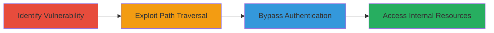

---
tags:
  - path-traversal
  - auth-bypass
  - web-vulnerability
  - onelogin
type: attack_chain
tools: []
tactics:
  - '[[Initial Access]]'
  - '[[Discovery]]'
verified: false
platforms:
  - Web
submitted: true
complexity: medium
created_at: '2023-10-01T00:00:00Z'
procedures:
  - '[[procedures/Exploit-Path-Traversal-in-Web-Server]]'
  - '[[procedures/Bypass-Authentication-via-Path-Traversal]]'
step_count: 2
techniques:
  - '[[Exploit Public-Facing Application]]'
  - '[[File and Directory Discovery]]'
updated_at: '2025-12-14T17:29:44.975Z'
description: >-
  A multi-step attack exploiting path traversal in Uber's web server to bypass
  OneLogin authentication and access internal subdomain content.
skill_level: intermediate
impact_level: high
id: c9ba5780-2d5b-4ad9-915a-1485bdd64fb1
validated: true
mitre_tactics:
  - '[[Initial Access]]'
  - '[[Discovery]]'
mitre_techniques:
  - '[[Exploit Public-Facing Application]]'
  - '[[File and Directory Discovery]]'
---
# Path Traversal in Web Server to Bypass OneLogin Authentication

Multi-stage attack chain demonstrating exploitation of a path traversal vulnerability in the web server powering uberinternal.com, leading to unauthorized access to subdomain content by bypassing OneLogin authentication.

## Chain Metrics Dashboard

| Metric | Value |
|--------|-------|
| Chain Status | Unverified |
| Total Steps | 2 |
| Execution Time | ~5 minutes |
| Skill Level | Intermediate |
| Complexity | Medium |
| Impact Level | High |

## Attack Flow Visualization



## Prerequisites & Requirements

### Required Tools

- [[commands/curl-path-traversal-test]]

### Target Environment

- Web platform with vulnerable server (e.g., uberinternal.com subdomains)
- Services: OneLogin authentication
- Network access: Direct HTTP/HTTPS to target web server

### Initial Access Requirements

- No prior credentials needed
- Public-facing web application
- Ability to send crafted HTTP requests

## Detailed Attack Procedures

### Step 1: Identify Path Traversal Vulnerability
procedure: [[procedures/Exploit-Path-Traversal-in-Web-Server]]

**Objective**: Test and confirm the web server's susceptibility to directory traversal by manipulating file paths to access unauthorized directories.

**Instructions**: Begin by sending HTTP requests to the target endpoint using [[commands/curl-path-traversal-test]] to inject traversal sequences like '../' and observe if the server resolves paths outside the intended root.

```bash
curl -X GET "https://uberinternal.com/path?file=../../../etc/passwd" -v
```

Monitor the response for signs of path resolution, such as error messages revealing server internals or unexpected file access.

**Expected Output**: Server response indicating successful traversal, e.g., contents of unauthorized files or directory listings from parent paths.

**Success Indicators**:
- Response contains data from outside the web root (e.g., system files or subdomain directories)
- No 404 or access denied for invalid paths

### Step 2: Bypass OneLogin Authentication
procedure: [[procedures/Bypass-Authentication-via-Path-Traversal]]

**Objective**: Leverage the confirmed path traversal to navigate to protected subdomain paths, evading OneLogin checks and accessing sensitive internal resources.

**Instructions**: Using the traversal technique, craft requests to access subdomain content directly. For example, target a protected resource on a subdomain by traversing to its path:

```bash
curl -X GET "https://uberinternal.com/path?file=../../subdomain.internal/path/to/resource" -v
```

Adjust the traversal depth (e.g., number of '../') based on the server's directory structure to reach the desired subdomain without triggering authentication redirects.

**Expected Output**: Direct access to subdomain content, such as HTML pages or files, without OneLogin login prompts or redirects.

**Success Indicators**:
- Retrieval of internal resource data (e.g., documents, configs) from subdomains
- Absence of authentication challenges in responses

## Attack Chain Summary

### Key Achievements

1. Confirmed path traversal in web server handling of uberinternal.com subdomains
2. Bypassed OneLogin authentication boundaries
3. Gained unauthorized access to sensitive internal resources

## Technique & Tactic Coverage

### MITRE ATT&CK Techniques

- [[Exploit Public-Facing Application]] Exploit Public-Facing Application
- [[File and Directory Discovery]] File and Directory Discovery

### MITRE ATT&CK Tactics

- [[Initial Access]] Initial Access
- [[Discovery]] Discovery

---
*Last updated: 2023-10-01T00:00:00Z*
