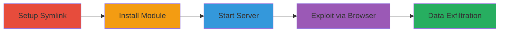

# Path Traversal in simplehttpserver via Symbolic Links to Access Files Outside Web Root

Multi-stage attack chain demonstrating exploitation of a path traversal vulnerability in the simplehttpserver Node.js module (v0.2.1), allowing unauthorized access to files outside the web root through symbolic links. This can lead to directory listing, exposure of sensitive data like usernames and passwords, and potential escalation to remote code execution.

## Chain Metrics Dashboard

| Metric | Value |
|--------|-------|
| Chain Status | Unverified |
| Total Steps | 4 |
| Execution Time | ~5 minutes |
| Skill Level | Intermediate |
| Complexity | Medium |
| Impact Level | High |

## Attack Flow Visualization



## Prerequisites & Requirements

### Required Tools

- [[tools/ln]]
- [[tools/npm]]
- [[tools/simplehttpserver]]
- [[tools/Chrome]]

### Target Environment

- Node.js environment (v10.9.0 or compatible)
- Unix-like OS (Linux/macOS) for symlink creation
- Local network access to the server (port 8000)
- No authentication required; assumes local attacker setup

### Initial Access Requirements

- Local file system access to create symlinks and run Node.js commands
- No prior network access needed; attack is local to the server host
- npm access to install packages

## Detailed Attack Procedures

### Step 1: Setup Symlink
procedure: [[procedures/Create-Symbolic-Link-for-Path-Traversal]]

**Objective**: Create a symbolic link pointing to parent directories to enable traversal outside the web root.

**Instructions**: Use [[commands/ln-create-symlink]] to generate the symlink in the current directory:

```bash
ln -s ../../ symdir
```

**Expected Output**: No output if successful; verify with `ls -l` showing the symlink.

**Success Indicators**:
- Symlink 'symdir' created and points to '../../'
- File system allows symlink resolution

### Step 2: Install Module
procedure: [[procedures/Install-Vulnerable-simplehttpserver-Module]]

**Objective**: Install the vulnerable simplehttpserver module globally to make the server command available.

**Instructions**: Execute [[commands/npm-install-simplehttpserver]] to fetch and install from npm:

```bash
npm install simplehttpserver -g
```

**Expected Output**: Installation logs ending with confirmation like 'added X packages'.

**Success Indicators**:
- 'simplehttpserver' command is available in PATH
- No installation errors

### Step 3: Start Server
procedure: [[procedures/Start-simplehttpserver-with-Current-Directory]]

**Objective**: Launch the HTTP server serving the current directory, which includes the malicious symlink.

**Instructions**: Run [[commands/simplehttpserver-start]] to initiate the server:

```bash
simplehttpserver ./
```

**Expected Output**: Server startup message, e.g., 'Serving ./ on port 8000'.

**Success Indicators**:
- Server listening on localhost:8000
- No startup errors; accessible via browser

### Step 4: Exploit via Browser
procedure: [[procedures/Exploit-Path-Traversal-via-Browser]]

**Objective**: Access the symlink URL to trigger path traversal and list files from outside the web root.

**Instructions**: Open [[tools/Chrome]] and navigate to `http://localhost:8000/symdir/`. The server resolves the symlink, listing parent directory contents.

**Expected Output**: Browser displays directory listing from higher-level folders, potentially showing sensitive files.

**Success Indicators**:
- Unauthorized files/directories visible in browser
- Sensitive data exposure confirmed (e.g., config files with credentials)

## Attack Chain Summary

### Key Achievements

1. Successful symlink creation to bypass directory boundaries
2. Deployment of vulnerable server without path validation
3. Exploitation leading to arbitrary file listing outside web root
4. Potential for sensitive information disclosure and further attacks like RCE

## Technique & Tactic Coverage

### MITRE ATT&CK Techniques

- [[File and Directory Discovery]] File and Directory Discovery
- [[Exploit Public-Facing Application]] Exploit Public-Facing Application

### MITRE ATT&CK Tactics

- [[Discovery]] Discovery
- [[Collection]] Collection

---
*Last updated: 2023-10-01T00:00:00Z*
