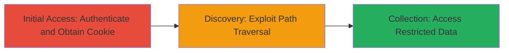

---
tags:
  - path-traversal
  - auth-bypass
  - web-vuln
  - cookie-misuse
type: attack_chain
tools: []
tactics:
  - '[[Initial Access]]'
  - '[[Discovery]]'
commands:
  - '[[commands/curl-login-starbucks]]'
  - '[[commands/curl-path-traversal-exploit]]'
platforms:
  - Web
complexity: medium
procedures:
  - '[[procedures/Obtain-Starbucks-Auth-Cookie]]'
  - '[[procedures/Exploit-Path-Traversal-with-Auth-Cookie]]'
step_count: 2
techniques:
  - '[[Valid Accounts]]'
  - '[[File and Directory Discovery]]'
description: >-
  A chained vulnerability exploiting path traversal in file handling combined
  with misuse of a valid authentication cookie to access restricted data on
  Starbucks' web application.
skill_level: intermediate
impact_level: high
id: 587ccdf2-1737-4e05-ad5b-dab3e3d953ce
created_at: '2025-12-14T17:31:52.948Z'
updated_at: '2025-12-14T17:31:52.948Z'
verified: false
validated: true
submitted: true
mitre_tactics:
  - '[[Initial Access]]'
  - '[[Discovery]]'
mitre_techniques:
  - '[[Valid Accounts]]'
  - '[[File and Directory Discovery]]'
---
# Path Traversal via Authentication Cookie Misuse on app.starbucks.com

## Overview

This attack chain demonstrates a critical vulnerability in the Starbucks web application at app.starbucks.com, where insufficient validation of file paths in conjunction with the misuse of a valid authentication cookie allows unauthorized access to restricted sensitive data. Discovered by researchers zlz and rhynorater, the flaw enables attackers with a legitimate session to traverse directory boundaries and retrieve files outside the intended scope, potentially exposing user information or internal documents. The severity is rated 9-10 due to the high impact on data confidentiality.

## Chain Metrics Dashboard

| Metric | Value |
|--------|-------|
| Chain Status | Unverified |
| Total Steps | 2 |
| Execution Time | ~5 minutes |
| Skill Level | Intermediate |
| Complexity | Medium |
| Impact Level | High |

## Attack Flow Visualization



## Prerequisites & Requirements

### Required Tools

- Browser or [[commands/curl-login-starbucks]] for authentication
- [[commands/curl-path-traversal-exploit]] for exploitation testing

### Target Environment

- Web platform: app.starbucks.com
- Required services/ports: HTTPS on port 443
- Network access requirements: Direct internet access to the target domain

### Initial Access Requirements

- Valid user credentials for Starbucks app login
- Network position: External attacker with internet connectivity
- Prior access needed: None, but legitimate account required for cookie

## Detailed Attack Procedures

### Step 1: Initial Access
procedure: [[procedures/Obtain-Starbucks-Auth-Cookie]]

**Objective**: Authenticate to the Starbucks web app to obtain a valid session cookie that can be misused for traversal.

**Instructions**: Use [[commands/curl-login-starbucks]] to simulate login and capture the authentication cookie from the response headers.

```bash
curl -c cookies.txt -d "username=validuser&password=validpass" -X POST https://app.starbucks.com/login
```

Extract the cookie value (e.g., session_id=abc123) from cookies.txt for use in subsequent requests.

**Expected Output**: Successful login response with Set-Cookie header containing the auth token.

**Success Indicators**:
- HTTP 200 or redirect to dashboard
- Cookie file populated with session token

### Step 2: Discovery and Collection
procedure: [[procedures/Exploit-Path-Traversal-with-Auth-Cookie]]

**Objective**: Misuse the valid authentication cookie in a file access request with path traversal payloads to retrieve restricted data beyond the intended directory.

**Instructions**: Load the cookie from Step 1 and use [[commands/curl-path-traversal-exploit]] to send a request with traversal sequences like "../../../etc/passwd" or target restricted paths.

```bash
curl -b cookies.txt "https://app.starbucks.com/api/files?path=../../../restricted/data.json"
```

Monitor the response for unintended file contents. Iterate with deeper traversals (e.g., ../../../../) if needed to bypass any partial filters.

**Expected Output**: Response body containing contents of restricted files, such as JSON data or internal configs.

**Success Indicators**:
- Unauthorized file contents returned in response
- No access denied errors for paths outside app scope

## Attack Chain Summary

### Key Achievements

1. Obtained a valid auth cookie through legitimate login.
2. Exploited path traversal to access restricted data using the cookie.
3. Demonstrated critical impact by retrieving sensitive information without additional privileges.

## Technique & Tactic Coverage

### MITRE ATT&CK Techniques

- [[Valid Accounts]] Valid Accounts
- [[File and Directory Discovery]] File and Directory Discovery

### MITRE ATT&CK Tactics

- [[Initial Access]] Initial Access
- [[Discovery]] Discovery

---
*Last updated: 2023-10-01*
