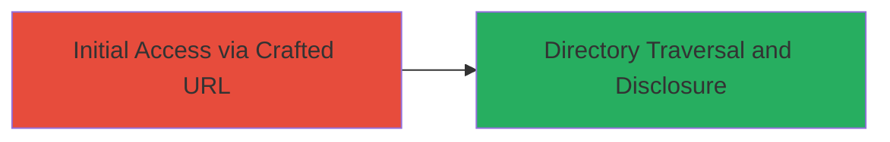

---
tags:
  - path-traversal
  - nginx
  - tomcat
  - information-disclosure
type: attack_chain
tools: []
tactics:
  - '[[Initial Access]]'
  - '[[Discovery]]'
commands:
  - '[[commands/curl-path-traversal-test]]'
platforms:
  - Web
complexity: medium
procedures:
  - '[[procedures/Exploit-Path-Traversal-in-Tomcat-via-Nginx-Proxy]]'
step_count: 1
techniques:
  - '[[Exploit Public-Facing Application]]'
  - '[[File and Directory Discovery]]'
description: >-
  Exploits a path traversal vulnerability in a Tomcat server behind an nginx
  reverse proxy by crafting a URL with '..;/' to bypass normalization and access
  internal directories, leading to information disclosure.
skill_level: intermediate
impact_level: high
id: a2ceb598-6108-418e-965c-c7cca75d6d63
created_at: '2025-12-14T17:26:22.169Z'
updated_at: '2025-12-14T17:26:22.169Z'
verified: false
validated: true
submitted: true
mitre_tactics:
  - '[[Initial Access]]'
  - '[[Discovery]]'
mitre_techniques:
  - '[[Exploit Public-Facing Application]]'
  - '[[File and Directory Discovery]]'
---
# Path Traversal via Misconfigured Nginx Proxy to Tomcat for Information Disclosure

## Overview

This attack chain demonstrates a path traversal vulnerability exploited in a Tomcat web application server protected by an nginx reverse proxy. Due to a misconfiguration in the proxy path settings, the string '..;/' in a URL bypasses nginx's path normalization and is interpreted by Tomcat as '../', allowing attackers to traverse directories and access internal resources such as administrator pages. The vulnerability was reported on a LINE-operated server, resulting in information disclosure of sensitive internal files.

## Chain Metrics Dashboard

| Metric | Value |
|--------|-------|
| Chain Status | Unverified |
| Total Steps | 1 |
| Execution Time | ~1 minutes |
| Skill Level | Intermediate |
| Complexity | Medium |
| Impact Level | High |

## Attack Flow Visualization



## Prerequisites & Requirements

### Required Tools

- Browser or [[commands/curl-path-traversal-test]] for sending requests

### Target Environment

- Web platform with nginx reverse proxy forwarding to Tomcat server
- Misconfigured proxy paths allowing unsanitized traversal sequences
- Accessible HTTP/HTTPS endpoint

### Initial Access Requirements

- Network access to the public-facing web application
- No authentication required for the vulnerable endpoint
- Knowledge of the base URL of the application

## Detailed Attack Procedures

### Step 1: Craft Malicious URL for Path Traversal
procedure: [[procedures/Exploit-Path-Traversal-in-Tomcat-via-Nginx-Proxy]]

**Objective**: Bypass proxy normalization to traverse directories and disclose internal resources.

**Instructions**: Identify the vulnerable endpoint, typically a web application URL. Craft a request by appending '..;/' to the path to exploit the misconfiguration. Use [[commands/curl-path-traversal-test]] to send the request:

```bash
curl -v "http://target.com/vulnerable-endpoint/..;/internal/admin.html"
```

This sends a GET request to the crafted path. The nginx proxy passes '..;/' without normalizing it to '../', but Tomcat interprets the semicolon as a separator, resolving it as '../' and accessing the parent directory.

**Expected Output**: HTTP response containing content from internal resources, such as the administrator page HTML or directory listings.

**Success Indicators**:
- 200 OK response with unexpected internal file content
- Access to restricted paths like /internal/admin
- No 404 or access denied errors
