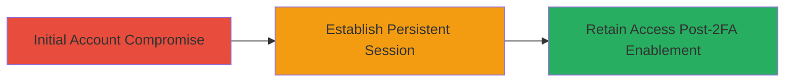

---
tags:
  - 2fa-bypass
  - session-persistence
  - access-control
  - rocketchat
type: attack_chain
tools: []
tactics:
  - '[[Persistence]]'
commands: []
platforms:
  - Web
complexity: low
procedures:
  - '[[procedures/Exploit-Rocket.Chat-2FA-Session-Persistence]]'
step_count: 3
techniques:
  - '[[Valid Accounts]]'
description: >-
  Demonstrates how an attacker maintains unauthorized access to a Rocket.Chat
  account via existing sessions that are not invalidated when the legitimate
  user enables two-factor authentication.
skill_level: low
impact_level: high
id: d955424f-b88c-4cc9-ab8d-edb7787d8205
created_at: '2025-12-14T17:28:51.886Z'
updated_at: '2025-12-14T17:28:51.886Z'
verified: false
validated: true
submitted: true
mitre_tactics:
  - '[[Persistence]]'
mitre_techniques:
  - '[[Valid Accounts]]'
---
# Persistent Account Access After 2FA Enablement in Rocket.Chat

Multi-stage attack chain demonstrating a complete attack workflow exploiting improper session management in Rocket.Chat's 2FA feature.

## Chain Metrics Dashboard

| Metric | Value |
|--------|-------|
| Chain Status | Unverified |
| Total Steps | 3 |
| Execution Time | ~5 minutes |
| Skill Level | Low |
| Complexity | Low |
| Impact Level | High |

## Attack Flow Visualization

## Prerequisites & Requirements

### Required Tools

- None (relies on existing session cookies or tokens)

### Target Environment

- Rocket.Chat web platform (version prior to patch for this issue)
- Web browser with access to the target's instance

### Initial Access Requirements

- Prior compromise of user credentials (e.g., via phishing or weak password)
- Active session established before 2FA enablement
- Network access to the Rocket.Chat server

## Detailed Attack Procedures

### Step 1: Initial Account Compromise
procedure: [[procedures/Exploit-Rocket.Chat-2FA-Session-Persistence]]

**Objective**: Gain initial unauthorized access to the target account to establish a persistent session.

**Instructions**: Assume prior compromise through methods like credential stuffing or phishing. Log in to the Rocket.Chat web interface using the stolen credentials to create an active session. Capture the session cookie (e.g., via browser developer tools) for later use.

**Expected Output**: Successful login and navigation within the Rocket.Chat dashboard.

**Success Indicators**:
- Access to user messages, channels, and settings
- Session cookie or token obtained

### Step 2: Establish Persistent Session
procedure: [[procedures/Exploit-Rocket.Chat-2FA-Session-Persistence]]

**Objective**: Ensure the session remains active while waiting for the legitimate user to enable 2FA.

**Instructions**: Maintain the session by keeping the browser tab open or exporting the session cookie to a tool like a cookie editor extension. Monitor the account for changes, such as 2FA activation, without performing disruptive actions to avoid detection.

**Expected Output**: Continued access to the account interface without re-authentication.

**Success Indicators**:
- Session remains valid over time
- No logout or invalidation occurs

### Step 3: Retain Access Post-2FA Enablement
procedure: [[procedures/Exploit-Rocket.Chat-2FA-Session-Persistence]]

**Objective**: Demonstrate that the existing session bypasses the new 2FA requirement, allowing ongoing account takeover.

**Instructions**: Once the legitimate user enables 2FA (e.g., via account settings), attempt to access protected features using the pre-existing session cookie. Import the cookie into a browser or use it in requests to endpoints like /api/v1/chat.getMessage. Verify access to sensitive data or actions that now require 2FA for new logins.

**Expected Output**: Full access to the account, including sending messages or viewing private channels, without 2FA prompts.

**Success Indicators**:
- Access granted without 2FA code entry
- Prolonged unauthorized control of the account

## Attack Chain Summary

### Key Achievements

1. Initial compromise leads to session establishment
2. 2FA enablement by victim fails to evict attacker
3. Sustained account takeover enabling data exfiltration or malicious actions

## Technique & Tactic Coverage

### MITRE ATT&CK Techniques

- [[Valid Accounts]]

### MITRE ATT&CK Tactics

- [[Persistence]]

---
*Last updated: 2023-10-01*
