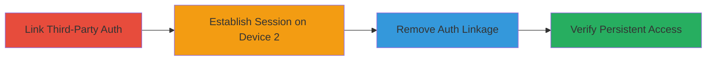

---
tags:
  - authentication-bypass
  - session-management
  - oauth
  - weblate
  - account-takeover
type: attack_chain
tools: []
tactics:
  - '[[Initial Access]]'
  - '[[Persistence]]'
verified: false
platforms:
  - Web
submitted: true
complexity: medium
created_at: '2023-10-01T00:00:00Z'
procedures:
  - '[[procedures/Link-Third-Party-Authentication-Provider]]'
  - '[[procedures/Establish-Session-via-Third-Party-Login-on-Separate-Device]]'
  - '[[procedures/Remove-Third-Party-Authentication-Linkage]]'
  - '[[procedures/Validate-Persistent-Session-Access]]'
step_count: 4
techniques:
  - '[[Valid Accounts]]'
updated_at: '2025-12-14T17:31:10.935Z'
description: >-
  Attack chain exploiting improper session management in Weblate, where removing
  third-party authentication like Google OAuth does not invalidate existing
  sessions, allowing continued unauthorized access.
skill_level: intermediate
impact_level: high
id: 43e92037-80e5-425d-b7db-016b252c1197
validated: true
mitre_tactics:
  - '[[Initial Access]]'
  - '[[Persistence]]'
mitre_techniques:
  - '[[Valid Accounts]]'
---
# Persistent Unauthorized Access via Uninvalidated Sessions After Third-Party Auth Removal

Multi-stage attack chain demonstrating exploitation of session management flaw in Weblate, enabling account hijacking by maintaining access after deauthorizing third-party authentication methods.

## Chain Metrics Dashboard

| Metric | Value |
|--------|-------|
| Chain Status | Unverified |
| Total Steps | 4 |
| Execution Time | ~5 minutes |
| Skill Level | Intermediate |
| Complexity | Medium |
| Impact Level | High |

## Attack Flow Visualization

## Prerequisites & Requirements

### Required Tools

- Web browser (e.g., Chrome, Firefox)

### Target Environment

- Weblate platform (https://hosted.weblate.org)
- Valid user account with access to profile settings

### Initial Access Requirements

- Legitimate credentials for the target account
- Two separate devices or browser sessions for parallel actions
- Network access to the Weblate instance

## Detailed Attack Procedures

### Step 1: Link Third-Party Authentication Provider
procedure: [[procedures/Link-Third-Party-Authentication-Provider]]

**Objective**: Establish a third-party authentication linkage (e.g., Google OAuth) to the target account on the first device, setting up the condition for session persistence testing.

**Instructions**: Access the account profile settings and initiate the linkage process for Google authentication.

Navigate to https://hosted.weblate.org/accounts/profile/#auth in your browser on Device 1, then click the option to link a Google account and complete the OAuth flow using valid Google credentials associated with the target Weblate account.

**Expected Output**: Successful linkage confirmation, with Google listed as a connected authentication method in the profile.

**Success Indicators**:
- Google account appears in the linked providers list
- No errors during OAuth authorization

### Step 2: Establish Session via Third-Party Login on Separate Device
procedure: [[procedures/Establish-Session-via-Third-Party-Login-on-Separate-Device]]

**Objective**: Create an active session on a second device using the newly linked third-party credentials, which will later demonstrate the persistence flaw.

**Instructions**: On Device 2, initiate login using the third-party provider.

Open a browser on Device 2, navigate to https://hosted.weblate.org, select Google as the login method, and authenticate with the same Google credentials linked in Step 1 to establish a valid session.

**Expected Output**: Successful login and redirection to the Weblate dashboard, confirming an active session.

**Success Indicators**:
- Access to account dashboard without prompts for additional credentials
- Session cookies or tokens active in browser developer tools

### Step 3: Remove Third-Party Authentication Linkage
procedure: [[procedures/Remove-Third-Party-Authentication-Linkage]]

**Objective**: Deauthorize the third-party authentication method on the first device, triggering the vulnerability by attempting to revoke access without invalidating existing sessions.

**Instructions**: Return to the profile on Device 1 and disconnect the linked provider.

On Device 1, go back to https://hosted.weblate.org/accounts/profile/#auth, locate the Google linkage, and click the disconnect or remove option to unlink the account.

**Expected Output**: Confirmation of disconnection, with Google no longer listed as a linked provider.

**Success Indicators**:
- Provider removed from the authentication methods list
- No immediate session invalidation or logout on Device 1

### Step 4: Validate Persistent Session Access
procedure: [[procedures/Validate-Persistent-Session-Access]]

**Objective**: Confirm the vulnerability by checking that the session on the second device remains active despite the removal of all linked authentication methods.

**Instructions**: Switch to Device 2 and attempt to interact with the account.

On Device 2, refresh the Weblate dashboard at https://hosted.weblate.org or perform an action like viewing account settings to test session validity.

**Expected Output**: Continued access to the account without re-authentication prompts, even though no authentication methods are linked.

**Success Indicators**:
- Full account access maintained
- No logout or credential challenges triggered

## Attack Chain Summary

### Key Achievements

1. Linked third-party auth to enable multi-device session creation
2. Established parallel session using OAuth without direct credentials
3. Removed auth linkage, exploiting lack of session invalidation
4. Achieved persistent unauthorized access, enabling potential hijacking

## Technique & Tactic Coverage

### MITRE ATT&CK Techniques

- [[Valid Accounts]]

### MITRE ATT&CK Tactics

- [[Initial Access]]
- [[Persistence]]

---
*Last updated: 2023-10-01T00:00:00Z*
