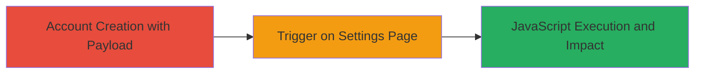

# Persistent XSS Exploitation in Respondly Group Name for Arbitrary JavaScript Execution

Multi-stage attack chain demonstrating a complete attack workflow exploiting unsanitized user input in Respondly's group name field to achieve persistent XSS, allowing arbitrary JavaScript execution in victims' browsers.

## Chain Metrics Dashboard

| Metric | Value |
|--------|-------|
| Chain Status | Unverified |
| Total Steps | 2 |
| Execution Time | ~5 minutes |
| Skill Level | Beginner |
| Complexity | Low |
| Impact Level | High |

## Attack Flow Visualization

## Prerequisites & Requirements

### Required Tools

- Web browser (e.g., Chrome, Firefox)

### Target Environment

- Respondly web application (https://app.respond.ly)
- No specific services/ports required beyond standard HTTPS (443)
- Internet access to the target

### Initial Access Requirements

- No prior credentials needed; public registration allowed
- Ability to create a new account
- No special network position required

## Detailed Attack Procedures

### Step 1: Account Creation with Malicious Payload
procedure: [[procedures/Inject-Malicious-Payload-into-Respondly-Group-Name]]

**Objective**: Inject a persistent XSS payload into the group name field during account registration to store malicious JavaScript that will be reflected unsanitized later.

**Instructions**: Navigate to the Respondly registration page and create a new account. In the group name field, enter the payload `">`. Complete the registration with any valid email and password. The payload is stored without sanitization.

**Expected Output**: Successful account creation confirmation, with the malicious group name saved in the backend.

**Success Indicators**:
- Account created without errors
- Payload accepted in group name field

### Step 2: Trigger XSS on Settings Page
procedure: [[procedures/Trigger-Persistent-XSS-on-Respondly-Settings-Page]]

**Objective**: Access the account settings page to render the unsanitized group name, executing the injected JavaScript in the browser context.

**Instructions**: Log in to the newly created account and navigate to the settings page at https://app.respond.ly/[account-id]/settings/account. The group name payload will be reflected in the HTML, triggering the onerror event and displaying an alert box with '4'.

**Expected Output**: JavaScript alert popup executing in the browser, confirming XSS success.

**Success Indicators**:
- Alert box appears on page load
- Inspect page source to see unsanitized payload in HTML

## Attack Chain Summary

### Key Achievements

1. Successful injection of persistent XSS payload via group name input
2. Triggering of arbitrary JavaScript execution on the settings page
3. Potential for broader impact, such as session hijacking when staff or other users view affected pages or emails

## Technique & Tactic Coverage

### MITRE ATT&CK Techniques

- [[JavaScript]]

### MITRE ATT&CK Tactics

- [[Execution]]
- [[Collection]]

---
*Last updated: 2023-10-01T00:00:00Z*
