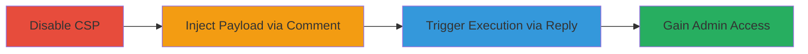

# Persistent XSS in Airship CMS Comment Name Field Leading to Admin Access

Multi-stage attack chain demonstrating a complete attack workflow exploiting a persistent cross-site scripting (XSS) vulnerability in Airship CMS version 2.0.0. The attack begins by disabling the Content Security Policy (CSP) to enable inline JavaScript execution, followed by injecting a malicious payload into the anonymous comment name field. Finally, triggering the payload via the 'Reply' function executes arbitrary JavaScript in the victim's browser, allowing actions like adding a new administrator for full application access. This vulnerability stems from unencoded insertion of the comment author's name in the /static/Hull/comments.js file.

## Chain Metrics Dashboard

| Metric | Value |
|--------|-------|
| Chain Status | Unverified |
| Total Steps | 3 |
| Execution Time | ~5 minutes |
| Skill Level | Intermediate |
| Complexity | Medium |
| Impact Level | High |

## Attack Flow Visualization

## Prerequisites & Requirements

### Required Tools

- Web browser (e.g., Chrome with developer tools)

### Target Environment

- Airship CMS v2.0.0 running on a web server
- Access to blog post with comments enabled (anonymous comments allowed by default)
- Administrative access for CSP disablement (attacker may need prior compromise or default creds)

### Initial Access Requirements

- Valid user session or anonymous access to blog comments
- Network access to the Airship CMS instance
- No prior authentication needed for comment submission, but admin privileges for CSP change

## Detailed Attack Procedures

### Step 1: Disable Content Security Policy
procedure: [[procedures/Disable-CSP-in-Airship-CMS]]

**Objective**: Remove restrictions on inline JavaScript to allow XSS payload execution.

**Instructions**: Log in to the admin panel and navigate to the JavaScript settings to enable unsafe inline scripts.

**Expected Output**: CSP updated to permit inline JavaScript, verifiable via browser dev tools inspecting response headers.

**Success Indicators**:
- 'allow unsafe inline' checkbox checked in admin settings
- No CSP blocks observed in console when testing inline scripts

### Step 2: Submit Malicious Comment
procedure: [[procedures/Submit-Malicious-Comment-in-Airship-CMS]]

**Objective**: Inject a persistent XSS payload into the comment name field, which is stored and displayed without encoding.

**Instructions**: Navigate to a blog post, enter the payload in the name field, and submit the comment anonymously.

Payload example: `'>`

**Expected Output**: Comment appears on the page with the injected payload visible in the DOM.

**Success Indicators**:
- Comment successfully posted
- Payload visible in the comment author's name element in browser inspector

### Step 3: Trigger XSS Execution
procedure: [[procedures/Trigger-XSS-via-Reply-in-Airship-CMS]]

**Objective**: Execute the injected JavaScript by interacting with the malicious comment, leading to arbitrary code execution in the victim's browser.

**Instructions**: As a victim user, click the 'Reply' button on the malicious comment to trigger the unencoded insertion of the name into the reply form.

**Expected Output**: Alert box or arbitrary JavaScript execution (e.g., alert(1)), confirming payload activation.

**Success Indicators**:
- JavaScript executes in victim's browser
- Potential for further actions like form submission to add admin user

## Attack Chain Summary

### Key Achievements

1. Bypassed CSP to enable inline script execution
2. Persistently stored XSS payload in comment metadata
3. Achieved JavaScript execution leading to potential account takeover or admin escalation

## Technique & Tactic Coverage

### MITRE ATT&CK Techniques

- [[JavaScript]]
- [[Exploit Public-Facing Application]]

### MITRE ATT&CK Tactics

- [[Execution]]
- [[Collection]]

---
*Last updated: 2023-10-01T00:00:00Z*
