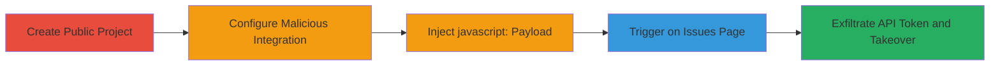

# Persistent XSS in GitLab Custom Issue Tracker for API Token Leak and Account Takeover

Multi-stage attack chain demonstrating exploitation of a persistent cross-site scripting (XSS) vulnerability in GitLab's custom issue tracker integration. An attacker creates a public project, injects a malicious javascript: URI into the Project URL field due to missing URL scheme validation, and triggers execution when victims view the Issues page, leading to JavaScript execution that exfiltrates the viewer's API token for account takeover and data access.

## Chain Metrics Dashboard

| Metric | Value |
|--------|-------|
| Chain Status | Unverified |
| Total Steps | 4 |
| Execution Time | ~5 minutes |
| Skill Level | Intermediate |
| Complexity | Medium |
| Impact Level | High |

## Attack Flow Visualization

## Prerequisites & Requirements

### Required Tools

- Web browser (e.g., Chrome with developer tools for payload testing)

### Target Environment

- GitLab instance (self-hosted or SaaS)
- Ruby on Rails backend
- Attacker requires ability to create projects (authenticated user)

### Initial Access Requirements

- Valid GitLab account with project creation permissions
- No special privileges needed beyond standard user access
- Public project visibility to lure victims

## Detailed Attack Procedures

### Step 1: Create Public Project
procedure: [[procedures/Create-Public-Project-in-GitLab]]

**Objective**: Establish a public-facing project to host the malicious integration configuration.

**Instructions**: Log in to GitLab, navigate to the projects creation page, and set the project to public visibility to ensure broad accessibility for triggering the payload.

**Expected Output**: A new public project dashboard accessible to any user without authentication.

**Success Indicators**:
- Project created successfully with public visibility level.
- Project URL is shareable and viewable by unauthenticated users.

### Step 2: Access Project Services Settings
procedure: [[procedures/Access-GitLab-Project-Services-Settings]]

**Objective**: Navigate to the integration configuration area where the vulnerable fields are located.

**Instructions**: From the project dashboard, access the settings menu and select the services section to enable custom issue tracker configuration.

**Expected Output**: Services configuration page loaded, with Custom Issue Tracker option available.

**Success Indicators**:
- Settings > Services page accessible.
- Custom Issue Tracker integration selectable without errors.

### Step 3: Inject XSS Payload in Custom Issue Tracker
procedure: [[procedures/Inject-XSS-Payload-in-Custom-Issue-Tracker]]

**Objective**: Exploit the lack of URL validation to store a malicious javascript: URI in the Project URL field.

**Instructions**: In the Custom Issue Tracker form, enter a javascript: payload in the Project URL field, such as `javascript:alert('Current user API token: ' + window.gon.api_token)`, and save the configuration. Note that Issues URL and New Issue URL fields may also accept similar payloads.

**Expected Output**: Configuration saved without validation errors; payload persists in the backend.

**Success Indicators**:
- Form submission successful.
- No immediate errors or sanitization applied to the input.

### Step 4: Trigger Persistent XSS on Issues Page
procedure: [[procedures/Trigger-Persistent-XSS-on-Issues-Page]]

**Objective**: Cause the payload to execute in a victim's browser by rendering the Issues page, leading to JS execution and token leakage.

**Instructions**: Direct a victim to view the project's Issues page, where the injected URI renders as a clickable link. Interaction or page load executes the JavaScript, accessing `window.gon.api_token` for exfiltration.

**Expected Output**: Alert or network request exfiltrating the API token; potential follow-on actions like unauthorized API calls.

**Success Indicators**:
- JavaScript executes in victim's browser.
- API token leaked (visible in alert or sent to attacker-controlled endpoint).
- Account takeover possible via stolen token.

## Attack Chain Summary

### Key Achievements

1. Persistent storage of malicious javascript: URI without scheme validation.
2. Arbitrary JS execution on public project Issues page for any viewer.
3. Exfiltration of sensitive `window.gon.api_token` enabling account takeover.
4. Potential access to private projects and confidential data.

## Technique & Tactic Coverage

### MITRE ATT&CK Techniques

- [[JavaScript]]
- [[Cloud Instance Metadata API]]

### MITRE ATT&CK Tactics

- [[Execution]]
- [[Initial Access]]
- [[Collection]]

---

*Last updated: 2023-10-01T00:00:00Z*
