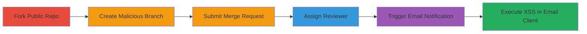

# Persistent XSS in GitLab Merge Request Emails via Malicious Branch Names

Multi-stage attack chain exploiting a persistent XSS vulnerability in GitLab's email notifications. Attackers fork a public repository, create a branch with an HTML/JavaScript payload as its name, submit a merge request to the original repository, and assign a reviewer. This triggers an email containing the unsanitized branch name, executing JavaScript in the recipient's email client under GitLab's branding. The vulnerability affects GitLab CE and EE versions, allowing broad targeting by adding users as repo members. Initially rated medium severity due to user reach, later adjusted to low as modern email clients mitigate some XSS risks.

## Chain Metrics Dashboard

| Metric | Value |
|--------|-------|
| Chain Status | Unverified |
| Total Steps | 8 |
| Execution Time | ~10 minutes |
| Skill Level | Intermediate |
| Complexity | Medium |
| Impact Level | Medium |

## Attack Flow Visualization

## Prerequisites & Requirements

### Required Tools

- [[tools/GDK-GitLab-Development-Kit]]
- [[tools/Letter-Opener]]
- [[tools/Git-Client]]

### Target Environment

- GitLab CE/EE instance (tested on local GDK at port 3000)
- Required services/ports: Web interface on port 3000, Email Notifications enabled
- Network access requirements: Local access to GitLab instance or authenticated user account

### Initial Access Requirements

- Authenticated GitLab user account with ability to fork public repos
- No special privileges needed; public repo access suffices
- Prior access: None, but forking requires a namespace

## Detailed Attack Procedures

### Step 1: Fork a Public Repository
procedure: [[procedures/Fork-Public-GitLab-Repository]]

**Objective**: Gain control over a copy of the target repository to create malicious branches without affecting the original.

**Instructions**: Select a public repository, such as the HTML5 boilerplate at `http://yourserver:3000/root/html5-boilerplate`, and fork it to your own namespace.

**Expected Output**: Forked repository accessible under your namespace, e.g., `http://yourserver:3000/your-namespace/html5-boilerplate`.

**Success Indicators**:
- Fork creation confirmation
- Access to forked repo's main page

### Step 2: Navigate to Forked Repository
procedure: [[procedures/Create-Malicious-Branch-via-UI]]

**Objective**: Access the repository interface to prepare for branch creation.

**Instructions**: Visit the main page of the forked repository at `http://yourserver:3000/your-namespace/html5-boilerplate` (replace `your-namespace` with your actual namespace).

**Expected Output**: Repository dashboard loads, showing files and options for new branches/files.

**Success Indicators**:
- Page loads without errors
- UI elements for creating files/branches visible

### Step 3: Initiate New File Creation
procedure: [[procedures/Create-Malicious-Branch-via-UI]]

**Objective**: Start the process to create a new branch with a malicious name.

**Instructions**: Click the '+' button on the repository page and select 'New File', which redirects to `http://yourserver:3000/your-namespace/html5-boilerplate/new/master`.

**Expected Output**: New file creation form appears, with branch name input field.

**Success Indicators**:
- Redirect to new file page
- Form fields editable

### Step 4: Set Malicious Branch Name
procedure: [[procedures/Create-Malicious-Branch-via-UI]]

**Objective**: Inject the XSS payload into the branch name.

**Instructions**: Enter any content in the file (e.g., a placeholder text), but set the target branch name to ``.

**Expected Output**: Branch name field accepts the HTML/JS payload without sanitization.

**Success Indicators**:
- Payload entered successfully
- No UI validation errors

### Step 5: Commit Changes
procedure: [[procedures/Submit-Merge-Request-with-XSS-Payload]]

**Objective**: Create the malicious branch by committing the file.

**Instructions**: Click 'Commit changes' and ignore any automatic merge request prompt; GitLab will redirect but proceed manually.

**Expected Output**: Commit succeeds, creating the branch named ``.

**Success Indicators**:
- Commit confirmation
- Branch appears in repository list

### Step 6: Create Merge Request
procedure: [[procedures/Submit-Merge-Request-with-XSS-Payload]]

**Objective**: Submit a merge request using the malicious branch as source.

**Instructions**: Navigate to `http://yourserver:3000/your-namespace/html5-boilerplate/merge_requests/new`, select source branch as your fork's `` and target as the original repo's master branch.

**Expected Output**: Merge request form populated with malicious branch.

**Success Indicators**:
- Source branch selectable despite payload
- Form submits without errors

### Step 7: Assign Reviewer and Submit
procedure: [[procedures/Assign-Reviewer-to-Trigger-Email]]

**Objective**: Trigger the email notification by assigning a reviewer.

**Instructions**: Select a maintainer of the original repository as reviewer and submit the merge request.

**Expected Output**: Merge request created and email queued for the reviewer.

**Success Indicators**:
- Submission success message
- Reviewer notified (check email logs)

### Step 8: View Generated Email
procedure: [[procedures/View-Email-with-Letter-Opener-to-Verify-XSS]]

**Objective**: Observe the XSS execution in the email.

**Instructions**: Access `http://yourserver:3000/your-namespace/html5-boilerplate/rails/letter_opener/` to view the intercepted email.

**Expected Output**: Email renders with the branch name, triggering `alert(1)` popup due to unsanitized `<script>` tag.

**Success Indicators**:
- Alert dialog appears in browser
- JavaScript executes under GitLab branding

## Attack Chain Summary

### Key Achievements

1. Successful injection of XSS payload via branch name, bypassing UI sanitization.
2. Triggering of persistent XSS in email notifications for merge requests and approvers.
3. Demonstration of broad impact by targeting any GitLab user as reviewer.

## Technique & Tactic Coverage

### MITRE ATT&CK Techniques

- [[JavaScript]] JavaScript
- [[Drive-by Compromise]] Drive-by Compromise

### MITRE ATT&CK Tactics

- [[Execution]] Execution
- [[Collection]] Collection

---
*Last updated: 2023-10-01T00:00:00Z*
