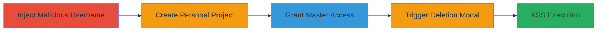

---
tags:
  - xss
  - stored-xss
  - gitlab
  - javascript-execution
type: attack_chain
tools: []
tactics:
  - '[[Execution]]'
  - '[[Collection]]'
verified: false
platforms:
  - Web
submitted: true
complexity: medium
created_at: '2023-10-01T00:00:00Z'
procedures:
  - '[[procedures/Inject-Malicious-Username-for-Stored-XSS-in-GitLab]]'
  - '[[procedures/Create-Personal-Project-in-GitLab]]'
  - '[[procedures/Grant-Master-Access-to-Project]]'
  - '[[procedures/Trigger-Project-Deletion-to-Execute-XSS]]'
step_count: 5
techniques:
  - '[[JavaScript]]'
  - '[[Exploit Public-Facing Application]]'
updated_at: '2025-12-14T03:16:20.333Z'
description: >-
  A multi-step attack exploiting a stored XSS vulnerability in GitLab's project
  deletion confirmation modal by injecting a malicious payload into the
  username, leading to JavaScript execution for users with Master access.
skill_level: intermediate
impact_level: medium
id: 5a84dc79-b6df-4883-935a-7a1f88cb7c11
validated: true
mitre_tactics:
  - '[[Execution]]'
  - '[[Collection]]'
mitre_techniques:
  - '[[JavaScript]]'
  - '[[Exploit Public-Facing Application]]'
---
# Persistent XSS in GitLab Project Deletion via Malicious Username

Multi-stage attack chain demonstrating a complete attack workflow exploiting a stored XSS vulnerability in GitLab versions prior to 10.7.

## Chain Metrics Dashboard

| Metric | Value |
|--------|-------|
| Chain Status | Unverified |
| Total Steps | 5 |
| Execution Time | ~5 minutes |
| Skill Level | Intermediate |
| Complexity | Medium |
| Impact Level | Medium |

## Attack Flow Visualization

## Prerequisites & Requirements

### Required Tools

- Web browser (e.g., Chrome with developer tools for payload testing)

### Target Environment

- GitLab instance (vulnerable versions < 10.7)
- Web platform
- Access to user profile settings and project creation

### Initial Access Requirements

- Valid GitLab account with ability to edit username and create personal projects
- Master access to the target project for impact simulation
- No special network access beyond standard web connectivity

## Detailed Attack Procedures

### Step 1: Inject Malicious Username
procedure: [[procedures/Inject-Malicious-Username-for-Stored-XSS-in-GitLab]]

**Objective**: Set the attacker's username to include a JavaScript payload that will be stored and later rendered unsafely.

**Instructions**: Log in to GitLab, navigate to user settings, and update the username field with the payload. Use the browser's developer console if needed to test the payload locally.

**Expected Output**: Username updated successfully, visible in profile.

**Success Indicators**:
- Username change confirmation
- Payload visible in username display without immediate execution

### Step 2: Create Personal Project
procedure: [[procedures/Create-Personal-Project-in-GitLab]]

**Objective**: Establish a personal project where the malicious username can be associated and later rendered in the deletion modal.

**Instructions**: From the user dashboard, create a new project under the personal namespace (not a custom group) to ensure the vulnerability triggers.

**Expected Output**: New project created and listed in the dashboard.

**Success Indicators**:
- Project appears in personal projects list
- No errors during creation

### Step 3: Grant Master Access (Optional for Testing)
procedure: [[procedures/Grant-Master-Access-to-Project]]

**Objective**: Simulate victim impact by allowing another user (or self in test) Master access to observe the XSS in their browser context.

**Instructions**: Invite a second user via project members settings and assign Master role.

**Expected Output**: Invitation sent and access granted upon acceptance.

**Success Indicators**:
- User listed with Master role in project members
- Ability to access project settings as Master

### Step 4: Trigger Project Deletion
procedure: [[procedures/Trigger-Project-Deletion-to-Execute-XSS]]

**Objective**: Navigate to the deletion interface to render the malicious username in the confirmation modal.

**Instructions**: Go to Project Settings > General > Advanced > Danger Zone, then click 'Remove Project' to open the modal.

**Expected Output**: Confirmation modal appears displaying the project details.

**Success Indicators**:
- Modal opens without errors
- Username rendered in modal content

### Step 5: Observe XSS Execution
procedure: [[procedures/Trigger-Project-Deletion-to-Execute-XSS]]

**Objective**: Confirm arbitrary JavaScript execution via the injected payload in the modal.

**Instructions**: In the modal, the onerror event in the img tag triggers the alert when the invalid src is processed.

**Expected Output**: Alert box pops up with 'gitlab.com' (or document.domain).

**Success Indicators**:
- JavaScript alert executes
- No blocking by browser security (e.g., CSP if present)

## Attack Chain Summary

### Key Achievements

1. Successful injection of stored XSS payload via username field
2. Rendering of payload in project deletion modal using unsafe jQuery .html()
3. Arbitrary JavaScript execution for Master users, enabling potential session hijacking or data theft within project scope

## Technique & Tactic Coverage

### MITRE ATT&CK Techniques

- [[JavaScript]]
- [[Exploit Public-Facing Application]]

### MITRE ATT&CK Tactics

- [[Execution]]
- [[Collection]]

---
*Last updated: 2023-10-01T00:00:00Z*
