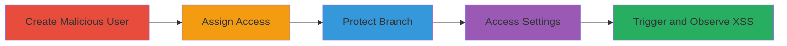

# Persistent XSS in GitLab Protected Branches via Malicious Username

Multi-stage attack chain demonstrating a complete attack workflow exploiting persistent XSS in GitLab.

## Chain Metrics Dashboard

| Metric | Value |
|--------|-------|
| Chain Status | Unverified |
| Total Steps | 5 |
| Execution Time | ~10 minutes |
| Skill Level | Intermediate |
| Complexity | Medium |
| Impact Level | High |

## Attack Flow Visualization

## Prerequisites & Requirements

### Required Tools

- None (web browser for UI interactions)

### Target Environment

- GitLab instance (self-hosted or SaaS)
- Project with repository access
- At least Developer or higher role for initial setup

### Initial Access Requirements

- Valid GitLab account
- Access to create users or invite members (Maintainer role)
- Network access to the GitLab web interface

## Detailed Attack Procedures

### Step 1: Create Malicious User
procedure: [[procedures/Create-Malicious-User-in-GitLab]]

**Objective**: Inject a malicious username containing an XSS payload that persists in the system.

**Instructions**: Log in to GitLab as an admin or user with permission to create accounts. Navigate to user creation and set the username to include the payload ` foo / bar`.

**Expected Output**: User account created with the malicious username stored in the database.

**Success Indicators**:
- User profile shows the injected username
- No immediate errors during creation

### Step 2: Assign Master Access
procedure: [[procedures/Assign-Master-Access-to-Project]]

**Objective**: Grant the malicious user sufficient privileges to appear in project role dropdowns.

**Instructions**: In the target project settings, add the malicious user and assign the Master role.

**Expected Output**: User listed with Master access in project members.

**Success Indicators**:
- Malicious user appears in project member list with Master role
- Permissions updated without issues

### Step 3: Protect Branch
procedure: [[procedures/Protect-Branch-in-GitLab-Project]]

**Objective**: Set up a protected branch to enable the vulnerable dropdown in settings.

**Instructions**: Go to project repository settings and configure a branch (e.g., main) as protected.

**Expected Output**: Branch marked as protected in repository settings.

**Success Indicators**:
- Protected branches section shows the configured branch
- Settings save successfully

### Step 4: Access Protected Branches Settings
procedure: [[procedures/Trigger-XSS-in-Protected-Branches-Dropdown]]

**Objective**: Navigate to the vulnerable UI component where the injected payload renders.

**Instructions**: As a project member with Master access, go to Project Settings > Repository > Protected Branches and interact with the 'Ability to Merge' dropdown.

**Expected Output**: Dropdown opens, rendering user options including the malicious one.

**Success Indicators**:
- Dropdown loads without errors
- Malicious username visible in the list

### Step 5: Observe Execution
procedure: [[procedures/Observe-JavaScript-Execution]]

**Objective**: Trigger and confirm arbitrary JavaScript execution from the payload.

**Instructions**: Select or hover over the dropdown option containing the malicious username to trigger the onerror event.

**Expected Output**: Alert box pops up showing the document domain, confirming XSS.

**Success Indicators**:
- JavaScript alert executes
- Potential for further payloads like session theft

## Attack Chain Summary

### Key Achievements

1. Persistent injection of XSS payload via username
2. Rendering of unescaped payload in protected branches UI
3. Arbitrary JavaScript execution for authenticated viewers

## Technique & Tactic Coverage

### MITRE ATT&CK Techniques

- [[JavaScript]]

### MITRE ATT&CK Tactics

- [[Execution]]
- [[Collection]]

---
*Last updated: 2023-10-01T00:00:00Z*
