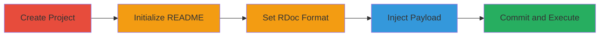

# Persistent XSS in GitLab README via RDoc Markup

Multi-stage attack chain demonstrating a complete attack workflow exploiting insufficient sanitization in GitLab's RDoc markup parser.

## Chain Metrics Dashboard

| Metric | Value |
|--------|-------|
| Chain Status | Unverified |
| Total Steps | 5 |
| Execution Time | ~5 minutes |
| Skill Level | Intermediate |
| Complexity | Medium |
| Impact Level | High |

## Attack Flow Visualization

## Prerequisites & Requirements

### Required Tools

- GitLab account with project creation privileges

### Target Environment

- GitLab instance (self-hosted or SaaS)
- Web browser for viewing rendered README
- No specific ports required beyond standard HTTPS (443)

### Initial Access Requirements

- Valid GitLab user credentials
- Ability to create and edit projects
- No prior network access beyond internet connectivity

## Detailed Attack Procedures

### Step 1: Create New GitLab Project
procedure: [[procedures/Create-GitLab-Project-and-Init-README]]

**Objective**: Establish a new repository to host the malicious README file.

**Instructions**: Log in to GitLab and use the project creation interface to set up a blank repository. This provides the foundation for injecting the payload.

**Expected Output**: A new empty project repository visible in the GitLab dashboard.

**Success Indicators**:
- Project created successfully
- Repository URL accessible

### Step 2: Initialize README File
procedure: [[procedures/Create-GitLab-Project-and-Init-README]]

**Objective**: Add an initial README file to the project to enable markup rendering.

**Instructions**: In the project repository, create a new file named README using the GitLab web editor. Add placeholder content if needed, then save.

**Expected Output**: README file committed and visible in the repository.

**Success Indicators**:
- File appears in the file list
- Basic rendering works without errors

### Step 3: Configure as RDoc Markup
procedure: [[procedures/Configure-README-as-RDoc]]

**Objective**: Rename the file to trigger RDoc parsing, which has the XSS vulnerability.

**Instructions**: Edit the file name in GitLab to README.rdoc. This extension forces GitLab to parse the content using the vulnerable RDoc markup processor.

**Expected Output**: File renamed and repository updated.

**Success Indicators**:
- File extension changed to .rdoc
- No parsing errors on save

### Step 4: Inject XSS Payload
procedure: [[procedures/Inject-XSS-Payload-in-README]]

**Objective**: Insert a crafted payload that generates an executable JavaScript link.

**Instructions**: Open the README.rdoc file in the GitLab editor and replace the content with the payload: `XSS[JaVaScriPt:alert(1)] <-- click to test`. Save the changes.

**Expected Output**: Payload committed to the file.

**Success Indicators**:
- Content updated without validation errors
- File preview shows the link text

### Step 5: Commit and Trigger Execution
procedure: [[procedures/Commit-and-Trigger-XSS]]

**Objective**: Finalize the changes and execute the payload by interacting with the rendered link.

**Instructions**: Commit the file via the GitLab interface. Navigate to the project overview to view the rendered README, then click the 'XSS' link to trigger the JavaScript alert.

**Expected Output**: Alert box pops up in the browser, confirming JavaScript execution.

**Success Indicators**:
- Commit successful
- JavaScript alert(1) executes on click
- Potential for more malicious payloads like session theft

## Attack Chain Summary

### Key Achievements

1. Successful creation of a vulnerable README.rdoc file in GitLab
2. Injection and rendering of executable JavaScript via RDoc markup
3. Demonstration of persistent XSS impacting any viewer of the project page

## Technique & Tactic Coverage

### MITRE ATT&CK Techniques

- [[JavaScript]]

### MITRE ATT&CK Tactics

- [[Execution]]

---
*Last updated: 2023-10-01T00:00:00Z*
