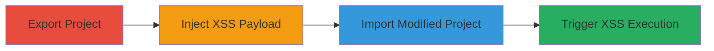

---
tags:
  - xss
  - stored-xss
  - persistent-xss
  - gitlab
  - web-vulnerability
type: attack_chain
tools:
  - '[[tools/GitLab]]'
  - '[[tools/Web-Browser]]'
tactics:
  - '[[Execution]]'
  - '[[Collection]]'
verified: false
platforms:
  - Web
  - GitLab
submitted: true
complexity: medium
created_at: '2023-10-01T00:00:00Z'
procedures:
  - '[[procedures/Export-GitLab-Project-with-Discussions]]'
  - '[[procedures/Inject-XSS-Payload-into-Project-JSON]]'
  - '[[procedures/Import-Modified-GitLab-Project]]'
  - '[[procedures/Trigger-XSS-in-Merge-Request-Discussion]]'
step_count: 4
techniques:
  - '[[JavaScript]]'
  - '[[Exploit Public-Facing Application]]'
updated_at: '2025-12-13T23:56:03.872Z'
description: >-
  A multi-stage attack exploiting persistent XSS in GitLab's Note objects by
  manipulating exported project JSON to inject malicious HTML, bypassing cache
  regeneration, and triggering execution in merge request discussions.
skill_level: intermediate
impact_level: high
id: c4e192de-bbce-444c-aeb9-6e756dfc5ea3
validated: true
mitre_tactics:
  - '[[Execution]]'
  - '[[Collection]]'
mitre_techniques:
  - '[[JavaScript]]'
  - '[[Exploit Public-Facing Application]]'
---
# Persistent XSS in GitLab via Manipulated Project Export and Import

Multi-stage attack chain demonstrating a complete attack workflow exploiting a persistent XSS vulnerability in GitLab's Note objects through project export, JSON manipulation, import, and execution in merge request discussions.

## Chain Metrics Dashboard

| Metric | Value |
|--------|-------|
| Chain Status | Unverified |
| Total Steps | 4 |
| Execution Time | ~15 minutes |
| Skill Level | Intermediate |
| Complexity | Medium |
| Impact Level | High |

## Attack Flow Visualization

## Prerequisites & Requirements

### Required Tools

- [[tools/GitLab]]
- [[tools/Web-Browser]]

### Target Environment

- GitLab instance (self-hosted or GitLab.com)
- Required services: GitLab Project Import/Export, Merge Requests
- Tech stack: Ruby on Rails
- Network access: Valid user account with project creation/import permissions

### Initial Access Requirements

- Authenticated GitLab account
- Ability to create and export projects
- No special privileges needed beyond standard user access

## Detailed Attack Procedures

### Step 1: Export Project with Discussions
procedure: [[procedures/Export-GitLab-Project-with-Discussions]]

**Objective**: Obtain the project.json file containing Note objects from a merge request discussion to prepare for manipulation.

**Instructions**: Log in to GitLab, create or select a project with at least one merge request containing discussions, and initiate the export process to download the archive including project.json.

**Expected Output**: Downloaded project export archive with project.json file.

**Success Indicators**:
- Export archive downloaded successfully
- project.json contains Note objects with note_html and cached_markdown_version fields

### Step 2: Inject XSS Payload into Project JSON
procedure: [[procedures/Inject-XSS-Payload-into-Project-JSON]]

**Objective**: Modify the exported project.json to insert a malicious XSS payload into the note_html field while setting cached_markdown_version to bypass cache invalidation.

**Instructions**: Extract the project.json from the archive, locate the Note object in the discussions array, add or overwrite the note_html field with an XSS payload such as `</img>`, and set cached_markdown_version to 917504. Save the modified JSON and repackage the archive if necessary.

**Expected Output**: Modified project.json with injected payload and bypassed cache version.

**Success Indicators**:
- note_html field contains the XSS payload
- cached_markdown_version set to 917504

### Step 3: Import Modified Project
procedure: [[procedures/Import-Modified-GitLab-Project]]

**Objective**: Upload the tampered project export to GitLab, allowing the Note objects to be processed without regenerating the note_html due to the cache bypass.

**Instructions**: In GitLab, navigate to a new project creation, select import from file, upload the modified export archive, and complete the import process.

**Expected Output**: Imported project with preserved malicious note_html in discussions.

**Success Indicators**:
- Import completes without errors
- Merge request discussions load with the injected note_html intact

### Step 4: Trigger XSS in Merge Request Discussion
procedure: [[procedures/Trigger-XSS-in-Merge-Request-Discussion]]

**Objective**: View the imported project's merge request discussion to execute the stored XSS payload in the victim's browser context.

**Instructions**: Access the imported project via a web browser, navigate to the merge request, and open the discussion thread to render the note_html, triggering the JavaScript execution.

**Expected Output**: Alert box displaying the document domain or other payload effects.

**Success Indicators**:
- JavaScript alert or payload executes
- Potential for session theft or further exploitation if viewed by other users

## Attack Chain Summary

### Key Achievements

1. Successful export and manipulation of GitLab project data to inject persistent XSS
2. Bypass of cache regeneration logic using controlled cached_markdown_version
3. Execution of arbitrary JavaScript in the context of any user viewing public project discussions
4. Demonstration of high-impact stored XSS leading to potential account takeover or data exfiltration

## Technique & Tactic Coverage

### MITRE ATT&CK Techniques

- [[JavaScript]]
- [[Exploit Public-Facing Application]]

### MITRE ATT&CK Tactics

- [[Execution]]
- [[Collection]]

---
*Last updated: 2023-10-01T00:00:00Z*
