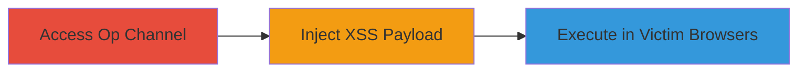

# Persistent XSS in IRCCloud via Malicious /ban Command

Multi-stage attack chain demonstrating exploitation of a persistent cross-site scripting (XSS) vulnerability in IRCCloud's IRC channel functionality, allowing channel operators to inject and execute malicious JavaScript in the browsers of all channel users.

## Chain Metrics Dashboard

| Metric | Value |
|--------|-------|
| Chain Status | Unverified |
| Total Steps | 3 |
| Execution Time | ~2 minutes |
| Skill Level | Intermediate |
| Complexity | Medium |
| Impact Level | High |

## Attack Flow Visualization



## Prerequisites & Requirements

### Required Tools

- None (uses built-in IRCCloud interface)

### Target Environment

- IRCCloud web application
- IRC channel with operator privileges
- Web browser for execution

### Initial Access Requirements

- Account with operator (op) privileges in an IRC channel on IRCCloud
- Access to the IRCCloud web interface

## Detailed Attack Procedures

### Step 1: Access a Channel with Operator Privileges

procedure: [[procedures/Inject-XSS-via-IRCCloud-ban-Command]]

**Objective**: Gain access to an IRC channel where the attacker holds operator (op) status to enable command injection.

**Instructions**: Log in to IRCCloud and navigate to the target IRC channel. Ensure the user has op privileges, which can be verified by checking the user list or channel modes.

**Expected Output**: Successful entry into the channel with op status displayed.

**Success Indicators**:
- Channel access confirmed
- Op privileges active (e.g., @ symbol next to username)

### Step 2: Inject Malicious /ban Command

procedure: [[procedures/Inject-XSS-via-IRCCloud-ban-Command]]

**Objective**: Inject a JavaScript payload disguised as a ban target via the /ban command, bypassing sanitization to persist the script in channel messages.

**Instructions**: In the channel input field, execute the malicious command using [[commands/irc-ban-xss-payload]]:

```irc
/ban <script>alert(2)</script>
```

This command is processed by IRCCloud, where the payload is rendered as HTML in the channel message history without proper escaping.

**Expected Output**: The command appears in the channel messages as a ban notice containing the unescaped script tag.

**Success Indicators**:
- Payload visible in channel messages
- No immediate error from IRCCloud

### Step 3: Observe Script Execution in Victim Browsers

procedure: [[procedures/Inject-XSS-via-IRCCloud-ban-Command]]

**Objective**: Confirm the persistent XSS by observing JavaScript execution when victims load or refresh the channel view.

**Instructions**: Have victims (other channel users) view the channel. The injected script executes automatically upon rendering of the message containing the payload.

**Expected Output**: An alert box displaying '2' pops up in each victim's browser.

**Success Indicators**:
- Alert triggered in victim browsers
- Potential for further payloads to steal sessions or log keystrokes

## Attack Chain Summary

### Key Achievements

1. Bypassed input sanitization in IRCCloud's /ban command processing
2. Achieved persistent JavaScript execution across all channel participants
3. Enabled client-side attacks like session hijacking or data theft

## Technique & Tactic Coverage

### MITRE ATT&CK Techniques

- [[Exploit Public-Facing Application]]
- [[JavaScript]]

### MITRE ATT&CK Tactics

- [[Initial Access]]
- [[Execution]]

---

*Last updated: 2023-10-01T12:00:00Z*
