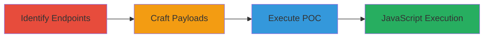

---
tags:
  - xss
  - persistent-xss
  - javascript
  - web-vulnerability
  - session-hijacking
type: attack_chain
tools: []
tactics:
  - '[[Execution]]'
  - '[[Collection]]'
commands: []
platforms:
  - Web
complexity: medium
procedures:
  - '[[procedures/identify-vulnerable-imgur-endpoints-for-xss]]'
  - '[[procedures/craft-malicious-payloads-for-imgur-r-parameter]]'
  - '[[procedures/execute-xss-proof-of-concept-on-imgur-gif-endpoints]]'
step_count: 3
techniques:
  - '[[JavaScript]]'
description: >-
  A multi-step attack exploiting a persistent XSS vulnerability in Imgur's GIF
  endpoints by injecting unsanitized JavaScript into the 'r' parameter, enabling
  arbitrary code execution and potential session hijacking.
skill_level: intermediate
impact_level: high
id: b1d38fa0-f84a-470d-a42d-72173a927205
created_at: '2025-12-14T03:15:26.999Z'
updated_at: '2025-12-14T03:15:26.999Z'
verified: false
validated: true
submitted: true
mitre_tactics:
  - '[[Execution]]'
  - '[[Collection]]'
mitre_techniques:
  - '[[JavaScript]]'
---
# Persistent XSS in Imgur Album and Image View Endpoints via 'r' Parameter

## Overview

This attack chain demonstrates a persistent cross-site scripting (XSS) vulnerability in Imgur's album and image view GIF endpoints (https://p.imgur.com/albumview.gif and http://p.imgur.com/imageview.gif). By manipulating the 'r' parameter with unsanitized HTML and JavaScript payloads via POST or GET requests, attackers can inject executable code. When victims view or embed the affected GIFs, the payload executes in their browser context, allowing actions like alerting messages, logging cookies, or stealing session data, which could lead to account takeover or data exfiltration. The chain involves identifying the endpoints, crafting payloads, and executing a proof-of-concept to confirm arbitrary JavaScript execution.

## Chain Metrics Dashboard

| Metric | Value |
|--------|-------|
| Chain Status | Unverified |
| Total Steps | 3 |
| Execution Time | ~5 minutes |
| Skill Level | Intermediate |
| Complexity | Medium |
| Impact Level | High |

## Attack Flow Visualization

## Prerequisites & Requirements

### Required Tools

- Web browser (e.g., Chrome Developer Tools for testing)
- Optional: [[tools/curl]] for request simulation

### Target Environment

- Web platform
- Access to Imgur's public endpoints (no authentication required)
- Network access to https://p.imgur.com and http://p.imgur.com

### Initial Access Requirements

- No credentials needed
- Public internet access
- Ability to craft and send HTTP requests

## Detailed Attack Procedures

### Step 1: Identify Vulnerable Endpoints
procedure: [[procedures/identify-vulnerable-imgur-endpoints-for-xss]]

**Objective**: Examine Imgur's GIF endpoints to identify parameters that accept user input without sanitization, focusing on potential XSS entry points.

**Instructions**: Review the endpoints https://p.imgur.com/albumview.gif and http://p.imgur.com/imageview.gif. Note that they process parameters like 'a' (album ID) and 'r' (referrer or redirect URL) via GET or POST. Use a browser or request tool to inspect responses and confirm parameter handling.

**Expected Output**: Confirmation that 'r' parameter is reflected in responses without escaping.

**Success Indicators**:
- Endpoints accept 'r' parameter
- Input in 'r' appears unescaped in HTML output

### Step 2: Craft Malicious Payloads
procedure: [[procedures/craft-malicious-payloads-for-imgur-r-parameter]]

**Objective**: Develop JavaScript payloads to inject into the 'r' parameter, testing for execution without sanitization.

**Instructions**: Create payloads like `` or ``. Encode if necessary for URL safety, but test direct injection. Simulate requests to the endpoints with these payloads in 'r'.

**Expected Output**: Payload reflected in response as executable HTML/JS.

**Success Indicators**:
- Payload appears in page source unescaped
- Basic test (e.g., alert) triggers on access

### Step 3: Execute Proof-of-Concept
procedure: [[procedures/execute-xss-proof-of-concept-on-imgur-gif-endpoints]]

**Objective**: Trigger the XSS by accessing crafted URLs or sending requests, demonstrating code execution and potential impacts like cookie theft.

**Instructions**: Construct and access URLs such as `https://p.imgur.com/albumview.gif?a=F78FO&r=https://community.imgur.com/`. For POST, use a tool to send the payload. Observe execution in the browser console or via alerts.

**Expected Output**: JavaScript executes, showing alert or console log with cookies.

**Success Indicators**:
- Alert pops up or console logs data
- Cookies or session info accessible via payload

## Attack Chain Summary

### Key Achievements

1. Identified unsanitized 'r' parameter in Imgur GIF endpoints
2. Injected and executed arbitrary JavaScript payloads
3. Demonstrated potential for session hijacking and data theft

## Technique & Tactic Coverage

### MITRE ATT&CK Techniques

- [[JavaScript]]

### MITRE ATT&CK Tactics

- [[Execution]]
- [[Collection]]

---
*Last updated: 2023-10-01*
