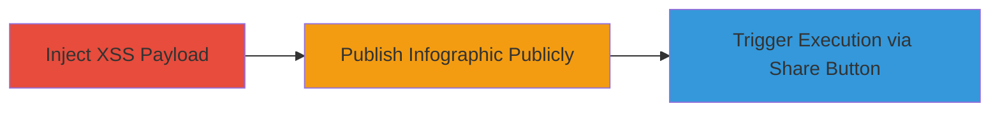

---
tags:
  - xss
  - persistent-xss
  - infogram
  - javascript-execution
  - client-side-attack
type: attack_chain
tools: []
tactics:
  - '[[Execution]]'
verified: false
platforms:
  - Web
submitted: true
complexity: medium
created_at: '2023-10-01T00:00:00Z'
procedures:
  - '[[procedures/Inject-XSS-Payload-in-Infogram-Custom-Link-Field]]'
  - '[[procedures/Publish-Infogram-with-XSS-Payload]]'
  - '[[procedures/Trigger-XSS-via-Public-Infographic-Share-Button]]'
step_count: 3
techniques:
  - '[[JavaScript]]'
updated_at: '2025-12-14T03:16:14.233Z'
description: >-
  A multi-step attack exploiting a persistent XSS vulnerability in the custom
  link field of Infogram's Share button, allowing arbitrary JavaScript execution
  on visitors' browsers.
skill_level: intermediate
impact_level: high
id: 50857157-1850-4923-9cd1-eca9d8dc5b56
validated: true
mitre_tactics:
  - '[[Execution]]'
mitre_techniques:
  - '[[JavaScript]]'
---
# Persistent XSS in Infogram Share Button for Arbitrary JavaScript Execution

Multi-stage attack chain demonstrating a complete attack workflow exploiting a persistent cross-site scripting (XSS) vulnerability in Infogram infographics.

## Chain Metrics Dashboard

| Metric | Value |
|--------|-------|
| Chain Status | Unverified |
| Total Steps | 3 |
| Execution Time | ~5 minutes |
| Skill Level | Intermediate |
| Complexity | Medium |
| Impact Level | High |

## Attack Flow Visualization

## Prerequisites & Requirements

### Required Tools

- None (manual interaction via web browser)

### Target Environment

- Infogram platform (web-based infographic creation tool)
- Access to create and edit infographics
- Public sharing capability

### Initial Access Requirements

- Valid Infogram account with permissions to create infographics
- No special network position required; standard internet access
- Prior access to the Infogram dashboard

## Detailed Attack Procedures

### Step 1: Inject XSS Payload
procedure: [[procedures/Inject-XSS-Payload-in-Infogram-Custom-Link-Field]]

**Objective**: Introduce a malicious JavaScript payload into the custom link field of the Share button to establish persistence.

**Instructions**: Access the Infogram editor, navigate to the Share button settings, and append the XSS payload to the custom link field. The payload breaks out of the attribute context and injects an SVG element that executes JavaScript on load.

**Expected Output**: The custom link field accepts the payload without validation errors, storing it for later rendering.

**Success Indicators**:
- Payload successfully saved in the infographic configuration
- No immediate errors during editing

### Step 2: Publish Infographic Publicly
procedure: [[procedures/Publish-Infogram-with-XSS-Payload]]

**Objective**: Make the infographic accessible to the public, embedding the unsanitized payload in the shared content.

**Instructions**: From the Infogram dashboard, select the option to share the infographic publicly, generating a public URL. Ensure the Share button with the custom link is included in the public view.

**Expected Output**: A public URL is generated, and the infographic is live without triggering the payload during preview.

**Success Indicators**:
- Public URL accessible without authentication
- Infographic loads correctly in public mode

### Step 3: Trigger XSS Execution
procedure: [[procedures/Trigger-XSS-via-Public-Infographic-Share-Button]]

**Objective**: Execute the injected payload in a victim's browser by simulating user interaction with the Share button.

**Instructions**: Visit the public infographic URL in a browser, then click the Share button. This renders the custom link field, executing the payload and displaying a confirm dialog with the document domain.

**Expected Output**: A browser confirm dialog pops up showing the domain, confirming JavaScript execution.

**Success Indicators**:
- Confirm dialog appears on Share button click
- Arbitrary JavaScript runs in the victim's browser context

## Attack Chain Summary

### Key Achievements

1. Successful injection of persistent XSS payload without detection during editing
2. Public exposure of the vulnerable infographic to arbitrary visitors
3. Arbitrary JavaScript execution enabling session hijacking or data theft

## Technique & Tactic Coverage

### MITRE ATT&CK Techniques

- [[JavaScript]]

### MITRE ATT&CK Tactics

- [[Execution]]

---
*Last updated: 2023-10-01T00:00:00Z*
