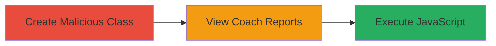

# Persistent XSS in Khan Academy Class Creation Leading to JavaScript Execution

Multi-stage attack chain demonstrating a complete attack workflow exploiting persistent XSS in Khan Academy's class management system.

## Chain Metrics Dashboard

| Metric | Value |
|--------|-------|
| Chain Status | Unverified |
| Total Steps | 2 |
| Execution Time | ~5 minutes |
| Skill Level | Intermediate |
| Complexity | Medium |
| Impact Level | High |

## Attack Flow Visualization

## Prerequisites & Requirements

### Required Tools

- Web browser (e.g., Chrome with developer tools)

### Target Environment

- Khan Academy web application
- Access to class creation feature (requires user account)
- Coach reports page access (https://www.khanacademy.org/coach/reports/grid?force=1)

### Initial Access Requirements

- Valid Khan Academy account with permissions to create classes
- Network access to Khan Academy domain
- No prior elevated access needed, but coach role enhances impact

## Detailed Attack Procedures

### Step 1: Create Malicious Class
procedure: [[procedures/Create-Malicious-Class-Name-for-XSS]]

**Objective**: Inject a malicious payload into a class name to persist XSS across sessions and pages.

**Instructions**: Log in to Khan Academy, navigate to the class creation interface, and enter the payload `'</script>">` as the class name. Save the class to persist the input.

**Expected Output**: Class created successfully without errors, payload stored in the backend.

**Success Indicators**:
- Class appears in the user's dashboard
- No immediate JavaScript errors during creation

### Step 2: Trigger XSS on Coach Reports
procedure: [[procedures/Trigger-XSS-on-Coach-Reports-Page]]

**Objective**: Render the malicious class in the coach reports grid to execute the injected JavaScript.

**Instructions**: Navigate to the coach reports page at https://www.khanacademy.org/coach/reports/grid?force=1. The payload will break out of any containing script tag and execute, triggering an alert dialog.

**Expected Output**: Alert box with `0` displayed, confirming JavaScript execution.

**Success Indicators**:
- Alert(0) pops up on page load
- Inspect element shows the payload rendered unsanitized in HTML/JSON contexts

## Attack Chain Summary

### Key Achievements

1. Persistent storage of XSS payload via class name input
2. Arbitrary JavaScript execution on victim viewers of reports
3. Potential for session hijacking or data exfiltration from affected users

## Technique & Tactic Coverage

### MITRE ATT&CK Techniques

- [[JavaScript]]

### MITRE ATT&CK Tactics

- [[Execution]]
- [[Collection]]

---
*Last updated: 2023-10-01T00:00:00Z*
