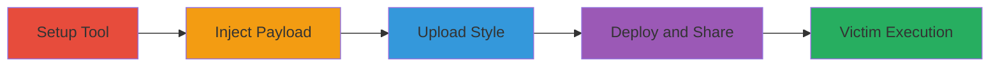

---
tags:
  - xss
  - persistent-xss
  - mapbox
  - javascript-injection
  - session-hijacking
type: attack_chain
tools:
  - '[[tools/Mapbox-Studio-Classic]]'
tactics:
  - '[[Initial Access]]'
  - '[[Execution]]'
  - '[[Collection]]'
verified: false
platforms:
  - Web
submitted: true
created_at: '2023-10-01T00:00:00Z'
procedures:
  - '[[procedures/Setup-Mapbox-Studio-Classic]]'
  - '[[procedures/Inject-XSS-into-Map-Attribution]]'
  - '[[procedures/Upload-Malicious-Style-to-Mapbox]]'
  - '[[procedures/Create-and-Share-Malicious-Map-Project]]'
step_count: 4
techniques:
  - '[[JavaScript]]'
  - '[[LLMNR-NBT-NS Poisoning and SMB Relay]]'
updated_at: '2025-12-14T03:16:30.293Z'
description: >-
  A multi-stage attack exploiting persistent XSS in Mapbox's map attribution
  control to inject JavaScript payloads via custom styles, leading to session
  hijacking and cookie theft on mapbox.com.
id: 06955b83-7eaa-49bb-ac2b-02eb444d6bfa
validated: true
mitre_tactics:
  - '[[Initial Access]]'
  - '[[Execution]]'
  - '[[Collection]]'
mitre_techniques:
  - '[[JavaScript]]'
  - '[[LLMNR-NBT-NS Poisoning and SMB Relay]]'
---
---

# Persistent XSS in Mapbox Map Attribution for Session Hijacking

Multi-stage attack chain demonstrating a complete attack workflow exploiting a persistent XSS vulnerability in Mapbox.js maps via user-controlled attribution in custom styles.

## Chain Metrics Dashboard

| Metric | Value |
|--------|-------|
| Chain Status | Unverified |
| Total Steps | 4 |
| Execution Time | ~15 minutes |
| Skill Level | Intermediate |
| Complexity | Medium |
| Impact Level | High |

## Attack Flow Visualization

## Prerequisites & Requirements

### Required Tools

- [[tools/Mapbox-Studio-Classic]]

### Target Environment

- Web platform with access to Mapbox.com
- Mapbox account credentials
- Network access to https://www.mapbox.com/

### Initial Access Requirements

- Valid Mapbox account
- No special privileges required beyond standard user access
- Victim must visit shared project URL while logged into Mapbox.com

## Detailed Attack Procedures

### Step 1: Setup Mapbox Studio

procedure: [[procedures/Setup-Mapbox-Studio-Classic]]

**Objective**: Install and launch the Mapbox Studio Classic application to prepare for creating a custom map style.

**Instructions**: Download the Mapbox Studio Classic desktop application from the official website. Launch the application and create a new style project with a random name and description to begin editing.

**Expected Output**: A new style project opened in the Mapbox Studio interface, ready for modifications.

**Success Indicators**:
- Application installed successfully
- New style project initiated without errors

### Step 2: Inject XSS Payload

procedure: [[procedures/Inject-XSS-into-Map-Attribution]]

**Objective**: Embed a malicious JavaScript payload into the map attribution field to enable persistent XSS execution.

**Instructions**: In the style editor, navigate to the attribution control and insert the XSS payload `'>` into the attribution value field. This payload will be injected into the TileJSON attribution property without sanitization.

**Expected Output**: The attribution field updated with the payload, visible in the style preview.

**Success Indicators**:
- Payload entered without validation errors
- Style preview shows the modified attribution

### Step 3: Upload Malicious Style

procedure: [[procedures/Upload-Malicious-Style-to-Mapbox]]

**Objective**: Save the modified style and upload it to the attacker's Mapbox account for persistence.

**Instructions**: Save the changes in Mapbox Studio Classic, then upload the project directly to your Mapbox account via the application's upload feature. Close the application once the upload completes.

**Expected Output**: Confirmation of successful upload, with the style now listed in your Mapbox.com styles section.

**Success Indicators**:
- Upload completes without errors
- Style appears in the online Mapbox dashboard

### Step 4: Create and Share Project

procedure: [[procedures/Create-and-Share-Malicious-Map-Project]]

**Objective**: Create a new project using the malicious style and generate a shareable URL to trigger XSS on victims.

**Instructions**: Log into Mapbox.com, navigate to the Styles section, select the uploaded malicious style, and click 'New project'. Configure basic project parameters (e.g., default view), save the project, then access the project list at https://www.mapbox.com/projects/ and share the project URL (e.g., https://api.tiles.mapbox.com/v4/pr0ph3t.lkag551j/page.html?access_token=pk.eyJ1IjoicHIwcGgzdCIsImEiOiJuRlQ1RDk0In0.qWRU_9DCEAMsAYIEpNTpnw#3/0.00/0.00). Victims execute the XSS upon accessing the URL while logged in.

**Expected Output**: Shareable project URL generated, and upon testing, the payload executes (e.g., alert showing cookies).

**Success Indicators**:
- Project created and saved successfully
- URL access triggers JavaScript execution in the browser
- Cookies or session data accessible via payload

## Attack Chain Summary

### Key Achievements

1. Successful injection of persistent XSS payload into Mapbox custom style attribution
2. Upload and deployment of malicious style via Mapbox.com project
3. Session hijacking capability on victim browsers, including cookie theft
4. Potential compromise of third-party sites using the malicious TileJSON source with Mapbox.js

## Technique & Tactic Coverage

### MITRE ATT&CK Techniques

- [[JavaScript]]
- [[LLMNR-NBT-NS Poisoning and SMB Relay]]

### MITRE ATT&CK Tactics

- [[Initial Access]]
- [[Execution]]
- [[Collection]]

---

*Last updated: 2023-10-01T00:00:00Z*
