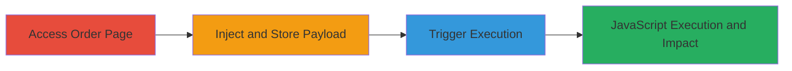

# Persistent XSS in MoPub Advertiser Field Leading to Arbitrary JavaScript Execution

Multi-stage attack chain demonstrating exploitation of a persistent cross-site scripting (XSS) vulnerability on mopub.com's order page, enabling arbitrary JavaScript execution in victims' browsers for potential session hijacking, data theft, or other client-side attacks.

## Chain Metrics Dashboard

| Metric | Value |
|--------|-------|
| Chain Status | Unverified |
| Total Steps | 3 |
| Execution Time | ~5 minutes |
| Skill Level | Intermediate |
| Complexity | Medium |
| Impact Level | High |

## Attack Flow Visualization

## Prerequisites & Requirements

### Required Tools

- Web browser (e.g., Chrome with developer tools for payload testing)

### Target Environment

- Web platform
- Access to mopub.com order creation interface (requires authenticated session as advertiser or admin)
- No specific ports or services beyond standard HTTPS (443)

### Initial Access Requirements

- Valid authenticated session on mopub.com
- Network access to the internet
- No prior access needed beyond login credentials

## Detailed Attack Procedures

### Step 1: Navigate to Order Page
procedure: [[procedures/Exploit-Persistent-XSS-in-Advertiser-Field]]

**Objective**: Gain access to the vulnerable order creation or management interface to prepare for payload injection.

**Instructions**: Open a web browser and log in to your MoPub account. Navigate to the order creation or editing page on mopub.com, where the advertiser input field is available.

**Expected Output**: The order page loads, displaying the advertiser input field ready for data entry.

**Success Indicators**:
- Order page accessible without errors
- Advertiser field visible and editable

### Step 2: Inject and Store Malicious Payload
procedure: [[procedures/Exploit-Persistent-XSS-in-Advertiser-Field]]

**Objective**: Inject a malicious JavaScript payload into the advertiser field and persist it by saving the order, exploiting insufficient sanitization.

**Instructions**: In the advertiser input field, enter the payload `>`. This payload breaks out of any expected HTML context using the closing tag `>`, followed by an image tag that triggers JavaScript on error. Save the order or form to store the payload persistently in the backend.

**Expected Output**: The order saves successfully without immediate errors, and the payload is stored for later retrieval.

**Success Indicators**:
- Order saved confirmation
- No validation errors on input

### Step 3: Trigger Payload Execution
procedure: [[procedures/Exploit-Persistent-XSS-in-Advertiser-Field]]

**Objective**: Retrieve the stored order and trigger the XSS by manually closing the HTML tag and blurring the field, leading to arbitrary JavaScript execution.

**Instructions**: Return to the order page or edit the affected order. In the advertiser field, which now displays the stored payload, manually type a closing angle bracket `>` to complete the tag breakout. Then, press the Tab key to focus out of the field, causing the browser to re-render and execute the JavaScript payload.

**Expected Output**: A browser prompt appears displaying the document domain (e.g., "mopub.com"), confirming JavaScript execution.

**Success Indicators**:
- Alert or prompt box executes
- JavaScript runs in the context of the authenticated session

## Attack Chain Summary

### Key Achievements

1. Successful storage of unsanitized HTML/JavaScript in the advertiser field
2. Triggering of persistent XSS via user interaction (tabbing out)
3. Demonstration of arbitrary code execution, enabling further attacks like session theft

## Technique & Tactic Coverage

### MITRE ATT&CK Techniques

- [[JavaScript]]

### MITRE ATT&CK Tactics

- [[Execution]]

---
*Last updated: 2023-10-01T00:00:00Z*
