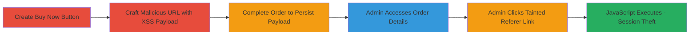

---
tags:
  - xss
  - persistent-xss
  - shopify
  - admin-takeover
  - javascript-execution
type: attack_chain
tools:
  - '[[tools/Custom-JavaScript-Exploit-Script]]'
tactics:
  - '[[Initial Access]]'
  - '[[Execution]]'
  - '[[Collection]]'
verified: false
platforms:
  - Web
  - Shopify
submitted: true
created_at: '2023-10-01T00:00:00Z'
procedures:
  - '[[procedures/Create-Malicious-Buy-Now-Button-in-Shopify]]'
  - '[[procedures/Craft-and-Submit-Order-with-XSS-Payload]]'
  - '[[procedures/Trigger-XSS-Execution-in-Admin-Panel]]'
step_count: 5
techniques:
  - '[[JavaScript]]'
  - '[[Exploit Public-Facing Application]]'
updated_at: '2025-12-14T03:15:52.880Z'
description: >-
  A multi-stage attack exploiting a persistent XSS vulnerability in Shopify's
  buy now button referer parameter to execute JavaScript in an admin's browser,
  enabling session theft and shop takeover.
id: 60b340ce-cb9c-43d5-9987-26d978469fd7
validated: true
mitre_tactics:
  - '[[Initial Access]]'
  - '[[Execution]]'
  - '[[Collection]]'
mitre_techniques:
  - '[[JavaScript]]'
  - '[[Exploit Public-Facing Application]]'
---
# Persistent XSS in Shopify Buy Now Button Leading to Admin Takeover

Multi-stage attack chain demonstrating a complete attack workflow exploiting unsanitized referer parameters in Shopify's buy now button to achieve persistent XSS and admin session theft.

## Chain Metrics Dashboard

| Metric | Value |
|--------|-------|
| Chain Status | Unverified |
| Total Steps | 5 |
| Execution Time | ~10 minutes |
| Skill Level | Intermediate |
| Complexity | Medium |
| Impact Level | High |

## Attack Flow Visualization

## Prerequisites & Requirements

### Required Tools

- [[tools/Custom-JavaScript-Exploit-Script]]

### Target Environment

- Shopify-hosted online store
- Access to create products or buttons as a customer (no admin access needed initially)
- Admin panel for the target shop

### Initial Access Requirements

- Ability to interact with the shop's frontend (e.g., as a customer)
- Valid payment method to complete a test order (can be refunded)
- No prior admin credentials required; targets admins via social engineering or waiting for access

## Detailed Attack Procedures

### Step 1: Create Buy Now Button
procedure: [[procedures/Create-Malicious-Buy-Now-Button-in-Shopify]]

**Objective**: Set up a buy now button in the target Shopify shop to generate the vulnerable cart redirect URL.

**Instructions**: Use the Shopify store interface to add a product and enable the buy now button feature. This generates a URL like `https://example.myshopify.com/products/product-name?buy_now=1` that redirects to the cart upon clicking.

**Expected Output**: A functional buy now button on the product page.

**Success Indicators**:
- Button appears on the product page
- Clicking redirects to cart URL with referer parameter

### Step 2: Craft Malicious URL with XSS Payload
procedure: [[procedures/Craft-and-Submit-Order-with-XSS-Payload]]

**Objective**: Modify the referer parameter in the cart URL to inject a JavaScript payload, then initiate the order.

**Instructions**: Intercept or manually construct the cart URL, e.g., `https://example.myshopify.com/cart/1234567890:1?channel=buy_button&referer=javascript:alert(document.cookie)`. Replace the payload with a more advanced one using [[tools/Custom-JavaScript-Exploit-Script]] for session theft.

**Expected Output**: Modified URL ready for checkout.

**Success Indicators**:
- URL includes the javascript: scheme without errors
- Payload is accepted in the referer field

### Step 3: Complete Order to Persist Payload
procedure: [[procedures/Craft-and-Submit-Order-with-XSS-Payload]]

**Objective**: Finalize the checkout process to store the tainted referer in the shop's order database.

**Instructions**: Proceed through Shopify's checkout flow using the malicious URL, providing necessary details to complete the purchase. The referer parameter is saved with the order.

**Expected Output**: Order confirmation; payload persisted server-side.

**Success Indicators**:
- Order completes successfully
- No validation errors on referer

### Step 4: Admin Accesses Order Details

**Objective**: Wait for or induce an admin to view the order in the dashboard.

**Instructions**: As the attacker, monitor or notify the shop owner about the order. The admin logs into `https://admin.shopify.com/store/example` and navigates to Orders.

**Expected Output**: Order appears in admin panel with referer as a clickable link.

**Success Indicators**:
- Admin views the specific order
- Referer displays as hyperlink

### Step 5: Trigger XSS Execution
procedure: [[procedures/Trigger-XSS-Execution-in-Admin-Panel]]

**Objective**: Execute the stored JavaScript payload in the admin's browser context for arbitrary code execution.

**Instructions**: The admin clicks the referer link in the order details, triggering the javascript: URI. This executes the payload, e.g., stealing cookies or sessions via the custom script.

**Expected Output**: Alert or script execution; potential session hijack.

**Success Indicators**:
- JavaScript runs in admin's session
- Cookies or tokens exfiltrated

## Attack Chain Summary

### Key Achievements

1. Persistent storage of XSS payload via order referer
2. Execution in high-privilege admin context
3. Full shop takeover through session theft

## Technique & Tactic Coverage

### MITRE ATT&CK Techniques

- [[JavaScript]]
- [[Exploit Public-Facing Application]]

### MITRE ATT&CK Tactics

- [[Initial Access]]
- [[Execution]]
- [[Collection]]

---
*Last updated: 2023-10-01T00:00:00Z*
