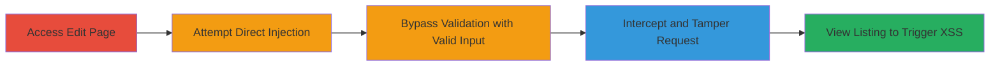

# Persistent XSS in SoundCloud Link Field via Client-Side Validation Bypass

Multi-stage attack chain demonstrating a complete workflow to exploit a persistent cross-site scripting (XSS) vulnerability in the SoundCloud link field of Reverb.com's product listings on their sandbox environment. The attack bypasses client-side validation by tampering with HTTP requests, stores a malicious payload, and executes JavaScript when victims view the listing, potentially leading to store defacement, denial of service, or unauthorized actions.

## Chain Metrics Dashboard

| Metric | Value |
|--------|-------|
| Chain Status | Unverified |
| Total Steps | 4 |
| Execution Time | ~5 minutes |
| Skill Level | Intermediate |
| Complexity | Medium |
| Impact Level | High |

## Attack Flow Visualization

## Prerequisites & Requirements

### Required Tools

- [[tools/Burp-Suite]]

### Target Environment

- Web platform (Reverb.com sandbox)
- Required services: HTTP/HTTPS
- Network access: Direct access to listing edit endpoint

### Initial Access Requirements

- Authenticated access to Reverb.com sandbox as a listing owner
- Network position: Able to intercept traffic (e.g., via proxy)
- Prior access: Existing product listing ID

## Detailed Attack Procedures

### Step 1: Access Edit Page and Attempt Direct Payload Injection
procedure: [[procedures/Bypass-Client-Side-Validation-for-XSS-Injection]]

**Objective**: Navigate to the listing edit page and test direct injection of a malicious payload into the SoundCloud link field to identify client-side validation.

**Instructions**: Open a browser and log in to the Reverb.com sandbox. Navigate to the edit page for an existing listing using the URL format `https://sandbox.reverb.com/listings/[YOUR_LISTING_ID]/edit`. Locate the SoundCloud link field and attempt to input the payload `https://soundcloud.com/rich-the-kid/sets/the-world-is-yours-15?fuzzing" onload=alert(document.domain) x="`. This will trigger a client-side validation error, confirming the restriction on invalid URLs.

**Expected Output**: Client-side error message preventing submission, such as a validation warning for invalid URL format.

**Success Indicators**:
- Validation error displayed
- Payload not accepted directly

### Step 2: Enter Valid SoundCloud Link to Pass Validation
procedure: [[procedures/Bypass-Client-Side-Validation-for-XSS-Injection]]

**Objective**: Input a legitimate SoundCloud URL to satisfy client-side checks and prepare for request interception.

**Instructions**: In the same SoundCloud link field, replace the payload with a valid URL like `https://soundcloud.com/rich-the-kid/sets/the-world-is-yours-15`. This should not trigger any validation errors, allowing the form to proceed to submission.

**Expected Output**: No error messages; form fields appear valid.

**Success Indicators**:
- Valid URL accepted without errors
- Form ready for submission

### Step 3: Intercept and Tamper with Save Request
procedure: [[procedures/Bypass-Client-Side-Validation-for-XSS-Injection]]

**Objective**: Use a proxy tool to capture the submission request and modify the SoundCloud link parameter to inject the malicious payload, bypassing server-side checks.

**Instructions**: Configure [[tools/Burp-Suite]] as a proxy for your browser traffic. Click 'Save & Review Listing' to submit the form. In Burp Suite's Proxy or Repeater tab, intercept the HTTP POST request to the listing update endpoint. Locate the parameter `_product[soundcloud_link_attributes][link]` and modify its value to the malicious payload `https://soundcloud.com/rich-the-kid/sets/the-world-is-yours-15?fuzzing" onload=alert(document.domain) x="`. Forward the modified request to complete the update.

**Expected Output**: Server accepts the request (HTTP 200 or redirect), and the listing is updated with the tampered payload stored persistently.

**Success Indicators**:
- Request forwarded successfully without server rejection
- Listing saved; no encoding applied to payload

### Step 4: View Listing Page to Trigger XSS
procedure: [[procedures/Bypass-Client-Side-Validation-for-XSS-Injection]]

**Objective**: Access the updated listing to execute the injected JavaScript payload on the client-side when rendered.

**Instructions**: Navigate to the listing view URL, such as `https://sandbox.reverb.com/item/[LISTING_ID]`. The SoundCloud link field will render the payload, triggering the `onload=alert(document.domain)` JavaScript, which executes an alert box displaying the document domain.

**Expected Output**: Alert popup with the domain (e.g., 'sandbox.reverb.com'), confirming arbitrary JavaScript execution.

**Success Indicators**:
- JavaScript alert triggered
- Potential for further exploitation like defacement or data theft

## Attack Chain Summary

### Key Achievements

1. Bypassed client-side URL validation through request tampering
2. Achieved persistent storage of XSS payload without server-side sanitization
3. Demonstrated arbitrary JavaScript execution on victim browsers, enabling high-impact attacks like store defacement or session hijacking

## Technique & Tactic Coverage

### MITRE ATT&CK Techniques

- [[JavaScript]]
- [[Exploit Public-Facing Application]]

### MITRE ATT&CK Tactics

- [[Execution]]
- [[Collection]]

---
*Last updated: 2023-10-01T00:00:00Z*
