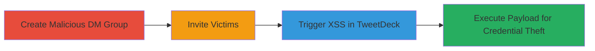

# Persistent XSS in TweetDeck via Malicious Twitter DM Group Names

Multi-stage attack chain demonstrating a complete attack workflow exploiting a persistent XSS vulnerability in TweetDeck through unsanitized Twitter DM group names.

## Chain Metrics Dashboard

| Metric | Value |
|--------|-------|
| Chain Status | Unverified |
| Total Steps | 3 |
| Execution Time | ~5 minutes |
| Skill Level | Intermediate |
| Complexity | Medium |
| Impact Level | High |

## Attack Flow Visualization

## Prerequisites & Requirements

### Required Tools

- None (uses native Twitter web interface)

### Target Environment

- Twitter.com for DM group creation
- TweetDeck (tweetdeck.twitter.com) for payload execution
- Web browser (affects all modern browsers: Chrome, Firefox, Safari, Edge)

### Initial Access Requirements

- Valid Twitter account with DM capabilities
- Ability to create and manage DM groups
- No special privileges needed beyond standard user access

## Detailed Attack Procedures

### Step 1: Create Malicious DM Group
procedure: [[procedures/Create-Malicious-Twitter-DM-Group-with-XSS-Payload]]

**Objective**: Set up a Twitter DM group with an XSS payload in the name to bypass sanitization and enable persistent script execution.

**Instructions**: Log into twitter.com and navigate to the DM section. Create a new group DM, limiting the name to 9 characters due to restrictions. Use a payload like `hi` to close any existing tags, then a second group `<script>alert(1);//` to open and execute the script.

**Expected Output**: Successful group creation with the malicious name stored on Twitter's backend.

**Success Indicators**:
- Group DM created without errors
- Name reflects the payload when viewed in DM list

### Step 2: Invite Victims
procedure: [[procedures/Invite-Victims-to-Malicious-DM-Group]]

**Objective**: Add targeted users to the malicious DM group to expose them to the XSS payload.

**Instructions**: From the group DM interface on twitter.com, use the invite feature to add 100-200 victims. Any group member can invite others via the Twitter DM features; send direct invites or share the group link if applicable.

**Expected Output**: Victims receive invitation notifications and can join the group.

**Success Indicators**:
- Invitations sent successfully
- Victims join the group (confirm via group member list)

### Step 3: Trigger XSS Execution
procedure: [[procedures/Trigger-XSS-Execution-in-TweetDeck]]

**Objective**: Cause the payload to execute in victims' browsers when they load TweetDeck, leading to arbitrary JavaScript execution.

**Instructions**: Victims must log into https://tweetdeck.twitter.com/. Upon loading, TweetDeck fetches and renders the unsanitized DM group name from Twitter's API, executing the JavaScript payload (e.g., `alert(1)`) in the browser context. The attacker can craft payloads for keylogging during password entry for account additions or to perform actions like sending tweets/DMs.

**Expected Output**: JavaScript alert or other payload effects visible in the victim's browser.

**Success Indicators**:
- Payload executes (e.g., alert pops up)
- Attacker observes effects like stolen credentials or unauthorized actions

## Attack Chain Summary

### Key Achievements

1. Bypassed 9-character limit using multi-stage payloads to inject executable script tags.
2. Persistently stored XSS via Twitter DM groups, affecting multiple victims.
3. Enabled high-impact actions like password theft and account manipulation in TweetDeck.

## Technique & Tactic Coverage

### MITRE ATT&CK Techniques

- [[Exploit Public-Facing Application]]
- [[JavaScript]]

### MITRE ATT&CK Tactics

- [[Initial Access]]
- [[Execution]]
- [[Credential Access]]

---
*Last updated: 2023-10-01T00:00:00Z*
