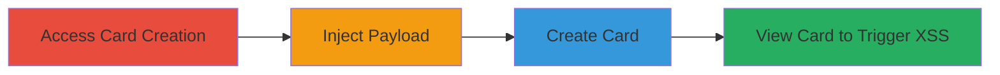

# Persistent XSS in Twitter Ads Card Creation via card[name] Parameter

Multi-stage attack chain demonstrating exploitation of a persistent Cross-Site Scripting (XSS) vulnerability in the Twitter Ads platform's card creation feature.

## Chain Metrics Dashboard

| Metric | Value |
|--------|-------|
| Chain Status | Unverified |
| Total Steps | 4 |
| Execution Time | ~5 minutes |
| Skill Level | Intermediate |
| Complexity | Medium |
| Impact Level | High |

## Attack Flow Visualization

## Prerequisites & Requirements

### Required Tools

- Web browser with developer tools (e.g., Chrome DevTools for payload testing)

### Target Environment

- Twitter Ads platform (ads.twitter.com)
- Authenticated access to an ads account

### Initial Access Requirements

- Valid Twitter Ads account credentials
- Network access to ads.twitter.com
- No prior access beyond authentication needed

## Detailed Attack Procedures

### Step 1: Access Card Creation Page
procedure: [[procedures/Access-Twitter-Ads-Card-Creation]]

**Objective**: Navigate to the card creation endpoint to prepare for payload injection.

**Instructions**: Open a web browser and log in to the Twitter Ads dashboard. Manually navigate to the card creation URL for the specific card type.

**Expected Output**: The card creation form loads, displaying fields including card[name].

**Success Indicators**:
- Card creation page accessible without errors
- Form fields visible and editable

### Step 2: Inject XSS Payload into Card Name
procedure: [[procedures/Inject-XSS-Payload-into-Card-Name]]

**Objective**: Insert a malicious JavaScript payload into the card[name] parameter to break out of HTML context and execute code.

**Instructions**: In the card[name] input field, enter the payload `</title><title>`. This payload closes the existing title tag, injects a script, and reopens the title to avoid breaking the page structure.

**Expected Output**: Payload accepted without immediate error or sanitization.

**Success Indicators**:
- Payload entered successfully in the form
- No client-side validation blocks the input

### Step 3: Create Persistent Malicious Card
procedure: [[procedures/Create-Persistent-Malicious-Card]]

**Objective**: Submit the form to store the injected payload persistently in the backend.

**Instructions**: Fill any remaining required fields in the card creation form and submit it to complete the creation process.

**Expected Output**: Confirmation of card creation, with the malicious card saved and assigned a URL ID.

**Success Indicators**:
- Card created successfully
- Payload stored without server-side sanitization

### Step 4: Trigger XSS by Viewing Card
procedure: [[procedures/Trigger-XSS-by-Viewing-Card]]

**Objective**: Access the created card to execute the injected JavaScript in the viewer's browser context.

**Instructions**: Navigate to the card view URL, such as `https://ads.twitter.com/accounts/18ce53wrkma/cards/show?url_id=42qj`, while authenticated. The payload executes, displaying an alert with the viewer's document.cookie.

**Expected Output**: JavaScript alert pops up revealing session cookies.

**Success Indicators**:
- Alert box appears with cookie data
- Arbitrary JS execution confirmed (e.g., via network requests or further payloads)

## Attack Chain Summary

### Key Achievements

1. Successful injection and persistence of XSS payload in card metadata
2. Execution of arbitrary JavaScript in authenticated users' sessions
3. Potential for session hijacking through cookie theft

## Technique & Tactic Coverage

### MITRE ATT&CK Techniques

- [[JavaScript]]

### MITRE ATT&CK Tactics

- [[Execution]]
- [[Collection]]

---

*Last updated: 2023-10-01T00:00:00Z*
