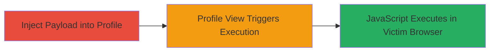

# Persistent XSS in ownCloud Account Profile via Unsanitized Name Fields

Multi-stage attack chain demonstrating a complete attack workflow exploiting a persistent XSS vulnerability in ownCloud's account profile feature.

## Chain Metrics Dashboard

| Metric | Value |
|--------|-------|
| Chain Status | Unverified |
| Total Steps | 1 |
| Execution Time | ~2 minutes |
| Skill Level | Beginner |
| Complexity | Low |
| Impact Level | High |

## Attack Flow Visualization

## Prerequisites & Requirements

### Required Tools

- Web browser (e.g., Chrome, Firefox)

### Target Environment

- ownCloud web application
- Authenticated user account
- No special services or ports required beyond standard HTTPS (443)

### Initial Access Requirements

- Valid ownCloud user credentials
- Direct access to the ownCloud web interface
- No prior network compromise needed

## Detailed Attack Procedures

### Step 1: Inject XSS Payload
procedure: [[procedures/Inject-XSS-Payload-into-ownCloud-Profile-Name]]

**Objective**: Inject a malicious JavaScript payload into the account profile's first or last name field to break out of an embedded <iframe> tag and enable persistent XSS execution when other users view the profile.

**Instructions**: Log in to the ownCloud instance, navigate to the account profile settings, and enter a payload like "> into the first name field. Save the changes. When another user views the affected profile, the payload executes in their browser context.

**Expected Output**: Successful save without errors; alert() or other JS triggers on profile view by victims.

**Success Indicators**:
- Profile updates successfully
- JavaScript executes (e.g., alert box appears) when viewing the profile from another account
- Potential for cookie theft or BeEF hooking confirmed via network inspection

## Attack Chain Summary

### Key Achievements

1. Persistent storage of malicious JavaScript in user profile
2. Arbitrary code execution in the browser of any user viewing the profile
3. Potential for session hijacking or advanced browser exploitation (e.g., via BeEF)

## Technique & Tactic Coverage

### MITRE ATT&CK Techniques

- [[JavaScript]]

### MITRE ATT&CK Tactics

- [[Execution]]
- [[Collection]]

---
*Last updated: 2023-10-01T00:00:00Z*
