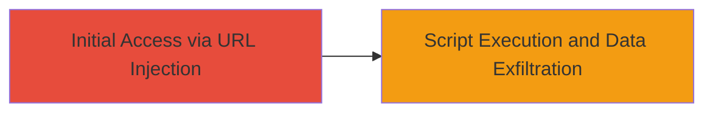

# Persistent XSS on DoD Website via Malicious URL Injection

Multi-stage attack chain demonstrating a complete attack workflow.

## Chain Metrics Dashboard

| Metric | Value |
|--------|-------|
| Chain Status | Unverified |
| Total Steps | 1 |
| Execution Time | ~5 minutes |
| Skill Level | Intermediate |
| Complexity | Low |
| Impact Level | High |

## Attack Flow Visualization



## Prerequisites & Requirements

### Required Tools

- Browser developer tools for payload testing

### Target Environment

- Web platform
- Vulnerable DoD website with insufficient input sanitization
- No specific ports or services required beyond standard HTTP/HTTPS

### Initial Access Requirements

- Public access to the DoD website
- No credentials needed for injection
- Ability to craft and share URLs

## Detailed Attack Procedures

### Step 1: Inject Malicious Script via Crafted URL
procedure: [[procedures/Exploit-Persistent-XSS-via-URL]]

**Objective**: Identify a vulnerable URL parameter on the DoD website and inject a persistent XSS payload to store and execute malicious JavaScript when other users view the affected content.

**Instructions**: Start by navigating to the target DoD website and identifying input fields or URL parameters that accept user input, such as search queries or form submissions that are reflected persistently (e.g., stored in a database and displayed later). Craft a URL with a malicious payload, for example, appending a parameter like ?search=<script>alert('XSS')</script> to the base URL. Submit the URL to trigger the injection. The payload will persist and execute in the browsers of subsequent users who access the affected page.

To test the payload without external tools, use the browser's address bar directly:

```bash
# No command-line tool needed; use browser URL: https://target-dod-site.com/page?param=<script>alert(document.cookie)</script>
```

Monitor the page source or use browser console to confirm script execution.

**Expected Output**: Alert box or console log displaying session cookies or modified page content upon page load for affected users.

**Success Indicators**:
- Malicious script executes in victim's browser
- Session information (e.g., cookies) is revealed or exfiltrated
- Web content is altered as per payload
