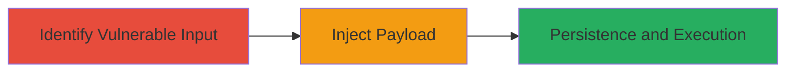

# Persistent XSS on Eternal Application Booking Page Leading to Session Hijacking

Multi-stage attack chain demonstrating a complete attack workflow exploiting unsanitized user input in a web booking form to achieve persistent cross-site scripting.

## Chain Metrics Dashboard

| Metric | Value |
|--------|-------|
| Chain Status | Unverified |
| Total Steps | 2 |
| Execution Time | ~5 minutes |
| Skill Level | Intermediate |
| Complexity | Medium |
| Impact Level | High |

## Attack Flow Visualization

## Prerequisites & Requirements

### Required Tools

- Browser developer tools for manual testing
- Video recording software for demonstration

### Target Environment

- Web application (Eternal booking/reservation page)
- Required services/ports: HTTP/HTTPS on standard web ports (80/443)
- Network access requirements: Direct access to the public-facing web application

### Initial Access Requirements

- No credentials required (public booking form)
- Network position: External attacker with internet access
- Prior access needed: None

## Detailed Attack Procedures

### Step 1: Identify Vulnerable Input
procedure: [[procedures/Identify-Vulnerable-Input-for-Persistent-XSS]]

**Objective**: Locate unsanitized input fields on the booking form that allow JavaScript injection and persistence in the database.

**Instructions**: Navigate to the Eternal application's reservation or booking page. Manually test user input fields (e.g., name, notes, or description fields) by submitting simple payloads like `` to check for lack of sanitization. Observe if the input is reflected or stored without escaping when viewing the booking details.

**Expected Output**: Payload executes or is visible unescaped in the database-stored view, confirming persistence.

**Success Indicators**:
- Script tag or JavaScript code is not sanitized and appears in the page source when viewing the booking.
- Alert or other effect triggers on page load for subsequent viewers.

### Step 2: Inject Malicious Payload
procedure: [[procedures/Inject-Malicious-Payload-for-Persistent-XSS]]

**Objective**: Submit a malicious JavaScript payload through the vulnerable form to store it persistently, enabling execution for all users accessing the affected booking details.

**Instructions**: On the identified vulnerable field, craft and submit a payload such as ``. Record the submission and subsequent viewing process via video to demonstrate persistence. Access the booking details page as another user to verify execution.

**Expected Output**: Malicious script stores in the database and executes on page load, potentially hijacking sessions or exfiltrating data.

**Success Indicators**:
- Payload persists in the database and triggers on view (e.g., data sent to attacker server).
- Video evidence shows injection and execution for multiple users.

## Attack Chain Summary

### Key Achievements

1. Identified and confirmed persistent XSS in booking form input fields.
2. Injected JavaScript payload that executes for all viewers, enabling client-side attacks like session theft.
3. Demonstrated high-impact potential for data exfiltration or account compromise.

## Technique & Tactic Coverage

### MITRE ATT&CK Techniques

- [[JavaScript]]

### MITRE ATT&CK Tactics

- [[Execution]]
- [[Collection]]

---
*Last updated: 2023-10-01T00:00:00Z*
