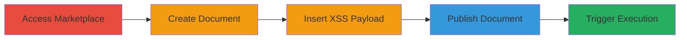

---
tags:
  - xss
  - persistent-xss
  - javascript
  - web-vulnerability
type: attack_chain
tools:
  - '[[tools/mozilla-firefox]]'
  - '[[tools/google-chrome]]'
tactics:
  - '[[Execution]]'
  - '[[Initial Access]]'
commands: []
verified: false
platforms:
  - Web
submitted: true
complexity: medium
procedures:
  - '[[procedures/access-marketplace-and-create-document]]'
  - '[[procedures/configure-document-location]]'
  - '[[procedures/insert-xss-payload-in-title]]'
  - '[[procedures/publish-malicious-document]]'
  - '[[procedures/trigger-xss-on-document-view]]'
step_count: 5
techniques:
  - '[[JavaScript]]'
  - '[[Exploit Public-Facing Application]]'
description: >-
  A multi-step attack exploiting a persistent XSS vulnerability in the document
  title field of Informatica Marketplace, allowing arbitrary JavaScript
  execution in viewers' browsers.
skill_level: intermediate
impact_level: high
id: eee717d4-6937-4aa8-97f5-5ec6d8292129
created_at: '2025-12-14T03:16:30.873Z'
updated_at: '2025-12-14T03:16:30.873Z'
validated: true
mitre_tactics:
  - '[[Execution]]'
  - '[[Initial Access]]'
mitre_techniques:
  - '[[JavaScript]]'
  - '[[Exploit Public-Facing Application]]'
---
# Persistent XSS via Informatica Marketplace Document Title

Multi-stage attack chain demonstrating exploitation of a persistent Cross-Site Scripting (XSS) vulnerability in the document title field on marketplace.informatica.com. An attacker creates a document with a malicious JavaScript payload in the title, publishes it, and any user viewing the document triggers the payload, enabling arbitrary code execution in their browser context.

## Chain Metrics Dashboard

| Metric | Value |
|--------|-------|
| Chain Status | Unverified |
| Total Steps | 5 |
| Execution Time | ~5 minutes |
| Skill Level | Intermediate |
| Complexity | Medium |
| Impact Level | High |

## Attack Flow Visualization

## Prerequisites & Requirements

### Required Tools

- [[tools/mozilla-firefox]]
- [[tools/google-chrome]]

### Target Environment

- Web platform
- Access to https://marketplace.informatica.com/
- Valid user account for publishing documents

### Initial Access Requirements

- Authenticated session on Informatica Marketplace
- No special privileges beyond standard user access
- Browser with JavaScript enabled

## Detailed Attack Procedures

### Step 1: Access Marketplace and Create Document
procedure: [[procedures/access-marketplace-and-create-document]]

**Objective**: Log in to the marketplace and initiate creation of a new document to set up the exploit vector.

**Instructions**: Open a browser and navigate to the marketplace site. Log in with valid credentials, then access the profile page and select the option to create a new document.

**Expected Output**: The new document creation interface loads, ready for input.

**Success Indicators**:
- Successfully logged in
- Document creation form visible

### Step 2: Configure Document Location
procedure: [[procedures/configure-document-location]]

**Objective**: Select the storage location for the document to ensure it is accessible for publishing.

**Instructions**: In the document creation form, choose 'Your Documents' as the location to store the malicious document under the attacker's account.

**Expected Output**: Location selected, proceeding to content input.

**Success Indicators**:
- Location option updated
- Form advances to title and body fields

### Step 3: Insert XSS Payload in Title
procedure: [[procedures/insert-xss-payload-in-title]]

**Objective**: Craft the document with a benign body but embed a JavaScript payload in the title to escape and execute on render.

**Instructions**: Enter arbitrary text in the document body for legitimacy. Set the title to a payload like ';alert("XSS in "+document.domain);//' to break out of any JavaScript string context and execute an alert.

**Expected Output**: Title and body fields populated with the malicious input.

**Success Indicators**:
- Payload entered without validation errors
- Preview shows title as entered (no sanitization visible)

### Step 4: Publish Malicious Document
procedure: [[procedures/publish-malicious-document]]

**Objective**: Make the document live, persisting the XSS payload for any viewer to trigger.

**Instructions**: Review the document and click the 'Publish' button at the bottom of the creation page to release it to the marketplace.

**Expected Output**: Confirmation of publication, with a link to the document's view page.

**Success Indicators**:
- Publish success message
- Document accessible via /docs/ path

### Step 5: Trigger XSS on Document View
procedure: [[procedures/trigger-xss-on-document-view]]

**Objective**: Access the published document to execute the payload in the viewer's browser.

**Instructions**: Navigate to the document's page at https://marketplace.informatica.com/docs/[document-id], causing the title to render and trigger the JavaScript alert.

**Expected Output**: Alert box pops up displaying 'XSS in marketplace.informatica.com', confirming execution.

**Success Indicators**:
- JavaScript alert executes
- Arbitrary code runs in browser context

## Attack Chain Summary

### Key Achievements

1. Successful creation and publication of a document with unescaped XSS in the title
2. Persistent storage of the payload without sanitization
3. Arbitrary JavaScript execution for all users viewing the document

## Technique & Tactic Coverage

### MITRE ATT&CK Techniques

- [[JavaScript]]
- [[Exploit Public-Facing Application]]

### MITRE ATT&CK Tactics

- [[Execution]]
- [[Initial Access]]

---
*Last updated: 2023-10-01*
