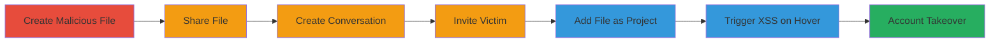

---
tags:
  - xss
  - persistent-xss
  - nextcloud
  - account-takeover
  - talk-spreed
type: attack_chain
tools: []
tactics:
  - '[[Execution]]'
verified: false
platforms:
  - Web
submitted: true
complexity: medium
created_at: '2023-10-01T00:00:00Z'
procedures:
  - '[[procedures/Create-Malicious-File-with-XSS-Payload]]'
  - '[[procedures/Share-File-with-Victim]]'
  - '[[procedures/Create-and-Invite-to-Conversation]]'
  - '[[procedures/Add-File-as-Project-in-Conversation]]'
  - '[[procedures/Trigger-XSS-Payload-as-Victim]]'
step_count: 6
techniques:
  - '[[JavaScript]]'
updated_at: '2025-12-13T23:55:20.394Z'
description: >-
  A multi-stage attack exploiting a persistent XSS vulnerability in Nextcloud's
  Talk/Spreed application by injecting JavaScript via a filename in the projects
  tab, leading to account takeover when the victim hovers over the file symbol.
skill_level: intermediate
impact_level: high
id: 76128fe2-0436-4345-9aaa-96da07057b89
validated: true
mitre_tactics:
  - '[[Execution]]'
mitre_techniques:
  - '[[JavaScript]]'
---
# Persistent XSS via Malicious Filename in Nextcloud Talk Projects for Account Takeover

Multi-stage attack chain demonstrating a complete attack workflow exploiting a persistent XSS in Nextcloud's Talk/Spreed application.

## Chain Metrics Dashboard

| Metric | Value |
|--------|-------|
| Chain Status | Unverified |
| Total Steps | 6 |
| Execution Time | ~5 minutes |
| Skill Level | Intermediate |
| Complexity | Medium |
| Impact Level | High |

## Attack Flow Visualization

## Prerequisites & Requirements

### Required Tools

- None (UI-based actions in Nextcloud)

### Target Environment

- Nextcloud instance with Talk/Spreed app enabled
- Access to file sharing and conversation features
- Victim user account

### Initial Access Requirements

- Attacker account in Nextcloud
- Ability to create and share files
- Victim must interact with the conversation projects tab

## Detailed Attack Procedures

### Step 1: Create Malicious File
procedure: [[procedures/Create-Malicious-File-with-XSS-Payload]]

**Objective**: Inject XSS payload into a filename to prepare for persistent storage and execution.

**Instructions**: Log in as the attacker and create a file with a name containing the XSS payload, such as 'test'>.txt'. The content of the file can be arbitrary, as the vulnerability is in the filename display.

**Expected Output**: File created successfully in the attacker's file storage.

**Success Indicators**:
- File appears in the file list with the malicious name
- No immediate errors during creation

### Step 2: Share File with Victim
procedure: [[procedures/Share-File-with-Victim]]

**Objective**: Make the malicious file accessible to the victim for inclusion in shared contexts.

**Instructions**: From the file details page, select the share option and add the victim user as a recipient with read access.

**Expected Output**: Share confirmation, and victim can see the file in their shared files.

**Success Indicators**:
- Victim receives share notification
- File visible to victim

### Step 3: Create New Conversation
procedure: [[procedures/Create-and-Invite-to-Conversation]]

**Objective**: Establish a conversation context where the project linking can occur.

**Instructions**: Navigate to the Talk app, click 'New conversation', and enter a conversation name.

**Expected Output**: New conversation created and listed in the Talk interface.

**Success Indicators**:
- Conversation appears in the list
- Attacker can access it

### Step 4: Invite Victim to Conversation
procedure: [[procedures/Create-and-Invite-to-Conversation]]

**Objective**: Include the victim in the conversation to ensure they can view the projects tab.

**Instructions**: In the conversation, go to Participants, click 'Add participant', and select the victim user.

**Expected Output**: Victim added to participants list and receives invitation.

**Success Indicators**:
- Victim listed as participant
- Victim can join the conversation

### Step 5: Add File as Project
procedure: [[procedures/Add-File-as-Project-in-Conversation]]

**Objective**: Link the malicious file as a project in the conversation, persisting the filename for display.

**Instructions**: In the conversation, navigate to Projects, click 'Add a project', select 'Link to a file', and choose the shared malicious file from step 1.

**Expected Output**: File added as a project in the conversation's projects tab.

**Success Indicators**:
- Project listed with the malicious filename
- No sanitization errors

### Step 6: Trigger Payload as Victim
procedure: [[procedures/Trigger-XSS-Payload-as-Victim]]

**Objective**: Execute the XSS by victim interaction, leading to JavaScript execution in the victim's browser.

**Instructions**: As the victim, open the conversation, go to the projects tab, and hover over the file symbol to display the unsanitized filename.

**Expected Output**: Alert or JavaScript execution (e.g., alert(document.location)), confirming XSS.

**Success Indicators**:
- JavaScript payload executes
- Potential for further actions like stealing cookies or session hijacking

## Attack Chain Summary

### Key Achievements

1. Persistent storage of XSS payload in filename
2. Delivery via shared conversation project
3. Execution on victim hover, enabling account takeover
4. Potential full admin access if victim is privileged

## Technique & Tactic Coverage

### MITRE ATT&CK Techniques

- [[JavaScript]]

### MITRE ATT&CK Tactics

- [[Execution]]

---

*Last updated: 2023-10-01T00:00:00Z*
