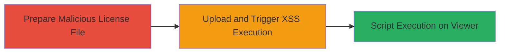

# Persistent XSS via Malicious License File in ExpressionEngine

Multi-stage attack chain demonstrating a complete attack workflow exploiting a stored XSS vulnerability in the license file display functionality of ExpressionEngine.

## Chain Metrics Dashboard

| Metric | Value |
|--------|-------|
| Chain Status | Unverified |
| Total Steps | 1 |
| Execution Time | ~5 minutes |
| Skill Level | Intermediate |
| Complexity | Medium |
| Impact Level | Medium |

## Attack Flow Visualization

## Prerequisites & Requirements

### Required Tools

- Browser developer tools for payload testing
- Text editor for crafting the malicious license file

### Target Environment

- ExpressionEngine CMS (vulnerable versions prior to patch)
- Web platform with PHP backend
- Administrative access or ability to submit license files (e.g., via support or update mechanisms)

### Initial Access Requirements

- Ability to upload or submit a license file to the target ExpressionEngine instance
- No special credentials required if license submission is open; otherwise, low-privilege user account
- Network access to the web application

## Detailed Attack Procedures

### Step 1: Exploit Persistent XSS
procedure: [[procedures/Exploit-Persistent-XSS-in-License-File-Display]]

**Objective**: Inject a malicious JavaScript payload into a license file, upload it to the ExpressionEngine instance, and trigger execution when an administrator views the license information page.

**Instructions**: Craft a license file containing an XSS payload embedded in a comment or metadata field. For example, use a simple alert payload like `` within the file content. Submit the file via the license update or support interface in ExpressionEngine. Once uploaded, navigate to or wait for an admin to access the license information display page, where the unsanitized content is rendered, executing the script.

**Expected Output**: JavaScript alert or other payload effects visible in the browser when the license page is loaded.

**Success Indicators**:
- Payload executes without errors (e.g., alert pops up)
- Script runs in the context of the viewing user's session, potentially allowing cookie theft or further actions

## Attack Chain Summary

### Key Achievements

1. Successful injection of persistent XSS payload via license file
2. Arbitrary script execution for any user viewing the license information
3. Demonstration of medium-severity impact on web application security

## Technique & Tactic Coverage

### MITRE ATT&CK Techniques

- [[JavaScript]]
- [[Exploit Public-Facing Application]]

### MITRE ATT&CK Tactics

- [[Execution]]

---
*Last updated: 2023-10-01T00:00:00Z*
