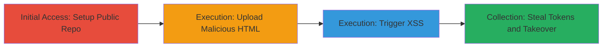

# Persistent XSS via Unsanitized HTML Upload in GitLab Public Wiki

Multi-stage attack chain demonstrating exploitation of a persistent cross-site scripting (XSS) vulnerability in GitLab's public wiki pages. Attackers upload HTML files containing malicious JavaScript via Git, which are rendered without sanitization, allowing arbitrary code execution in victims' browsers. Without a Content Security Policy (CSP), this enables theft of API tokens, account takeover, project access, and data exfiltration.

## Chain Metrics Dashboard

| Metric | Value |
|--------|-------|
| Chain Status | Unverified |
| Total Steps | 4 |
| Execution Time | ~10 minutes |
| Skill Level | Intermediate |
| Complexity | Medium |
| Impact Level | High |

## Attack Flow Visualization



## Prerequisites & Requirements

### Required Tools

- [[tools/Git]]

### Target Environment

- GitLab instance (version vulnerable to CVE-2015-XXXX or similar, pre-CSP enforcement)
- Public repository access
- Git client installed on attacker machine

### Initial Access Requirements

- GitLab account with ability to create public repositories
- SSH key configured for Git pushes (git@gitlab.com access)
- Victim must visit the public wiki page

## Detailed Attack Procedures

### Step 1: Create and Setup Public Repository
procedure: [[procedures/Create-and-Setup-Public-GitLab-Repository]]

**Objective**: Establish a public GitLab repository with an associated wiki submodule to host malicious content.

**Instructions**: Use the GitLab web interface to create a new public repository named 'test' under a dummy group (e.g., dummy/test). Note the wiki Git URL: git@gitlab.com:dummy/test-wiki.git. Ensure the repository is public for unrestricted access.

**Expected Output**: Repository created with wiki enabled; SSH clone URL available.

**Success Indicators**:
- Public repo visible at https://gitlab.com/dummy/test
- Wiki submodule accessible via Git

### Step 2: Clone and Prepare Wiki Repository
procedure: [[procedures/Clone-and-Prepare-GitLab-Wiki-Repository]]

**Objective**: Obtain a local copy of the wiki repository to stage malicious files.

**Instructions**: Clone the wiki using [[commands/git-clone-gitlab-wiki]]:

```bash
git clone git@gitlab.com/dummy/test-wiki.git
```

Then navigate to the directory with [[commands/cd-to-wiki-directory]]:

```bash
cd test-wiki
```

**Expected Output**: Local wiki directory cloned and current working directory set.

**Success Indicators**:
- Directory 'test-wiki' created and accessible
- Git status shows clean working tree

### Step 3: Upload Malicious HTML to Wiki
procedure: [[procedures/Upload-Malicious-HTML-to-GitLab-Wiki]]

**Objective**: Create and commit an HTML file with XSS payload, then push it to make it publicly renderable.

**Instructions**: Create the malicious HTML using [[commands/create-xss-html-file]]:

```bash
echo "<script>alert('Hello world!');</script>" > index.html
```

Stage the file with [[commands/git-add-malicious-file]]:

```bash
git add index.html
```

Commit the changes using [[commands/git-commit-changes]]:

```bash
git commit -m "This message is super important"
```

Push to remote with [[commands/git-push-to-wiki]]:

```bash
git push
```

**Expected Output**: File committed and pushed; Git output confirms upload to git@gitlab.com:dummy/test-wiki.git.

**Success Indicators**:
- index.html present in Git history
- Push successful without errors

### Step 4: Trigger XSS Execution on Wiki Page
procedure: [[procedures/Trigger-XSS-Execution-on-Wiki-Page]]

**Objective**: Access the wiki page to render the HTML and execute the JavaScript payload in the victim's browser.

**Instructions**: Navigate to the wiki URL, e.g., https://gitlab.com/dummy/test/wikis/index.html. The page renders the unsanitized HTML, executing the script (e.g., alert popup). In a real attack, replace alert with code to steal session tokens or API keys via fetch to attacker-controlled server.

**Expected Output**: JavaScript executes; alert shows or network request to exfiltrate data occurs.

**Success Indicators**:
- Script runs in browser console
- Victim's API token captured if payload is adapted for theft

## Attack Chain Summary

### Key Achievements

1. Bypassed HTML sanitization in GitLab wiki rendering
2. Achieved persistent XSS on public pages without authentication
3. Enabled arbitrary JS execution leading to token theft and account compromise

## Technique & Tactic Coverage

### MITRE ATT&CK Techniques

- [[Exploit Public-Facing Application]] Exploit Public-Facing Application
- [[JavaScript]] JavaScript

### MITRE ATT&CK Tactics

- [[Initial Access]] Initial Access
- [[Execution]] Execution
- [[Collection]] Collection

---

*Last updated: 2023-10-01T00:00:00Z*
