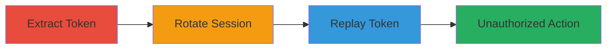

# Phabricator CSRF Token Reuse After Session Logout

Multi-stage attack chain demonstrating exploitation of CSRF tokens in Phabricator that persist after user logout due to timer-based rotation rather than session tying. An attacker with a stolen token can perform actions on the user's behalf indefinitely, bypassing session invalidation.

## Chain Metrics Dashboard

| Metric | Value |
|--------|-------|
| Chain Status | Unverified |
| Total Steps | 3 |
| Execution Time | ~5 minutes |
| Skill Level | Intermediate |
| Complexity | Medium |
| Impact Level | High |

## Attack Flow Visualization

## Prerequisites & Requirements

### Required Tools

- [[tools/Burp-Suite]]

### Target Environment

- Web platform
- Phabricator instance (e.g., https://secure.phabricator.com/)
- Required services/ports: HTTPS (443)
- Network access requirements: Direct access to the Phabricator login and form endpoints

### Initial Access Requirements

- Valid user credentials for Phabricator
- Network position: Attacker must have the ability to intercept or replay requests (e.g., via proxy)
- Prior access needed: Ability to authenticate as the target user to extract the initial token

## Detailed Attack Procedures

### Step 1: Extract CSRF Token
procedure: [[procedures/Extract-Phabricator-CSRF-Token]]

**Objective**: Obtain the initial Anti-CSRF token from an authenticated session to prepare for reuse testing.

**Instructions**: Log in to the Phabricator account and inspect the session or form elements to copy the token value.

**Expected Output**: A valid CSRF token string copied for later use.

**Success Indicators**:
- Token extracted successfully from the browser developer tools or network tab
- Token appears in form fields or headers during authenticated requests

### Step 2: Rotate Session
procedure: [[procedures/Rotate-Phabricator-Session]]

**Objective**: Simulate session change by logging out and back in to verify token persistence.

**Instructions**: Perform logout, wait briefly, then re-authenticate to create a new session while retaining the old token.

**Expected Output**: New session established, but old token remains unchanged due to timer rotation.

**Success Indicators**:
- Successful logout and re-login
- No token invalidation observed

### Step 3: Replay Persistent Token
procedure: [[procedures/Replay-Phabricator-CSRF-Token-with-Burp-Suite]]

**Objective**: Replay the old CSRF token in a form submission to demonstrate unauthorized action execution.

**Instructions**: Intercept a form submission with Burp Suite and replace the current token with the extracted old one, then forward the request.

**Expected Output**: Form submission succeeds using the old token, confirming vulnerability.

**Success Indicators**:
- Modified request accepted by Phabricator
- Action (e.g., form post) completes without CSRF validation failure

## Attack Chain Summary

### Key Achievements

1. Successful extraction of persistent CSRF token
2. Verification of token validity across session rotations
3. Execution of unauthorized actions via token replay, enabling potential CSRF attacks

## Technique & Tactic Coverage

### MITRE ATT&CK Techniques

- [[Exploit Public-Facing Application]]

### MITRE ATT&CK Tactics

- [[Initial Access]]

---
*Last updated: 2023-10-01T00:00:00Z*
