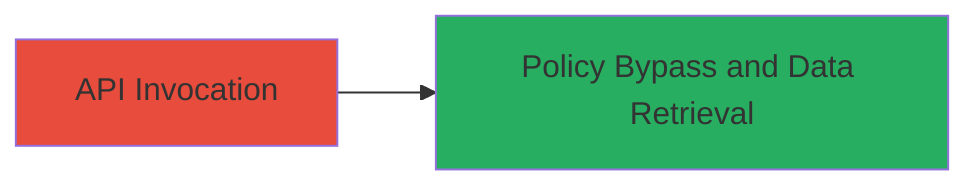

# Phabricator Deprecated owners.query API Bypass for Unauthorized Owner Package Access

Multi-stage attack chain demonstrating a complete attack workflow targeting Phabricator's deprecated API to gain unauthorized access to sensitive repository and owner information.

## Chain Metrics Dashboard

| Metric | Value |
|--------|-------|
| Chain Status | Unverified |
| Total Steps | 1 |
| Execution Time | ~1 minutes |
| Skill Level | Intermediate |
| Complexity | Low |
| Impact Level | High |

## Attack Flow Visualization



## Prerequisites & Requirements

### Required Tools

- None (uses standard HTTP client like curl)

### Target Environment

- Phabricator instance (web-based code review platform)
- Accessible API endpoint (typically over HTTPS on port 443)
- No authentication required for the deprecated endpoint

### Initial Access Requirements

- Network access to the Phabricator instance
- Knowledge of target owner package PHID (can be guessed or enumerated if partial info available)
- No prior credentials needed due to policy bypass

## Detailed Attack Procedures

### Step 1: Invoke Deprecated API for Unauthorized Access
procedure: [[procedures/Exploit-Phabricator-Owners-Query-API-Bypass]]

**Objective**: Bypass Phabricator's object view policy by calling the deprecated owners.query API to retrieve sensitive details of restricted owner packages, such as names, descriptions, owner PHIDs, repository PHIDs, and paths.

**Instructions**: Use a standard HTTP client to send a POST request to the owners.query endpoint, specifying constraints for the target owner package. The API does not enforce view policies, allowing retrieval of restricted data.

Execute the API call using [[commands/phabricator-owners-query-invoke]]:

```bash
curl -X POST 'https://phabricator.example.com/api/owners.query' \
  --data-urlencode 'constraints[owners][0]=PHID-OWNER-abc123' \
  --data-urlencode 'outputKey=packages' \
  -H 'Content-Type: application/x-www-form-urlencoded'
```

**Expected Output**: JSON response containing details like package name, description, owner PHID, repository PHIDs, and commit paths from potentially restricted repositories.

**Success Indicators**:
- JSON response with sensitive package details (e.g., restricted repository paths)
- No authentication or policy errors returned
- Confirmation that data from restricted sources is accessible

## Attack Chain Summary

### Key Achievements

1. Bypassed Phabricator's object view policy via deprecated API
2. Retrieved unauthorized sensitive information on owner packages and repositories
3. Demonstrated improper access control in legacy API endpoints

## Technique & Tactic Coverage

### MITRE ATT&CK Techniques

- [[Exploit Public-Facing Application]]

### MITRE ATT&CK Tactics

- [[Initial Access]]

---
*Last updated: 2023-10-01T00:00:00Z*
