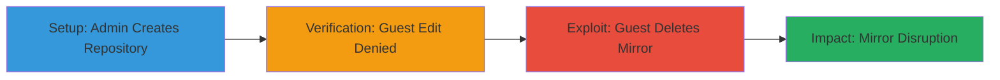

# Phabricator Diffusion Unauthorized Repository Mirror Deletion

Multi-stage attack chain demonstrating an authorization bypass in Phabricator's Diffusion application, allowing unauthorized guest users to delete repository mirrors via a missing permission check in the DiffusionMirrorDeleteController.

## Chain Metrics Dashboard

| Metric | Value |
|--------|-------|
| Chain Status | Unverified |
| Total Steps | 3 |
| Execution Time | ~5 minutes |
| Skill Level | Intermediate |
| Complexity | Low |
| Impact Level | Low |

## Attack Flow Visualization

## Prerequisites & Requirements

### Required Tools

- Web browser for accessing Phabricator URLs

### Target Environment

- Phabricator instance with Diffusion application enabled
- PHP-based web server
- No specific ports required beyond standard HTTP/HTTPS (e.g., 80/443)

### Initial Access Requirements

- Administrative access for setup (creating repository)
- Guest access (no credentials) for exploitation
- Direct network access to the Phabricator web interface

## Detailed Attack Procedures

### Step 1: Setup Repository Creation
procedure: [[procedures/Create-Repository-as-Admin-in-Phabricator]]

**Objective**: Establish a test repository with a mirror to target for deletion.

**Instructions**: Log in as an administrator and create a new repository in the Diffusion application. Name it 'TEST' and configure a mirror if not already present.

**Expected Output**: Repository 'TEST' created successfully, visible in the Diffusion dashboard.

**Success Indicators**:
- Repository listed under Diffusion
- Mirror associated with repository ID

### Step 2: Verify Access Restrictions
procedure: [[procedures/Verify-Guest-Access-Denied-to-Edit-Endpoint]]

**Objective**: Confirm that standard edit permissions are enforced for guest users, highlighting the specificity of the bypass.

**Instructions**: Log out or access as a guest user and attempt to navigate to the edit endpoint for the repository.

**Expected Output**: Access denied error, such as a 403 Forbidden response.

**Success Indicators**:
- Edit endpoint inaccessible to guests
- Permission error displayed

### Step 3: Exploit Authorization Bypass
procedure: [[procedures/Delete-Repository-Mirror-as-Guest-via-Bypass]]

**Objective**: Leverage the missing permission check to delete the repository mirror as a guest user.

**Instructions**: As a guest, directly access the mirror delete endpoint using the repository name and mirror ID.

**Expected Output**: Mirror deleted successfully without authentication prompts.

**Success Indicators**:
- Mirror removed from repository
- Confirmation of deletion in Phabricator logs or UI

## Attack Chain Summary

### Key Achievements

1. Demonstrated authorization bypass allowing guest deletion of mirrors
2. Verified selective permission enforcement (edit denied, delete allowed)
3. Highlighted low-severity impact on repository synchronization

## Technique & Tactic Coverage

### MITRE ATT&CK Techniques

- [[Exploit Public-Facing Application]]

### MITRE ATT&CK Tactics

- [[Initial Access]]

---
*Last updated: 2023-10-01T00:00:00Z*
