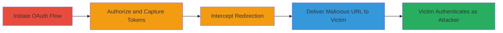

---
tags:
  - csrf
  - oauth
  - phabricator
  - twitter
  - authentication-bypass
  - account-takeover
type: attack_chain
tools: []
tactics:
  - '[[Initial Access]]'
  - '[[Credential Access]]'
verified: false
platforms:
  - Web
submitted: true
complexity: medium
created_at: '2023-10-01T00:00:00Z'
procedures:
  - '[[procedures/Initiate-Twitter-OAuth-and-Capture-Tokens]]'
  - '[[procedures/Deliver-Captured-Tokens-to-Victim]]'
step_count: 5
techniques:
  - '[[Valid Accounts]]'
  - '[[Exploit Public-Facing Application]]'
updated_at: '2025-12-14T17:27:35.884Z'
description: >-
  A multi-stage attack exploiting the lack of state validation in Phabricator's
  Twitter OAuth 1.0A flow to force a victim to log in as the attacker's account.
skill_level: intermediate
impact_level: high
id: 2af98acf-2e1e-40b5-9599-d611b2290dd5
validated: true
mitre_tactics:
  - '[[Initial Access]]'
  - '[[Credential Access]]'
mitre_techniques:
  - '[[Valid Accounts]]'
  - '[[Exploit Public-Facing Application]]'
---
# Phabricator Login CSRF via Twitter OAuth Token Reuse

Multi-stage attack chain demonstrating a complete attack workflow exploiting the absence of state parameters in Phabricator's OAuth 1.0A Twitter authentication, allowing token reuse to force victim login as the attacker.

## Chain Metrics Dashboard

| Metric | Value |
|--------|-------|
| Chain Status | Unverified |
| Total Steps | 5 |
| Execution Time | ~10 minutes |
| Skill Level | Intermediate |
| Complexity | Medium |
| Impact Level | High |

## Attack Flow Visualization

## Prerequisites & Requirements

### Required Tools

- Web browser for manual OAuth interaction
- URL crafting tool (e.g., browser dev tools or simple script)

### Target Environment

- Phabricator instance with Twitter OAuth enabled
- Victim must be logged out of Phabricator
- Attacker must have a Phabricator account linked to Twitter

### Initial Access Requirements

- Attacker's Twitter account with access to Phabricator app
- Ability to trick victim into clicking a malicious link (e.g., via phishing)
- No prior victim credentials needed

## Detailed Attack Procedures

### Step 1: Initiate Twitter OAuth Process
procedure: [[procedures/Initiate-Twitter-OAuth-and-Capture-Tokens]]

**Objective**: Start the OAuth flow to generate reusable tokens.

**Instructions**: Access the Phabricator Twitter login endpoint to begin authorization. This redirects to Twitter for app approval.

**Expected Output**: Redirect to Twitter authorization page.

**Success Indicators**:
- Successful redirect to twitter.com for authorization
- No errors in Phabricator logs

### Step 2: Authorize Phabricator App on Twitter
procedure: [[procedures/Initiate-Twitter-OAuth-and-Capture-Tokens]]

**Objective**: Grant access to capture the oauth_token and oauth_verifier.

**Instructions**: On Twitter, approve the Phabricator application to proceed with token generation.

**Expected Output**: Twitter callback URL with oauth_token and oauth_verifier parameters.

**Success Indicators**:
- Authorization granted
- Callback parameters visible in browser

### Step 3: Intercept and Record Redirection
procedure: [[procedures/Initiate-Twitter-OAuth-and-Capture-Tokens]]

**Objective**: Capture tokens without completing the flow to keep them reusable.

**Instructions**: Use browser dev tools or a proxy to inspect the callback URL from Twitter to Phabricator, extract oauth_token and oauth_verifier, then abort the redirection to avoid token consumption.

**Expected Output**: Recorded token values: e.g., oauth_token=ABC123&oauth_verifier=XYZ789.

**Success Indicators**:
- Tokens extracted
- Flow interrupted before Phabricator processes them

### Step 4: Craft and Deliver Malicious Login URL
procedure: [[procedures/Deliver-Captured-Tokens-to-Victim]]

**Objective**: Trick the victim into authenticating with attacker's tokens.

**Instructions**: Construct the URL: https://target-phabricator.com/auth/login/twitter:twitter.com/?oauth_token={captured_token}&oauth_verifier={captured_verifier}. Send this link to the victim via email, chat, or social engineering.

**Expected Output**: Victim visits the URL and gets redirected through OAuth.

**Success Indicators**:
- Victim clicks and loads the login endpoint
- No immediate errors on page load

### Step 5: Victim Logs In as Attacker
procedure: [[procedures/Deliver-Captured-Tokens-to-Victim]]

**Objective**: Achieve forced authentication without state validation.

**Instructions**: Upon visiting the URL, Phabricator processes the tokens, logs the victim into the attacker's account.

**Expected Output**: Victim dashboard showing attacker's Phabricator account.

**Success Indicators**:
- Victim authenticated as attacker
- Access to attacker's repositories or data

## Attack Chain Summary

### Key Achievements

1. Successful token capture without consumption
2. Forced victim login to attacker's account via CSRF
3. Potential for further exploitation like data access or privilege escalation

## Technique & Tactic Coverage

### MITRE ATT&CK Techniques

- [[Valid Accounts]] Valid Accounts
- [[Exploit Public-Facing Application]] Exploit Public-Facing Application

### MITRE ATT&CK Tactics

- [[Initial Access]] Initial Access
- [[Credential Access]] Credential Access

---
*Last updated: 2023-10-01T00:00:00Z*
