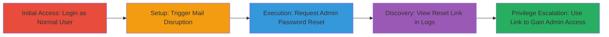

# Phabricator Privilege Escalation via Exposed Password Reset Links in Daemon Logs

Multi-stage attack chain demonstrating a complete attack workflow.

## Chain Metrics Dashboard

| Metric | Value |
|--------|-------|
| Chain Status | Unverified |
| Total Steps | 5 |
| Execution Time | ~10 minutes |
| Skill Level | Intermediate |
| Complexity | Medium |
| Impact Level | High |

## Attack Flow Visualization

## Prerequisites & Requirements

### Required Tools

- None (web browser access sufficient)

### Target Environment

- Phabricator web application
- Accessible daemon logs via web UI
- Mail services (SMTP) that can be temporarily disrupted (e.g., via firewall or configuration changes)

### Initial Access Requirements

- Valid normal user credentials for Phabricator
- Network access to the Phabricator web interface
- Ability to influence or wait for mail service downtime (e.g., admin privileges on network or known outage window)

## Detailed Attack Procedures

### Step 1: Initial Access
procedure: [[procedures/Login-to-Phabricator-as-Normal-User]]

**Objective**: Gain authenticated access to the Phabricator platform as a standard user to initiate the attack.

**Instructions**: Navigate to the Phabricator login page and authenticate using valid normal user credentials. This establishes a session for subsequent actions.

**Expected Output**: Successful login redirect to the dashboard, with user profile indicating standard privileges.

**Success Indicators**:
- Dashboard loads without errors
- User menu shows non-admin role

### Step 2: Setup Disruption
procedure: [[procedures/Trigger-Mail-Service-Disruption]]

**Objective**: Create a condition where email delivery fails, causing password reset links to be logged in daemon logs instead of sent.

**Instructions**: Wait for or induce a temporary mail service disruption, such as SMTP credential rejection (e.g., invalid Gmail SMTP config) or firewall blocking outbound mail. No direct command needed; monitor for known outages or simulate by altering mail settings if possible.

**Expected Output**: Confirmation of mail failure (e.g., error messages in Phabricator UI or external verification).

**Success Indicators**:
- Mail delivery attempts fail
- No reset emails received by target admin

### Step 3: Execution Request
procedure: [[procedures/Request-Admin-Password-Reset]]

**Objective**: Trigger the generation of a password reset link for the admin account, which will fail to deliver and log the sensitive token.

**Instructions**: From the authenticated session, navigate to the password reset functionality in Phabricator and submit a reset request for the administrator's email address. This can be done via the user management or forgot password interface.

**Expected Output**: UI confirmation of reset request submitted, but no email arrives due to disruption.

**Success Indicators**:
- Reset request acknowledged in UI
- Admin email inbox remains empty

### Step 4: Information Discovery
procedure: [[procedures/View-Reset-Link-in-Daemon-Logs]]

**Objective**: Access the daemon logs through the web UI to retrieve the exposed password reset link.

**Instructions**: Navigate to the daemon logs section in the Phabricator web UI (accessible to normal users due to misconfiguration). Search or scroll for recent entries related to the failed mail delivery, where the full reset URL/token is logged uncensored.

**Expected Output**: Log entry displaying the password reset link, e.g., a URL like https://phabricator.example.com/reset?token=abc123.

**Success Indicators**:
- Logs visible without admin privileges
- Reset link found in plain text

### Step 5: Privilege Escalation
procedure: [[procedures/Use-Reset-Link-for-Privilege-Escalation]]

**Objective**: Utilize the exposed reset link to change the admin password and assume administrative control.

**Instructions**: Copy the reset link from the logs, open it in a browser, enter a new password for the admin account, and complete the reset process. Log in with the new credentials to verify elevated access.

**Expected Output**: Successful password change confirmation and admin dashboard access.

**Success Indicators**:
- New password accepted
- Admin privileges granted (e.g., access to restricted features)

## Attack Chain Summary

### Key Achievements

1. Bypassed email delivery to expose sensitive reset tokens in accessible logs
2. Achieved unauthorized admin password reset from a normal user account
3. Demonstrated full privilege escalation without direct code execution or exploits

## Technique & Tactic Coverage

### MITRE ATT&CK Techniques

- [[Data from Information Repositories]] Data from Information Repositories
- [[Valid Accounts]] Valid Accounts
- [[Account Manipulation]] Account Manipulation

### MITRE ATT&CK Tactics

- [[Privilege Escalation]] Privilege Escalation
- [[Initial Access]] Initial Access

---
*Last updated: 2023-10-01T12:00:00Z*
