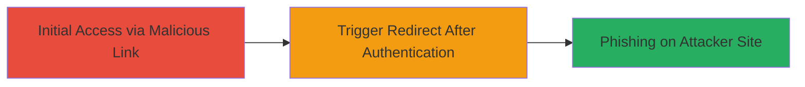

---
tags:
  - open-redirect
  - phishing
  - oauth
  - authentication
type: attack_chain
tools: []
tactics:
  - '[[Initial Access]]'
verified: false
platforms:
  - Web
submitted: true
complexity: low
created_at: '2023-10-01T00:00:00Z'
procedures:
  - '[[procedures/Exploit-Open-Redirect-in-Acronis-OAuth-State]]'
step_count: 1
techniques:
  - '[[T1566.002]]'
  - '[[Drive-by Compromise]]'
updated_at: '2025-12-14T17:24:30.539Z'
description: >-
  An attack chain exploiting an open redirect vulnerability in the Acronis
  authentication endpoint to redirect authenticated users to malicious sites for
  phishing.
skill_level: beginner
impact_level: medium
id: 23ba7c76-162e-4c22-991b-f4002c1d9407
validated: true
mitre_tactics:
  - '[[Initial Access]]'
mitre_techniques:
  - '[[T1566.002]]'
  - '[[Drive-by Compromise]]'
---
# Phishing via Open Redirect in Acronis Authentication State Parameter

Multi-stage attack chain demonstrating a complete attack workflow.

## Chain Metrics Dashboard

| Metric | Value |
|--------|-------|
| Chain Status | Unverified |
| Total Steps | 1 |
| Execution Time | ~2 minutes |
| Skill Level | Beginner |
| Complexity | Low |
| Impact Level | Medium |

## Attack Flow Visualization



## Prerequisites & Requirements

### Required Tools

- Web browser

### Target Environment

- Web platform
- Access to Acronis authentication endpoint (https://mc-beta-cloud.acronis.com)
- Valid user credentials for login

### Initial Access Requirements

- User must be tricked into clicking a malicious link (e.g., via email phishing)
- Network access to the target site
- No prior access needed beyond legitimate user account

## Detailed Attack Procedures

### Step 1: Trigger Open Redirect After Authentication
procedure: [[procedures/Exploit-Open-Redirect-in-Acronis-OAuth-State]]

**Objective**: Craft a malicious URL and have the victim access it after logging in to redirect them to an attacker-controlled site for phishing.

**Instructions**: Prepare the malicious URL with the vulnerable state parameter. Send it to the victim via phishing email or other means. The victim logs in and accesses the URL, triggering the redirect.

Use a browser to access the crafted URL:

```url
https://mc-beta-cloud.acronis.com/api/2/idp/authorize?client_id=f2e82dbb-78af-4b5b-bc7f-651d4f42a722&redirect_uri=%2Fbc%2Fapi%2Fgateway%2Fcb&response_type=code&scope=offline_access+openid+profile+email&state=http://evil.com&nonce=yhokbempqmmqllfbwpsfzfmf
```

After login, the endpoint processes the state and redirects to http://evil.com.

**Expected Output**: Automatic redirect to the attacker-specified URL (http://evil.com) upon successful authentication.

**Success Indicators**:
- Victim is redirected to the malicious site
- Phishing page loads, enabling credential theft or malware delivery

## Attack Chain Summary

### Key Achievements

1. Successful redirection of authenticated user to external malicious domain
2. Facilitation of phishing attack leading to potential credential theft
3. Exploitation of OAuth-like flow without additional privileges

## Technique & Tactic Coverage

### MITRE ATT&CK Techniques

- [[T1566.002]] Spearphishing Link
- [[Drive-by Compromise]] Drive-by Compromise

### MITRE ATT&CK Tactics

- [[Initial Access]] Initial Access

---
*Last updated: 2023-10-01T00:00:00Z*
