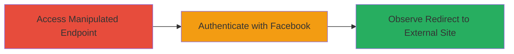

---
tags:
  - open-redirect
  - phishing
  - oauth
  - facebook
type: attack_chain
tools: []
tactics:
  - '[[Initial Access]]'
verified: false
platforms:
  - Web
submitted: true
complexity: low
procedures:
  - '[[procedures/Access-Facebook-Auth-Endpoint-with-Manipulated-Origin]]'
  - '[[procedures/Complete-Facebook-Authentication-for-Urban-Dictionary]]'
  - '[[procedures/Verify-Open-Redirect-by-Observing-Redirection]]'
step_count: 3
techniques:
  - '[[Drive-by Compromise]]'
description: >-
  Exploits an open redirect vulnerability in Urban Dictionary's Facebook OAuth
  endpoint to redirect authenticated users to arbitrary external sites, enabling
  phishing attacks and potential theft of authorization tokens.
skill_level: basic
impact_level: high
id: 8671bb12-fb55-49b0-9bfc-a50ca664e610
created_at: '2025-12-14T17:24:23.366Z'
updated_at: '2025-12-14T17:24:23.366Z'
validated: true
mitre_tactics:
  - '[[Initial Access]]'
mitre_techniques:
  - '[[Drive-by Compromise]]'
---
# Phishing via Open Redirect in Urban Dictionary Facebook Authentication

Multi-stage attack chain demonstrating an open redirect vulnerability in the Facebook authentication endpoint of Urban Dictionary, allowing attackers to craft phishing links that redirect users to malicious sites after authentication, potentially stealing tokens or credentials.

## Chain Metrics Dashboard

| Metric | Value |
|--------|-------|
| Chain Status | Unverified |
| Total Steps | 3 |
| Execution Time | ~5 minutes |
| Skill Level | Basic |
| Complexity | Low |
| Impact Level | High |

## Attack Flow Visualization

## Prerequisites & Requirements

### Required Tools

- Web browser (e.g., Chrome, Firefox)

### Target Environment

- Web platform
- Urban Dictionary website
- Facebook account for authentication testing
- No specific ports or services beyond public web access

### Initial Access Requirements

- Public internet access to Urban Dictionary
- Valid Facebook credentials (for testing; in real attack, victim provides these)
- No prior access needed; vulnerability is public-facing

## Detailed Attack Procedures

### Step 1: Access the Facebook Authentication Endpoint
procedure: [[procedures/Access-Facebook-Auth-Endpoint-with-Manipulated-Origin]]

**Objective**: Initiate the OAuth flow by accessing the endpoint with an arbitrary origin parameter to set up the redirect.

**Instructions**: Open a web browser and navigate to the manipulated URL `http://www.urbandictionary.com/auth/facebook?origin=http://google.com` (replace `http://google.com` with a malicious domain in a real attack).

**Expected Output**: The browser redirects to Facebook's login page, preparing for authentication.

**Success Indicators**:
- Facebook authorization page loads without errors
- Origin parameter is accepted without validation

### Step 2: Complete Facebook Authentication
procedure: [[procedures/Complete-Facebook-Authentication-for-Urban-Dictionary]]

**Objective**: Authenticate with Facebook and authorize the Urban Dictionary app, triggering the post-authentication redirect based on the origin.

**Instructions**: On the Facebook login page, enter credentials and authorize the connection to Urban Dictionary. Confirm any permissions requested by the app.

**Expected Output**: After successful authorization, the browser redirects to the specified origin URL (e.g., google.com).

**Success Indicators**:
- Successful Facebook login and app authorization
- No blocking or error on redirect initiation

### Step 3: Observe the Redirection
procedure: [[procedures/Verify-Open-Redirect-by-Observing-Redirection]]

**Objective**: Confirm the vulnerability by verifying the redirect to an external, unvalidated site, demonstrating phishing potential.

**Instructions**: Monitor the browser's navigation after authentication; the user should be seamlessly redirected to the external domain specified in the origin parameter.

**Expected Output**: Landing on the external site (e.g., google.com or a phishing page) without any Urban Dictionary confirmation page intervening.

**Success Indicators**:
- Redirect completes to arbitrary external URL
- No domain validation or whitelist enforcement

## Attack Chain Summary

### Key Achievements

1. Successful manipulation of the origin parameter to point to an external domain.
2. Completion of OAuth flow leading to unvalidated redirect.
3. Demonstration of phishing risk, where attackers can steal tokens by hosting fake login pages on the redirected domain.

## Technique & Tactic Coverage

### MITRE ATT&CK Techniques

- [[Drive-by Compromise]]

### MITRE ATT&CK Tactics

- [[Initial Access]]

---
*Last updated: 2023-10-01*
