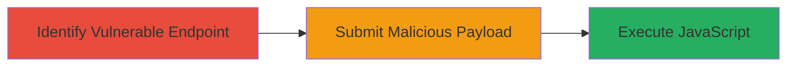

# Post-based XSS in Legacy WSO2 API Endpoint for JavaScript Execution

Multi-stage attack chain demonstrating exploitation of a post-based Cross-Site Scripting (XSS) vulnerability in a legacy API endpoint on https://apimgr.8x8.com, caused by an outdated WSO2 Data Analytics Server. The attack allows submission of malicious payloads via POST requests, leading to arbitrary JavaScript execution in users' browsers, enabling risks such as session hijacking, cookie theft, or phishing.

## Chain Metrics Dashboard

| Metric | Value |
|--------|-------|
| Chain Status | Unverified |
| Total Steps | 2 |
| Execution Time | ~5 minutes |
| Skill Level | Intermediate |
| Complexity | Medium |
| Impact Level | Medium |

## Attack Flow Visualization



## Prerequisites & Requirements

### Required Tools

- [[commands/curl-send-xss-payload]]

### Target Environment

- Web platform with API endpoints
- Outdated WSO2 Data Analytics Server
- Access to HTTPS endpoint: https://apimgr.8x8.com

### Initial Access Requirements

- Network access to the target API
- No authentication required for testing the endpoint
- Browser or tool for payload submission and verification

## Detailed Attack Procedures

### Step 1: Identify Vulnerable API Endpoint
procedure: [[procedures/Identify-Vulnerable-API-Endpoint]]

**Objective**: Locate the legacy API endpoint vulnerable to post-based XSS due to improper input sanitization in the outdated WSO2 server.

**Instructions**: Probe the target domain for API endpoints, focusing on legacy paths. Use reconnaissance to identify potential POST-accepting endpoints, then test for reflection of user input without sanitization.

**Expected Output**: Confirmation of an endpoint that echoes back unsanitized POST data, such as form parameters or JSON payloads.

**Success Indicators**:
- Endpoint responds with reflected input
- No sanitization observed in response

### Step 2: Exploit Post-based XSS with Payload
procedure: [[procedures/Exploit-Post-based-XSS-with-Payload]]

**Objective**: Submit a malicious JavaScript payload via POST request to trigger XSS execution in a victim's browser when the response is rendered.

**Instructions**: Craft a payload like `<script>alert('XSS')</script>` and send it via POST to the vulnerable endpoint. Verify execution by observing the alert in a browser or by exfiltrating data in a real attack scenario.

Use [[commands/curl-send-xss-payload]] to submit the payload:

```bash
curl -X POST https://apimgr.8x8.com/legacy-endpoint -d 'param=<script>alert("XSS")</script>' -H 'Content-Type: application/x-www-form-urlencoded'
```

In a browser context, load the response to trigger execution.

**Expected Output**: The payload is reflected and executed as JavaScript, popping an alert or performing other actions like stealing cookies.

**Success Indicators**:
- JavaScript alert or console log appears
- Potential for session data exfiltration confirmed

## Attack Chain Summary

### Key Achievements

1. Identified legacy API endpoint vulnerable to post-based XSS
2. Successfully injected and executed arbitrary JavaScript
3. Demonstrated medium-severity impact including session hijacking risks

## Technique & Tactic Coverage

### MITRE ATT&CK Techniques

- [[JavaScript]]

### MITRE ATT&CK Tactics

- [[Initial Access]]
- [[Execution]]

---
*Last updated: 2023-10-01T00:00:00Z*
