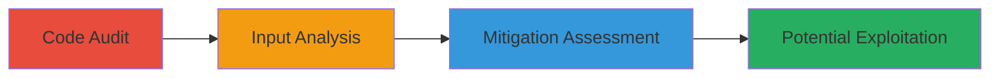

---
tags:
  - sqli
  - wordpress
  - plugin
  - php
  - mysql
type: attack_chain
tools: []
tactics:
  - '[[Initial Access]]'
verified: false
platforms:
  - Web
  - PHP
  - WordPress
submitted: true
complexity: low
created_at: '2023-10-01T00:00:00Z'
procedures:
  - '[[procedures/Audit-MapsMarker-Plugin-for-Security-Issues]]'
  - '[[procedures/Identify-Unescaped-User-Input-in-SQL-Queries]]'
  - '[[procedures/Assess-SQL-Injection-Mitigation-and-Bypass-Potential]]'
step_count: 3
techniques:
  - '[[Exploit Public-Facing Application]]'
updated_at: '2025-12-14T03:46:19.638Z'
description: >-
  A multi-stage vulnerability discovery process identifying a potential SQL
  Injection in the MapsMarker WordPress plugin due to unescaped user input in
  AJAX handlers, mitigated by deprecated magic quotes but exploitable if
  bypassed.
skill_level: intermediate
impact_level: informational
id: 809789cf-46b8-4164-a5ee-9fd8343a8560
validated: true
mitre_tactics:
  - '[[Initial Access]]'
mitre_techniques:
  - '[[Exploit Public-Facing Application]]'
---
# Potential SQL Injection in MapsMarker WordPress Plugin via Unescaped Multi-Layer Map List

Multi-stage attack chain demonstrating the discovery of a potential SQL Injection vulnerability in the MapsMarker WordPress plugin's AJAX frontend handler.

## Chain Metrics Dashboard

| Metric | Value |
|--------|-------|
| Chain Status | Unverified |
| Total Steps | 3 |
| Execution Time | ~30 minutes |
| Skill Level | Intermediate |
| Complexity | Low |
| Impact Level | Informational |

## Attack Flow Visualization

## Prerequisites & Requirements

### Required Tools

- Manual code review tools (e.g., text editor or IDE)
- WordPress environment for testing

### Target Environment

- WordPress installation with MapsMarker plugin
- PHP backend with MySQL database
- Access to plugin source code (inc/ajax-actions-frontend.php)

### Initial Access Requirements

- Read access to plugin files
- No network credentials needed for audit; authenticated session for testing exploitation
- Local or remote WordPress instance

## Detailed Attack Procedures

### Step 1: Code Audit
procedure: [[procedures/Audit-MapsMarker-Plugin-for-Security-Issues]]

**Objective**: Review the plugin's source code to identify potential security vulnerabilities, focusing on user input handling in AJAX endpoints.

**Instructions**: Download and examine the MapsMarker plugin files, particularly inc/ajax-actions-frontend.php. Scan for areas where user inputs from GET or POST are processed without sanitization.

**Expected Output**: Annotated code highlighting suspicious input handling sections.

**Success Indicators**:
- Identification of relevant files and functions
- Noted potential injection points

### Step 2: Input Analysis
procedure: [[procedures/Identify-Unescaped-User-Input-in-SQL-Queries]]

**Objective**: Pinpoint unescaped user-controlled inputs being concatenated into SQL queries, enabling potential injection attacks.

**Instructions**: Analyze lines 49-50 for input retrieval from $_GET['multi_layer_map_list'] or $_POST['multi_layer_map_list']. Check explosion by commas and direct use in queries on line 145 (e.g., 'WHERE l.id="' . $multi_layer_map_list . '"') and UNION queries on lines 149+.

**Expected Output**: Detailed notes on vulnerable code snippets and potential payloads.

**Success Indicators**:
- Confirmed lack of esc_sql() or intval() usage
- Mapped input flow to SQL execution

### Step 3: Mitigation Assessment
procedure: [[procedures/Assess-SQL-Injection-Mitigation-and-Bypass-Potential]]

**Objective**: Evaluate existing protections and identify conditions under which the vulnerability could be exploited.

**Instructions**: Review WordPress core (wp-settings.php) for magic quotes auto-escaping. Test if other plugins or themes disable this feature, potentially allowing injection via crafted payloads like '1' OR '1'='1 in the multi_layer_map_list parameter.

**Expected Output**: Report on mitigation status and bypass scenarios.

**Success Indicators**:
- Documented reliance on deprecated magic quotes
- Outlined future risks if protection is removed

## Attack Chain Summary

### Key Achievements

1. Discovered unescaped input handling in AJAX frontend
2. Identified specific SQL query construction flaws
3. Assessed real-world exploitability as informational due to mitigations

## Technique & Tactic Coverage

### MITRE ATT&CK Techniques

- [[Exploit Public-Facing Application]]

### MITRE ATT&CK Tactics

- [[Initial Access]]

---
*Last updated: 2023-10-01T00:00:00Z*
