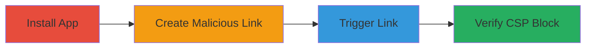

---
tags:
  - xss
  - stored-xss
  - stripe
  - csp
  - javascript
type: attack_chain
tools:
  - '[[tools/Custom-Links-App]]'
  - '[[tools/Browser-Developer-Console]]'
tactics:
  - '[[Execution]]'
commands: []
verified: false
platforms:
  - Web
submitted: true
complexity: medium
procedures:
  - '[[procedures/Install-Custom-Links-App]]'
  - '[[procedures/Create-Malicious-JavaScript-Link]]'
  - '[[procedures/Trigger-Custom-Link-for-XSS]]'
  - '[[procedures/Verify-CSP-Violation-in-Console]]'
step_count: 4
techniques:
  - '[[JavaScript]]'
description: >-
  Demonstrates a stored XSS attempt in Stripe dashboard using the Custom Links
  app, blocked by CSP but highlighting validation risks.
skill_level: intermediate
impact_level: high
id: 532c2eee-6828-4da7-a65a-fdf16d742f09
created_at: '2025-12-13T23:56:03.601Z'
updated_at: '2025-12-13T23:56:03.601Z'
validated: true
mitre_tactics:
  - '[[Execution]]'
mitre_techniques:
  - '[[JavaScript]]'
---
# Potential Stored XSS via Custom Links in Stripe Dashboard

Multi-stage attack chain demonstrating a potential stored XSS vulnerability in the Stripe dashboard using the Custom Links app to inject a javascript: URI payload. The payload attempts to execute JavaScript when clicked by team members, but is blocked by CSP. If bypassed, it could lead to arbitrary code execution in the dashboard context, compromising organizational accounts.

## Chain Metrics Dashboard

| Metric | Value |
|--------|-------|
| Chain Status | Unverified |
| Total Steps | 4 |
| Execution Time | ~5 minutes |
| Skill Level | Intermediate |
| Complexity | Medium |
| Impact Level | High |

## Attack Flow Visualization

## Prerequisites & Requirements

### Required Tools

- [[tools/Custom-Links-App]]
- [[tools/Browser-Developer-Console]]

### Target Environment

- Web platform
- Access to Stripe dashboard with permissions to install apps and manage products
- No specific ports or services beyond HTTPS access to Stripe

### Initial Access Requirements

- Valid Stripe account credentials
- Organizational access to install apps and create products
- Browser with developer tools enabled

## Detailed Attack Procedures

### Step 1: Install Custom Links App
procedure: [[procedures/Install-Custom-Links-App]]

**Objective**: Gain the ability to create custom links within Stripe products for payload injection.

**Instructions**: Navigate to the Stripe app marketplace and install the Custom Links app to enable link creation functionality.

**Expected Output**: App installed and available in the dashboard products section.

**Success Indicators**:
- App appears in the installed apps list
- Products section shows option to add custom links

### Step 2: Create Malicious JavaScript Link
procedure: [[procedures/Create-Malicious-JavaScript-Link]]

**Objective**: Inject a javascript: URI payload into a custom link to attempt stored XSS.

**Instructions**: In the Stripe dashboard products section, create a new custom link using the payload `javascript://%0aalert(1)` as the URL.

**Expected Output**: Custom link saved and visible in the products interface, ready for sharing or clicking.

**Success Indicators**:
- Link created without immediate errors
- Payload reflected in the link configuration

### Step 3: Trigger Custom Link for XSS
procedure: [[procedures/Trigger-Custom-Link-for-XSS]]

**Objective**: Attempt to execute the injected JavaScript by clicking the malicious link.

**Instructions**: Click the created custom link within the dashboard to trigger the javascript: scheme.

**Expected Output**: Browser attempts to navigate to the javascript: URI, but CSP blocks execution, showing a refusal error.

**Success Indicators**:
- Link click initiates but fails due to CSP
- No alert or code execution occurs

### Step 4: Verify CSP Violation in Console
procedure: [[procedures/Verify-CSP-Violation-in-Console]]

**Objective**: Confirm the vulnerability attempt and CSP protection via error logs.

**Instructions**: Open the browser developer console and observe the CSP refusal for inline script execution.

**Expected Output**: Console logs show CSP violation error related to unsafe-inline scripts or javascript: schemes.

**Success Indicators**:
- CSP error message visible in console
- No JavaScript execution confirmed

## Attack Chain Summary

### Key Achievements

1. Successful installation of the Custom Links app without restrictions
2. Injection of a javascript: payload into a stored link, demonstrating validation gap
3. Triggering of the payload results in CSP block, highlighting potential for bypass attacks
4. Verification of the block via console, confirming the stored XSS risk if protections weaken

## Technique & Tactic Coverage

### MITRE ATT&CK Techniques

- [[JavaScript]]

### MITRE ATT&CK Tactics

- [[Execution]]

---
*Last updated: 2023-10-01*
