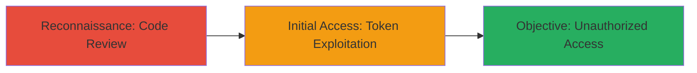

# Predictable Authentication Tokens via Weak Random Number Generation in joola.io

Multi-stage attack chain demonstrating the discovery and exploitation of weak random number generation for authentication tokens in the open-source joola.io application.

## Chain Metrics Dashboard

| Metric | Value |
|--------|-------|
| Chain Status | Unverified |
| Total Steps | 2 |
| Execution Time | ~30 minutes |
| Skill Level | Intermediate |
| Complexity | Medium |
| Impact Level | High |

## Attack Flow Visualization



## Prerequisites & Requirements

### Required Tools

- Git (for cloning repositories)
- Browser developer tools or scripting environment (e.g., Node.js REPL) for token prediction

### Target Environment

- Web platform running joola.io (Node.js/JavaScript-based)
- Access to the public GitHub repository
- Network access to the joola.io instance for token testing

### Initial Access Requirements

- No prior credentials needed for code review
- Valid session or API endpoint access for testing guessed tokens
- Basic knowledge of JavaScript and cryptography

## Detailed Attack Procedures

### Step 1: Reconnaissance via Code Review
procedure: [[procedures/Code-Review-for-Cryptographic-Weaknesses]]

**Objective**: Identify vulnerabilities in the authentication token generation mechanism by reviewing the open-source codebase.

**Instructions**: Clone the joola.io GitHub repository and examine the common.uuid() method in lib/common/index.js. Look for the use of Math.random() which produces predictable pseudorandom values unsuitable for security tokens.

Navigate to the specific commit and lines:

```bash
git clone https://github.com/joola/joola.git
cd joola
git checkout a534c3dca1a0deaec99c192978e61a35dd3a9069
cat lib/common/index.js | sed -n '90,98p'
```

**Expected Output**: Code snippet showing UUID generation like `Math.random().toString(36).substring(2) + Date.now().toString(36)`, revealing predictability due to Math.random()'s seed and low entropy.

**Success Indicators**:
- Identification of Math.random() usage in token generation
- Confirmation of insufficient entropy for cryptographic security

### Step 2: Initial Access via Token Exploitation
procedure: [[procedures/Brute-Force-Predictable-Auth-Tokens]]

**Objective**: Exploit the predictable token generation to guess or brute-force authentication tokens, gaining unauthorized access to user sessions or accounts.

**Instructions**: Reproduce the token generation locally to understand patterns, then script guesses against the application's API endpoints. Use a Node.js script to simulate Math.random() outputs based on known seeds or timestamps, and test against session endpoints.

Example reproduction script:

```javascript
// Simulate weak UUID generation
const weakUuid = () => Math.random().toString(36).substring(2) + Date.now().toString(36);
console.log(weakUuid()); // Predictable output
```

Then, use curl to test guessed tokens in requests:

```bash
curl -H "Authorization: Bearer GUESSED_TOKEN_HERE" https://joola.io/api/session
```

Iterate through predicted tokens by scripting variations around timestamps and random seeds.

**Expected Output**: Successful response (e.g., 200 OK with session data) instead of 401 Unauthorized, indicating access granted.

**Success Indicators**:
- Valid session or account data retrieved
- Bypass of authentication without legitimate credentials

## Attack Chain Summary

### Key Achievements

1. Discovered cryptographic weakness through open-source code review
2. Demonstrated predictability of auth tokens using Math.random()
3. Achieved unauthorized access via token guessing or brute-force

## Technique & Tactic Coverage

### MITRE ATT&CK Techniques

- [[Gather Victim Host Information]] Gather Victim Host Information (code review for vuln discovery)
- [[Brute Force]] Brute Force (exploiting predictable tokens)

### MITRE ATT&CK Tactics

- [[Reconnaissance]] Reconnaissance
- [[Initial Access]] Initial Access

---
*Last updated: 2023-10-01T00:00:00Z*
