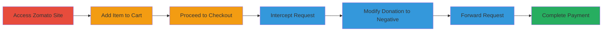

# Price Manipulation via Negative Support Rider Donation in Zomato Checkout

Multi-stage attack chain demonstrating a business logic flaw in Zomato's web checkout process, where the support rider donation amount can be manipulated to a negative value, reducing the total order cost by up to 1 rupee without server-side validation.

## Chain Metrics Dashboard

| Metric | Value |
|--------|-------|
| Chain Status | Unverified |
| Total Steps | 7 |
| Execution Time | ~5 minutes |
| Skill Level | Intermediate |
| Complexity | Medium |
| Impact Level | Low |

## Attack Flow Visualization

## Prerequisites & Requirements

### Required Tools

- [[tools/Burp-Suite]]

### Target Environment

- Web platform (zomato.com)
- No specific services or ports required beyond standard HTTPS (443)
- Network access to the internet

### Initial Access Requirements

- Valid user account on Zomato (anonymous browsing possible but checkout requires login)
- No prior privileged access needed
- Proxy tool configured to intercept browser traffic

## Detailed Attack Procedures

### Step 1: Navigate to Zomato Website
procedure: [[procedures/Prepare-Zomato-Checkout]]

**Objective**: Gain initial access to the target application and prepare for order placement.

**Instructions**: Open a web browser and visit the Zomato website to start the shopping process.

**Expected Output**: Zomato homepage loads successfully.

**Success Indicators**:
- Site accessible without errors
- User can browse restaurants and menu items

### Step 2: Add an Item to the Cart
procedure: [[procedures/Prepare-Zomato-Checkout]]

**Objective**: Simulate a legitimate order to reach the checkout stage where the vulnerability can be exploited.

**Instructions**: Select a restaurant, choose a menu item, and add it to the shopping cart via the standard UI.

**Expected Output**: Item appears in the cart with correct pricing.

**Success Indicators**:
- Cart contains at least one item
- Total amount calculated normally

### Step 3: Proceed to Checkout and Add Support Rider Donation
procedure: [[procedures/Prepare-Zomato-Checkout]]

**Objective**: Trigger the support rider donation option to generate the exploitable HTTP request.

**Instructions**: Proceed to the checkout page and select a support rider donation option (e.g., 25, 50, or 100 rupees) to add it to the order.

**Expected Output**: Donation option selected, but do not forward the request yet if proxy is active.

**Success Indicators**:
- Checkout page loads with donation options visible
- Selection initiates an HTTP request for donation addition

### Step 4: Intercept the Request for Adding Support Rider Money
procedure: [[procedures/Intercept-Support-Rider-Request]]

**Objective**: Capture the HTTP request payload containing the support rider amount parameters.

**Instructions**: Configure a web proxy like Burp Suite to intercept traffic from the browser. When the donation is selected, the request will be paused for inspection.

**Expected Output**: HTTP POST request to the donation endpoint is intercepted, showing JSON or form data with price fields.

**Success Indicators**:
- Request captured with fields like 'donation_money' or similar
- Payload visible in proxy tool

### Step 5: Modify the Support Rider Price Fields
procedure: [[procedures/Modify-Donation-Amount-to-Negative]]

**Objective**: Tamper with the donation amount to a negative fractional value to reduce the cart total.

**Instructions**: In the intercepted request, locate the two donation money fields (e.g., in JSON payload) and change their values from positive (e.g., 25.00) to -0.99.

**Expected Output**: Modified payload with negative values; total order amount should reflect a reduction when forwarded.

**Success Indicators**:
- Fields updated to -0.99
- No immediate client-side validation errors

### Step 6: Forward the Modified Request
procedure: [[procedures/Forward-Tampered-Request]]

**Objective**: Submit the tampered request to the server, applying the price manipulation.

**Instructions**: Release the request from the proxy to send it to Zomato's server.

**Expected Output**: Server accepts the request; cart total decreases by up to 1 rupee (e.g., from 100 to 99.01).

**Success Indicators**:
- Updated cart shows reduced total
- No server-side rejection of negative value

### Step 7: Complete the Payment and Place the Order
procedure: [[procedures/Complete-Manipulated-Order]]

**Objective**: Finalize the order with the manipulated lower total to realize the financial gain.

**Instructions**: Proceed with standard payment using any supported method (e.g., card, UPI); place the order.

**Expected Output**: Order confirmed with the reduced amount charged.

**Success Indicators**:
- Payment succeeds without discrepancies
- Order receipt shows manipulated total

## Attack Chain Summary

### Key Achievements

1. Successful interception and modification of checkout request
2. Server-side acceptance of negative donation value leading to 1 rupee discount
3. Order completion with minor financial manipulation

## Technique & Tactic Coverage

### MITRE ATT&CK Techniques

- [[Exploit Public-Facing Application]]

### MITRE ATT&CK Tactics

- [[Initial Access]]

---

*Last updated: 2023-10-01T00:00:00Z*
