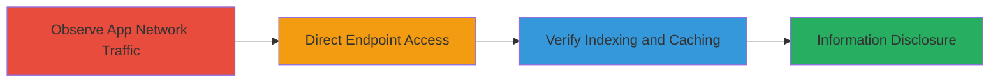

---
tags:
  - information-disclosure
  - auth-token-leak
  - search-engine-indexing
  - android-app
type: attack_chain
tools:
  - '[[tools/Google-Search]]'
tactics:
  - '[[Reconnaissance]]'
  - '[[Collection]]'
verified: false
platforms:
  - Web
  - Android
submitted: true
complexity: medium
created_at: '2023-10-01T00:00:00Z'
procedures:
  - >-
    [[procedures/Observe-Insecure-GET-Request-in-Grab-Android-App-Notifications]]
  - '[[procedures/Direct-Browser-Access-to-Exposed-Passenger-Endpoint]]'
  - '[[procedures/Verify-Search-Engine-Indexing-with-Google-Dorks]]'
step_count: 3
techniques:
  - '[[Social Media]]'
  - '[[Exploit Public-Facing Application]]'
updated_at: '2025-12-14T17:24:44.778Z'
description: >-
  Multi-stage attack chain exploiting a misconfigured web endpoint in the Grab
  Android app to disclose private user messages and authentication tokens,
  including verification of search engine indexing.
skill_level: intermediate
impact_level: high
id: bc11661e-d245-4990-bb2e-5af424f1ed34
validated: true
mitre_tactics:
  - '[[Reconnaissance]]'
  - '[[Collection]]'
mitre_techniques:
  - '[[Social Media]]'
  - '[[Exploit Public-Facing Application]]'
---
# Private Messages Disclosure via Exposed Auth Token in Grab Android App

Multi-stage attack chain demonstrating how a misconfiguration in the Grab Android app exposes private user messages, OTP pins, group invites, and authentication tokens via a web endpoint, allowing direct access and search engine caching for widespread information disclosure.

## Chain Metrics Dashboard

| Metric | Value |
|--------|-------|
| Chain Status | Unverified |
| Total Steps | 3 |
| Execution Time | ~5 minutes |
| Skill Level | Intermediate |
| Complexity | Medium |
| Impact Level | High |

## Attack Flow Visualization



## Prerequisites & Requirements

### Required Tools

- [[tools/Google-Search]]

### Target Environment

- Grab Android app installed
- Access to app notifications section
- Web browser for endpoint testing
- Network access to grab-attention.grabtaxi.com

### Initial Access Requirements

- Installed Grab Android app with user account
- No special credentials beyond app login
- Internet connectivity

## Detailed Attack Procedures

### Step 1: Observe Insecure GET Request
procedure: [[procedures/Observe-Insecure-GET-Request-in-Grab-Android-App-Notifications]]

**Objective**: Identify the insecure network request exposing the auth token in the Grab app's notifications section.

**Instructions**: Launch the Grab Android app and navigate to the 'Notifications' section. Use the app's built-in developer tools or a proxy like Burp Suite to inspect network traffic. Look for GET requests to the passenger endpoint that include the auth_token in the URL query parameters.

**Expected Output**: Capture a URL like `https://grab-attention.grabtaxi.com/passenger/passenger.html?auth_token=[token]&view=268435456` revealing the exposed token.

**Success Indicators**:
- Network request observed with auth_token in query string
- Endpoint URL noted for further testing

### Step 2: Direct Browser Access to Exposed Endpoint
procedure: [[procedures/Direct-Browser-Access-to-Exposed-Passenger-Endpoint]]

**Objective**: Gain unauthorized access to private messages by directly accessing the endpoint in a browser, bypassing app authentication.

**Instructions**: Copy the full URL from the observed network request, including the auth_token, and paste it into a web browser. Load the page to view the content without any additional authentication.

**Expected Output**: Browser displays private user messages, including sensitive data like OTP pins and group invites.

**Success Indicators**:
- Page loads successfully without app or additional login
- Sensitive private data visible in the browser

### Step 3: Verify Search Engine Indexing and Caching
procedure: [[procedures/Verify-Search-Engine-Indexing-with-Google-Dorks]]

**Objective**: Confirm that the exposed endpoint is indexed and cached by search engines, amplifying the disclosure.

**Instructions**: Use [[commands/google-dork-passenger-site-grab]] in Google Search to query for indexed pages:

Search query:
```
passenger site:grab-attention.grabtaxi.com
```

Review results for cached versions showing partial auth_tokens and sensitive data.

**Expected Output**: Search results with cached pages from the passenger.html endpoint containing exposed information.

**Success Indicators**:
- Cached pages retrieved showing sensitive data
- Evidence of public indexing of private content

## Attack Chain Summary

### Key Achievements

1. Identified misconfigured GET request exposing auth tokens in the Grab Android app.
2. Accessed private messages directly via browser without authentication.
3. Demonstrated search engine caching, enabling broad information disclosure and potential privilege escalation.

## Technique & Tactic Coverage

### MITRE ATT&CK Techniques

- [[Social Media]] Search Engines
- [[Exploit Public-Facing Application]] Exploit Public-Facing Application

### MITRE ATT&CK Tactics

- [[Reconnaissance]] Reconnaissance
- [[Collection]] Collection

---
*Last updated: 2023-10-01T00:00:00Z*
